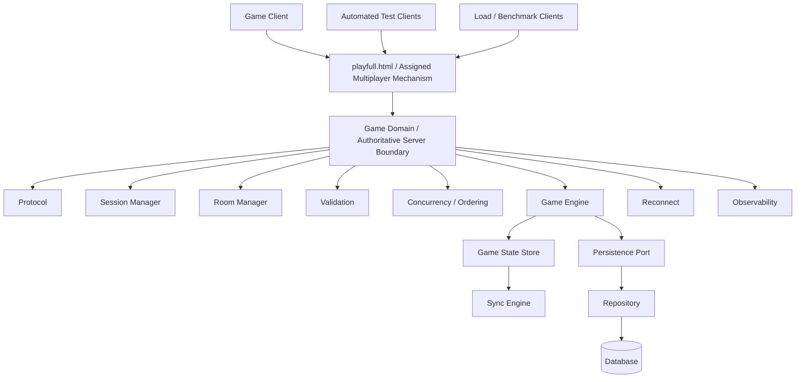
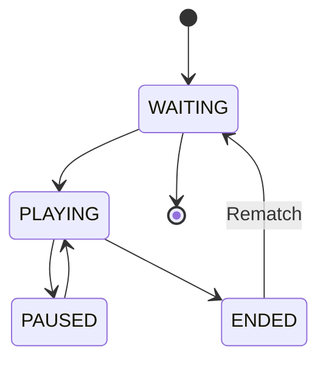
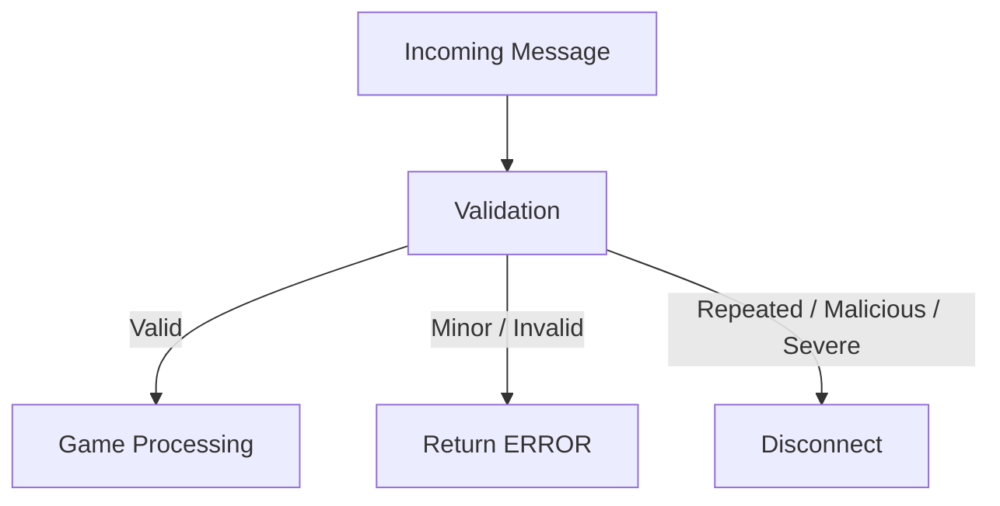
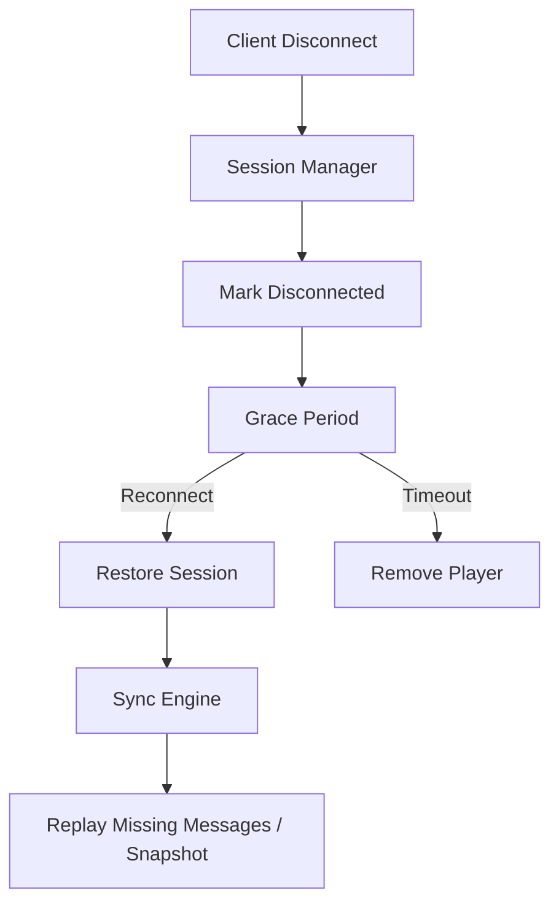
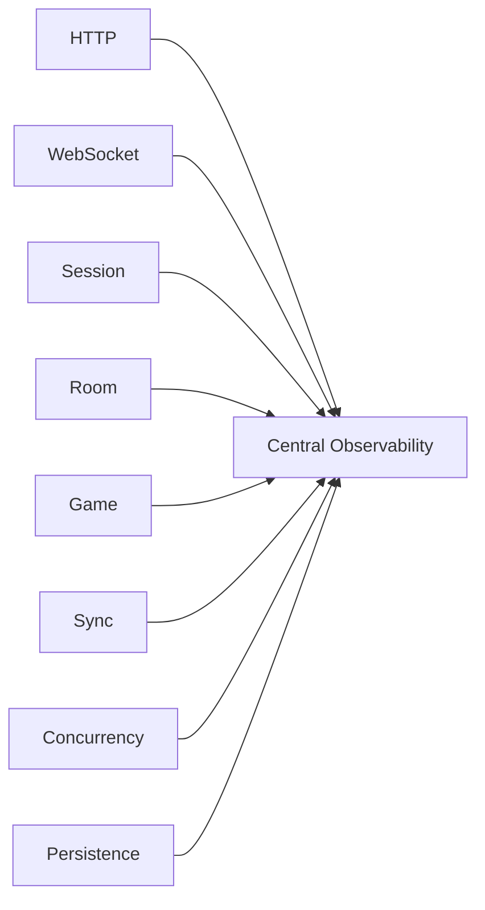
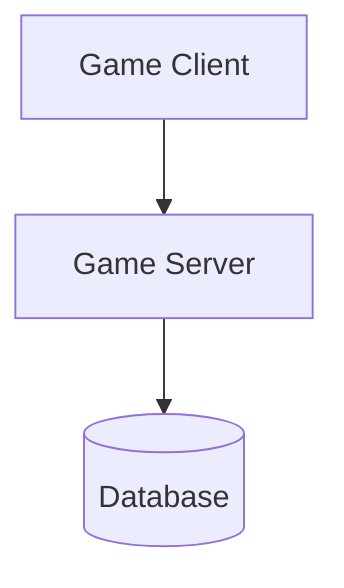
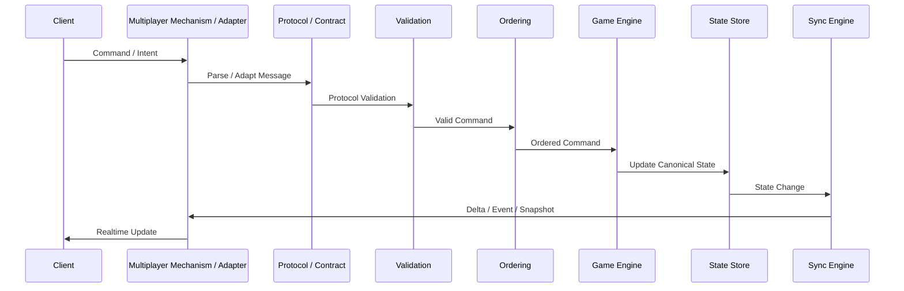

# 02_ARCHITECTURE.md

# System Architecture

> **Document Status:** ASSIGNMENT-INTEGRATED / NOT YET FROZEN  
> **Implementation Status:** Architecture baseline ready; game-specific implementation blocked by unresolved critical assignment items  
> **Architecture Readiness Target:** ≥95%  
> **Source of Truth:** This document + `SRS.md` + `01_PROJECT_SPEC.md`

---

# 1. AI AGENT GUIDING — MANDATORY

AI Agent MUST read and understand:

1. `01_PROJECT_SPEC.md`
2. `SRS.md`
3. `02_ARCHITECTURE.md`
4. Teacher's assignment / requirements
5. Other project documents explicitly referenced by the above documents

before implementing architecture-dependent functionality.

AI MUST:

- follow the architecture boundaries defined here;
- not invent undocumented architecture requirements;
- not silently introduce new infrastructure;
- not bypass the Network / Protocol / Validation / Sync boundaries;
- not couple Game Engine directly to WebSocket or HTTP;
- not make Database a dependency of the live game loop;
- preserve State Ownership defined in `SRS.md`;
- update Architecture Decision Log when architecture changes;
- detect conflicts between requirements and architecture;
- stop and request resolution when a conflict affects implementation correctness.

If AI discovers that the current architecture is insufficient:

```text
Problem
    ↓
Architecture Change Proposal
    ↓
Impact Analysis
    ↓
Trade-off Analysis
    ↓
Team / User Decision
    ↓
Architecture Decision Log
    ↓
Implementation
```

AI MUST NOT silently redesign the system merely because another architecture is easier to code.

---

# 2. Architecture Purpose

This document defines the technical organization of the realtime multiplayer system.

It describes:

- system boundaries;
- client architecture;
- server architecture;
- module responsibilities;
- HTTP and WebSocket boundaries;
- game state ownership;
- synchronization;
- concurrency;
- validation;
- session and room management;
- reconnect/resync;
- persistence;
- observability;
- testing/load architecture;
- deployment baseline;
- dependency rules;
- major runtime flows.

This document does NOT replace:

- `SRS.md` for detailed requirements;
- `01_PROJECT_SPEC.md` for project scope and objectives;
- protocol specifications for detailed message definitions;
- test plans for detailed test cases;
- team workflow documentation for task management.

---

# 3. Architecture Principles

The architecture follows five primary principles.

## 3.1 Simplicity First

The system should remain understandable and implementable by a small student team.

Do not introduce infrastructure merely to make the system appear more enterprise-grade.

---

## 3.2 Network Correctness First

Network correctness has priority over cosmetic or secondary gameplay complexity.

The architecture must correctly handle:

- communication;
- ordering;
- concurrency;
- synchronization;
- reconnect;
- resync;
- invalid messages;
- network degradation;
- room isolation.

---

## 3.3 Explicit Boundaries

Major responsibilities must have explicit boundaries.

Examples:

```text
Network ≠ Game Logic
Session ≠ Room
Game Engine ≠ WebSocket
Canonical State ≠ Sync Representation
Gameplay ≠ Persistence
```

---

## 3.4 Observable System

Important system behavior must be measurable.

Metrics include:

- RTT;
- message latency;
- messages/sec;
- bytes/sec;
- CPU;
- memory;
- active connections;
- tick processing time;
- synchronization failures;
- reconnect results;
- desync detection/recovery.

---

## 3.5 AI-Friendly Architecture

The architecture must be understandable by AI coding agents.

Every major module should have:

- explicit responsibility;
- explicit input/output boundary;
- limited coupling;
- clear dependency direction;
- testable behavior.

AI MUST NOT infer hidden responsibilities from implementation details.

---

# 4. Architecture Overview

The baseline architecture uses a **Modular Monolith / authoritative game-server boundary**, but the exact transport/server topology MUST be adapted to the teacher-specified `playfull.html` mechanism after its exact API/package identity is verified.

The architecture therefore separates the **game-domain responsibilities** from the **multiplayer transport provider**. If `playfull.html` already supplies room, session, synchronization, or server functionality, the project MUST use an adapter around those capabilities rather than build a competing networking layer.

External clients are used for:

- game interaction;
- automated integration testing;
- load testing;
- benchmark testing.

High-level structure:



The main diagram is intentionally kept at system/module level.

Detailed flows are documented separately below.

---

# 5. Architecture Layers

The server follows a hybrid layered + module-based architecture.

```text
Multiplayer Transport / Assigned Library Adapter
    ↓
Protocol / Contract Adapter
    ↓
Session / Room
    ↓
Validation
    ↓
Concurrency / Ordering
    ↓
Game Domain
    ↓
Canonical State
    ↓
Synchronization
    ↓
Transport
```

Infrastructure concerns such as persistence and observability remain separated from core gameplay logic.

---

# 6. Client Architecture

The client follows:

```text
Presentation
      ↓
Game / Application
      ↓
Client State
      ↓
Network / Multiplayer Adapter
      ↓
Assigned `playfull.html` mechanism
      ↓
Transport supplied by the library (exact API TBD)
```

## 6.1 Presentation

Responsible for:

- UI;
- rendering;
- player-facing feedback;
- game visualization.

Presentation MUST NOT directly manipulate WebSocket connections.

---

## 6.2 Game / Application

Responsible for:

- local gameplay interaction;
- input handling;
- client-side game behavior;
- client prediction where explicitly allowed.

Client gameplay MUST use the defined Network API/Protocol.

---

## 6.3 Client State

Stores:

- current known game state;
- local player state;
- room state;
- synchronization metadata;
- sequence information;
- connection state.

---

## 6.4 Network / Multiplayer Adapter

Provides a controlled interface to the teacher-assigned multiplayer mechanism.

Responsibilities:

- connection/session interaction supported by the library;
- room/player interaction supported by the library;
- send game commands/intents;
- receive authoritative state/events;
- expose connection/recovery status to application code.

The client MUST NOT couple gameplay code directly to `playfull.html` implementation details.

If the verified library exposes HTTP/WebSocket internally, those transports remain implementation details of the adapter unless the teacher/API contract explicitly requires direct use.

---

# 7. Assigned Multiplayer Mechanism Boundary

The teacher explicitly requires `playfull.html` for the multiplayer/server capability.

Until the exact teacher-provided library/package/API is verified, the architecture MUST NOT lock:

- a custom HTTP API as mandatory;
- a custom WebSocket server as mandatory;
- a second competing room/session system;
- a duplicate synchronization infrastructure.

The project will integrate through an adapter boundary:

```text
Game Client / Test Client
          ↓
Multiplayer Adapter
          ↓
Verified playfull.html API / mechanism
          ↓
Teacher-supported transport/server capability
          ↓
Authoritative Game Domain
```

The adapter must expose only the capabilities actually required by the game and the verified library.

---

# 8. Transport Boundary

The concrete transport is **TBD until `playfull.html` is verified**.

Possible HTTP/WebSocket behavior may be documented after verification, but this architecture does not assume that the project must implement a separate custom HTTP + WebSocket server if the assigned library already provides the required multiplayer infrastructure.

The transport boundary is responsible for:

- connection establishment;
- message/event delivery;
- connection-level errors;
- disconnect detection where supported;
- transport serialization where owned by the library/adapter.

Core game rules MUST remain outside the transport layer.

---

# 9. Protocol Layer

The Protocol layer defines the communication contract.

Messages/events MUST follow the project contract defined in `SRS.md` and `03_NETWORK_SPEC.md`. The exact wire envelope depends on the verified `playfull.html` API and must not be invented before integration confirmation:

```json
{
  "messageId": "...",
  "type": "...",
  "timestamp": "...",
  "roomId": "...",
  "playerId": "...",
  "sequence": 123,
  "payload": {}
}
```

Responsibilities:

- message parsing;
- serialization/deserialization;
- message type validation;
- protocol version compatibility where applicable;
- sequence metadata;
- message envelope validation.

Protocol validation is distinct from game validation.

---

# 10. Session Manager

The Session Manager owns connection/session lifecycle.

Responsibilities:

- guest identity;
- session token;
- authentication/session validation;
- connection state;
- reconnect state;
- disconnect detection;
- grace period;
- restoration of a previous session.

Identity flow:

```text
Client
  ↓
HTTP / Session establishment
  ↓
Guest Identity
  ↓
Session Token
  ↓
WebSocket Connection
```

The Session Manager does not own gameplay state.

---

# 11. Room Manager

The Room Manager owns room lifecycle and membership.

Responsibilities:

- create room;
- join room;
- leave room;
- room membership;
- player presence;
- ready state;
- room lifecycle;
- room isolation;
- rematch transition.

Multiple rooms may exist in the same Game Server process:

```text
Game Server
 ├── Room A
 ├── Room B
 ├── Room C
 └── ...
```

A room is an in-memory runtime domain for a live match.

---

# 12. Room Lifecycle

The high-level lifecycle is:



Room Manager owns room lifecycle.

Game Engine owns game-specific gameplay state.

These responsibilities must not be conflated.

---

# 13. Game Engine

The Game Engine is the core gameplay domain.

Responsibilities:

- process validated game commands;
- apply game rules;
- calculate game outcomes;
- update canonical game state;
- enforce game-specific rules.

The Game Engine MUST NOT directly depend on:

- WebSocket;
- HTTP;
- transport connection details;
- Session Manager implementation.

The Game Engine receives application-level commands/inputs.

---

# 14. Canonical Game State

The authoritative live state is maintained in memory.

Architecture:

```text
Game Engine
     ↓
Game State Store
     ↓
Canonical Game State
```

The Game State Store represents the authoritative state used to calculate gameplay results.

For Bài 2, the architecture now knows the following domain-level state constraints:

- board dimensions = 9×9;
- three piece types = Đấm / Lá / Kéo;
- one-square movement in 8 directions;
- same-type pieces cannot capture each other;
- win condition includes eliminating one complete opponent piece type;
- win condition includes reaching a1/i9.

The following remain `[TBD]` and MUST be resolved before SRS/protocol freeze:

- cross-type capture relation;
- initial board layout and piece counts;
- side ownership of a1/i9;
- exact occupied-cell/legal-move semantics;
- no-move/draw behavior;
- player capacity and join/leave semantics during a match.

The detailed field-level State Ownership Matrix remains the responsibility of `SRS.md`.

The detailed ownership of individual fields is defined in the State Ownership Matrix in `SRS.md`.

---

# 15. Client Command / Intent Model

Clients do not directly submit authoritative state.

Clients submit commands or intents.

Conceptual example only; the exact message shape is NOT frozen yet:

```text
Player Command / Intent
  → identify piece + destination (or equivalent library-supported action)
  → server/game-domain validation
  → authoritative state transition
```

The server determines the resulting authoritative state.

This prevents the client from becoming the source of truth for game-critical state.

---

# 16. Concurrency and Ordering

Concurrent inputs are handled before authoritative game-state mutation.

Primary flow:

```text
WebSocket
    ↓
Protocol
    ↓
Validation
    ↓
Concurrency / Ordering
    ↓
Game Engine
    ↓
Canonical State
```

The system must provide deterministic conflict resolution.

The architecture requires deterministic conflict resolution, but the exact ordering mechanism is **TBD** until the verified multiplayer mechanism and game turn semantics are confirmed. `SRS.md` / `03_NETWORK_SPEC.md` MUST define whether the game is strictly turn-based and how simultaneous/duplicate commands are handled. The architecture must not silently assume a first-arrival rule while `B2-TBD-04` remains unresolved.

---

# 17. Validation

Validation is divided into two levels.

```text
Incoming Message
       ↓
Protocol Validation
       ↓
Game Validation
       ↓
Concurrency / Ordering
       ↓
Game Engine
```

## 17.1 Protocol Validation

Checks:

- message structure;
- required fields;
- type;
- serialization;
- sequence format;
- envelope validity.

## 17.2 Game Validation

Checks:

- whether the action is legal;
- whether the player may perform it;
- whether the requested transition is valid;
- whether the action violates game rules.

Server-side validation is authoritative for game-critical actions.

---

# 18. Invalid Message Handling



Invalid messages MUST NOT directly mutate game state.

Rate limiting is applied as an additional protection mechanism.

---

# 19. Synchronization Engine

The Sync Engine is independent from the Game Engine.

Its responsibilities include:

- state synchronization;
- snapshot generation;
- delta generation;
- event propagation;
- sequence tracking;
- state hash/checksum;
- missing-message detection;
- replay/resync coordination.

The Sync Engine does not own authoritative gameplay state.

It MUST NOT independently mutate canonical state during normal synchronization.

---

# 20. Synchronization Strategy

The system uses hybrid synchronization.

```text
Initial Join
     ↓
Full Snapshot

Normal Gameplay
     ↓
Delta / Event

Periodic / Triggered Recovery
     ↓
Snapshot

Reconnect
     ↓
Replay Missing Messages
     ↓
Fallback to Full Snapshot
```

This balances:

- correctness;
- bandwidth;
- implementation complexity;
- recovery capability.

---

# 21. Sequence Numbers

Every relevant message contains a sequence number.

Sequence generation belongs to the server/protocol side.

The Sync Engine uses sequence numbers to detect:

- missing messages;
- ordering gaps;
- duplicate messages;
- recovery boundaries.

Example:

```text
101
102
103
105
```

Sequence `104` is missing.

The Sync Engine can request/reconstruct the missing state where possible.

---

# 22. State Hash / Checksum

State integrity is checked through state hash/checksum.

The Sync Engine is responsible for:

- generating/checking synchronization integrity information;
- detecting mismatch;
- logging mismatch;
- triggering recovery;
- verifying recovered state.

Recovery flow:

```text
Detect mismatch
      ↓
Log
      ↓
Resync
      ↓
Apply recovered state
      ↓
Verify state hash
```

---

# 23. Reconnect

Reconnect is owned by Session Manager, while state recovery is handled by Sync Engine.



Within the grace period:

- the original session may be restored;
- the player's previous state can be recovered.

After the grace period:

- the player is treated according to the game's reconnect policy;
- a new player/session may be created where specified.

---

# 24. Presence State

Presence is split between Session and Room responsibilities.

### Session Manager

Owns connection-level state:

- connected;
- disconnected;
- reconnecting;
- session validity.

### Room Manager

Owns room-level presence:

- player membership;
- ready state;
- spectator/player role where applicable.

---

# 25. Room Isolation

Room isolation is enforced through multiple boundaries.

```text
Session / Authorization
          ↓
Room Manager
          ↓
Room Membership
          ↓
Room-specific Game State
```

`roomId` alone is NOT authorization.

A valid session must also be authorized to access the requested room.

A client must not read or mutate another room's state.

---

# 26. Authorization

Room access requires:

```text
Room ID
+
Join Code / Room Token
+
Valid Session
```

The architecture therefore separates:

- identity;
- session;
- authorization;
- room membership.

Database is not required to perform live authorization checks.

---

# 27. Rate Limiting

Rate limiting is handled at two levels.

### Network / Connection Level

Implemented around the Gateway/Protocol boundary.

Examples:

- excessive messages;
- connection abuse;
- malformed request flooding.

### Game Action Level

Game-specific validation may reject excessive actions.

This follows:

```text
Gateway protection
        +
Game rule protection
```

No separate Rate Limiting microservice is required.

---

# 28. Persistence

Persistence is a **soft dependency**.

Live gameplay does not depend on database availability.

Primary architecture:

```text
Game / Match
      ↓
Persistence Port
      ↓
Repository
      ↓
Database
```

The Database may store:

- match history;
- match results;
- selected logs;
- selected benchmark/report information where appropriate.

The Database MUST NOT be required for every live game-state update.

---

# 29. Persistence Dependency Rule

The following is forbidden:

```text
Game Tick
   ↓
Database Query
   ↓
Database Write
   ↓
Next Tick
```

The preferred model is:

```text
Live Match
   ↓
In-Memory State
   ↓
Match Result / Required Persistence Event
   ↓
Persistence Boundary
   ↓
Database
```

If the Database is unavailable, the live match should not automatically fail solely because persistence is unavailable.

---

# 30. Dependency Direction

The project uses a hybrid of layered architecture and Dependency Inversion.

General direction:

```text
Transport
   ↓
Application / Domain
   ↓
Infrastructure
```

Core gameplay should depend on abstractions rather than concrete infrastructure implementations where practical.

Example:

```text
Game / Match
      ↓
Persistence Port
      ↓
Repository
      ↓
Database
```

The Game Engine should not directly instantiate database clients.

---

# 31. Event Bus Policy

No Event Bus is required by default.

An Event Bus may only be introduced if a concrete requirement demonstrates that it is necessary.

The following are not sufficient reasons:

- "more enterprise";
- "more scalable-looking";
- "AI architecture best practice";
- "microservices usually use it".

Any Event Bus addition requires an Architecture Change Proposal.

---

# 32. Observability

Observability is centralized.



The system records measurable behavior without requiring a separate external monitoring platform.

Visualization and benchmark reporting may be performed externally.

---

# 33. Performance Metrics

The architecture supports measurement of:

## Network

- RTT;
- message latency;
- messages/sec;
- bytes/sec;
- packet-loss recovery.

## Server

- CPU;
- memory;
- active connections;
- tick processing time.

## Correctness

- desynchronization;
- duplicate messages;
- missing messages;
- reconnect success;
- conflict resolution;
- recovery success.

---

# 34. Test / Load / Benchmark Architecture

Testing is separated from runtime architecture.

```text
                    ┌─────────────────────┐
                    │    Game Server      │
                    └──────────┬──────────┘
                               │
               ┌───────────────┼────────────────┐
               │               │                │
               ▼               ▼                ▼
        Automated Tests    Load Clients    Benchmark Clients
```

Test and Load clients communicate through the real HTTP/WebSocket interfaces.

This prevents load testing from bypassing the actual network layer.

Shared test utilities may be used across automated tests and load/benchmark tooling.

---

# 35. Benchmark Architecture

Benchmarking is external to the Game Server.

The project must support comparison of:

- Full Snapshot;
- Delta/Event synchronization.

Metrics should include relevant:

- bandwidth;
- latency;
- message count;
- CPU;
- memory;
- synchronization correctness.

Results should be represented using:

- tables;
- charts;
- analysis.

---

# 36. Network Degradation Testing

Required network degradation scenarios:

- latency;
- packet loss;
- disconnect.

A dedicated Network Failure Manager is NOT required.

Instead:

```text
Network Failure
     ↓
Gateway / Session / Sync
     ↓
Recovery Behavior
```

Automated test infrastructure is responsible for simulating degradation.

---

# 37. Multiple Rooms and Capacity

One Game Server process may host multiple rooms.

```text
Game Server
│
├── Room A
│    └── Game State
│
├── Room B
│    └── Game State
│
├── Room C
│    └── Game State
│
└── ...
```

Game capacity is determined by the actual game design.

Load-test client count is a separate concept and must not be confused with the game's intended player capacity.

---

# 38. Scalability Strategy

The baseline architecture is intentionally a Modular Monolith.

The project does NOT require:

- Kubernetes;
- microservices;
- service discovery;
- distributed message brokers;
- horizontal cluster orchestration.

Scalability is demonstrated primarily through:

- multiple rooms;
- concurrent clients;
- load testing;
- performance metrics;
- benchmark analysis.

Future scaling may be considered only if required by the actual project scope.

---

# 39. Deployment Architecture

The baseline deployment supports:

1. Local Native Run
2. Docker Compose

Docker is not a hard dependency if the lecturer's environment does not support it.

Conceptual Docker Compose deployment:



The project must document both:

- local development/run;
- Docker Compose run where supported.

---

# 40. Main Runtime Flows

## 40.1 Create Room

```text
Client
  ↓
Multiplayer Adapter
  ↓
Assigned `playfull.html` mechanism
  ↓
Session / Room capability (library or project adapter)
  ↓
Create Room / Game Instance
  ↓
Initial authoritative state
  ↓
Client receives initial snapshot/state
```

---

## 40.2 Join Room

```text
Client
  ↓
Multiplayer Adapter
  ↓
Assigned `playfull.html` mechanism
  ↓
Session + Room capability
  ↓
Join Game Instance
  ↓
Authoritative state / presence update
  ↓
Client receives initial snapshot/state
```

---

## 40.3 Gameplay



---

## 40.4 Synchronization

```text
Canonical State
      ↓
Sync Engine
      ├── Delta
      ├── Event
      └── Snapshot
             ↓
Assigned Multiplayer Mechanism / Adapter
             ↓
           Clients
```

---

## 40.5 Concurrent Actions

```text
Player A ── Command ──┐
                      │
Player B ── Command ──┤
                      ↓
              Validation
                      ↓
             Ordering / Concurrency
                      ↓
                 Game Engine
                      ↓
              Canonical State
```

---

## 40.6 Disconnect

```text
Transport / Library Disconnect
        ↓
Multiplayer Adapter / Library Capability
        ↓
Session Manager or equivalent session boundary
        ↓
Disconnected State
        ↓
Grace Period
```

---

## 40.7 Reconnect

```text
Reconnect
    ↓
Session Manager
    ↓
Validate Previous Session
    ↓
Restore Session
    ↓
Sync Engine
    ↓
Replay Missing Messages
    ↓
Fallback Snapshot if Necessary
    ↓
Resume
```

---

## 40.8 Match End

```text
Game Engine
     ↓
Match Result
     ├────────→ Clients
     ├────────→ Observability
     └────────→ Persistence
                    ↓
                 Database
     ↓
Room Manager
     ↓
Waiting / Rematch
```

---

# 41. Failure Boundaries

## Database Failure

```text
Database unavailable
        ↓
Live Game continues
        ↓
Persistence may be delayed/failed
        ↓
Failure recorded
```

Database failure must not automatically terminate the live match.

---

## WebSocket Failure

```text
WebSocket failure
        ↓
Session Manager
        ↓
Grace Period
        ↓
Reconnect / Remove
```

---

## Synchronization Failure

```text
Sequence Gap / State Hash Mismatch
        ↓
Detect
        ↓
Log
        ↓
Replay Missing Messages
        ↓
Full Snapshot if required
        ↓
Verify
```

---

## Server Restart

The baseline does not require live-match restoration after server restart.

```text
Server Restart
      ↓
Live Match may terminate
      ↓
Persisted Match History remains available
```

---

# 42. Security Architecture

Security boundaries include:

- Guest identity;
- session token;
- room authorization;
- server-side validation;
- rate limiting;
- room isolation;
- invalid-message handling;
- secure session handling.

The project should use standard cryptographic/security libraries rather than implementing cryptographic primitives manually.

---

# 43. Team Responsibility Mapping

Architecture ownership is mapped at a high level only.

| Team Member | Primary Architecture Area |
|---|---|
| Person A | Client, UI, Game Presentation, Player Representation, Input, Game-specific Client |
| Person B | HTTP, WebSocket, Protocol, Session, Room, Server, State, Sync, Validation, Concurrency, Reconnect |
| Person C | Integration, Automated Testing, Network Degradation, Load, Benchmark, Metrics, QA, Documentation/Demo Support |

All team members must understand the shared architecture and contracts.

No team member may redefine a shared protocol independently.

---

# 44. Dependency Rules

The following rules are mandatory.

## Allowed

```text
Client
  → Network Adapter

Gateway
  → Protocol

Protocol
  → Validation

Validation
  → Game Application

Concurrency
  → Game Engine

Game Engine
  → State Store

State Store
  → Sync Engine

Game
  → Persistence Port

Repository
  → Database
```

## Forbidden

### Game Engine → WebSocket

```text
Game Engine
      X
      ↓
WebSocket
```

### Game Engine → HTTP

```text
Game Engine
      X
      ↓
HTTP
```

### Game Engine → Concrete Database

```text
Game Engine
      X
      ↓
Database Client
```

### Sync Engine → Direct gameplay mutation

```text
Sync Engine
      X
      ↓
Canonical State Mutation
```

### Client → Authoritative state mutation

```text
Client
  X
  ↓
Server State
```

### Room A → Room B state

```text
Room A
  X
  ↓
Room B
```

---

# 45. Architecture Decision Rules

Any proposed architecture change must answer:

1. What problem does it solve?
2. Why can the current architecture not solve it?
3. Which components are affected?
4. What are the trade-offs?
5. Does it affect SRS requirements?
6. Does it affect Project Spec scope?
7. Does it increase implementation complexity?
8. Does it affect testing?
9. Does it affect performance?
10. Does it introduce a new dependency?

Only after the decision is accepted may the architecture be changed.

---

# 46. Architecture vs SRS Conflict Rule

If `SRS.md` and `02_ARCHITECTURE.md` conflict:

```text
Conflict Detected
      ↓
STOP implementation of affected area
      ↓
Identify source requirement
      ↓
Analyze impact
      ↓
Resolve decision
      ↓
Update affected document(s)
      ↓
Update Decision Log
      ↓
Resume implementation
```

AI MUST NOT simply choose the easier implementation.

---

# 47. Bài 2 Game-Specific Architecture Constraints

The assignment resolves these architecture-level facts:

- game is a 9×9 board game;
- pieces are Đấm / Lá / Kéo;
- each piece moves one square in any of 8 directions;
- same-type pieces cannot capture each other;
- win by completely eliminating one opponent piece type;
- win by reaching a1 or i9;
- multiple players must interact in the same live game instance;
- `playfull.html` is the teacher-specified multiplayer mechanism, exact identity/API still requiring verification.

The following remain explicitly `[TBD]`:

- cross-type capture relation;
- initial board setup and piece counts;
- a1/i9 ownership;
- turn/order and concurrent command semantics;
- occupied-cell/legal-move edge cases;
- draw/stalemate/no-move behavior;
- player capacity;
- late join/spectator behavior;
- exact room/session lifecycle;
- exact library integration API.

AI MUST NOT invent these values.

# 48. Architecture Readiness Gate

Before implementation begins, AI must verify:

- [ ] Main architecture is internally consistent.
- [ ] Client boundary is defined.
- [ ] HTTP/WebSocket boundary is defined.
- [ ] Protocol boundary is defined.
- [ ] Session boundary is defined.
- [ ] Room boundary is defined.
- [ ] Game Engine boundary is defined.
- [ ] Canonical State ownership is defined.
- [ ] Synchronization boundary is defined.
- [ ] Concurrency boundary is defined.
- [ ] Validation boundary is defined.
- [ ] Reconnect/resync boundary is defined.
- [ ] Persistence boundary is defined.
- [ ] Observability boundary is defined.
- [ ] Testing/load boundary is defined.
- [ ] Deployment baseline is defined.
- [ ] Security boundaries are defined.
- [ ] Dependency rules are defined.
- [ ] Game-dependent areas are explicitly marked.
- [ ] Exact `playfull.html` library/package/API has been verified or explicitly remains TBD.
- [ ] No competing custom multiplayer layer has been introduced without an accepted architecture decision.
- [ ] Bài 2 board/game constraints are mapped into the Game Engine boundary.
- [ ] All five critical Bài 2 ambiguities are resolved before implementation readiness is declared PASS.
- [ ] No unnecessary infrastructure has been introduced.
- [ ] Architecture is consistent with `SRS.md`.
- [ ] Architecture is consistent with `01_PROJECT_SPEC.md`.

AI must calculate an Architecture Implementation Readiness level.

Target:

> **≥95%**

In addition, the team/user must confirm readiness before implementation begins.

---

# 49. Architecture Definition of Done

Architecture is considered complete when:

1. Main system architecture is documented.
2. Main Mermaid diagram exists.
3. Client architecture is defined.
4. Server module boundaries are defined.
5. HTTP/WebSocket responsibilities are defined.
6. State ownership boundary is defined.
7. Synchronization strategy is defined.
8. Concurrency strategy is defined.
9. Validation boundary is defined.
10. Reconnect/resync flow is defined.
11. Persistence boundary is defined.
12. Observability is defined.
13. Test/load architecture is defined.
14. Deployment baseline is defined.
15. Security boundary is defined.
16. Dependency rules are defined.
17. Main runtime flows are documented.
18. Game-dependent areas are marked.
19. Architecture conflicts with SRS/Project Spec are resolved.
20. Architecture Readiness Audit reaches ≥95%.
21. Team confirms implementation readiness.

---

# 50. Final AI Implementation Instruction

Before writing production code:

```text
READ
 ↓
01_PROJECT_SPEC.md
 ↓
SRS.md
 ↓
02_ARCHITECTURE.md
 ↓
Teacher Assignment
 ↓
Analyze Game-Dependent Requirements
 ↓
Complete unresolved GAME-DEPENDENT/TBD items
 ↓
Verify State Ownership Matrix
 ↓
Verify Protocol
 ↓
Verify Architecture Boundaries
 ↓
Run Architecture Readiness Audit
 ↓
Confirm ≥95%
 ↓
Team Approval
 ↓
Implementation
```

During implementation AI MUST:

- preserve architecture boundaries;
- use the defined Protocol;
- use the defined State Ownership Matrix;
- keep Game Engine independent from transport;
- keep live gameplay independent from Database;
- use the Sync Engine for synchronization;
- enforce validation before game-state mutation;
- handle concurrency explicitly;
- implement reconnect/resync according to the defined flow;
- expose required metrics;
- write tests against the architecture contracts.

If a requirement cannot be implemented without violating this architecture:

> **STOP → DOCUMENT THE CONFLICT → PROPOSE CHANGE → WAIT FOR DECISION.**

---

# 51. Architecture Decision Log

| ID | Decision |
|---|---|
| ADR-001 | Modular Monolith + external Test/Load clients |
| ADR-002 | Hybrid layered + module-based server architecture |
| ADR-003 | Hybrid Authority |
| ADR-004 | Client/Server responsibility split |
| ADR-005 | Persistence allowed but not a hard live-game dependency |
| ADR-006 | Transport is abstracted behind the assigned multiplayer mechanism; HTTP/WebSocket are not mandatory until `playfull.html` is verified |
| ADR-007 | Test/Load architecture shown at high level |
| ADR-008 | Local + Docker Compose deployment baseline |
| ADR-009 | Module-level main diagram + supporting sub-diagrams |
| ADR-010 | Mermaid is architecture source of truth |
| ADR-011 | Explicit server module boundaries |
| ADR-012 | Session Manager and Room Manager are separate |
| ADR-013 | Game Engine independent from Network |
| ADR-014 | State Ownership boundary in Architecture; field-level matrix in SRS |
| ADR-015 | Independent Sync Engine |
| ADR-016 | Hybrid Game Engine + concurrency/ordering layer |
| ADR-017 | Protocol Validation + Game Validation |
| ADR-018 | Reconnect in Session; Resync in Sync |
| ADR-019 | Central Observability |
| ADR-020 | Soft Persistence |
| ADR-021 | Hybrid Layered + Dependency Inversion |
| ADR-022 | Structured Client Architecture |
| ADR-023 | Automated Test + Load/Benchmark + Shared Utilities |
| ADR-024 | No Event Bus unless justified |
| ADR-025 | Simplicity First |
| ADR-026 | Network Correctness First |
| ADR-027 | Explicit Boundaries |
| ADR-028 | Observable System |
| ADR-029 | AI-Friendly Architecture |
| ADR-030 | Game State separated into Game State Store |
| ADR-031 | Client sends Command / Intent |
| ADR-032 | Delta/Event + Snapshot synchronization |
| ADR-033 | Snapshot + replay missing events for recovery |
| ADR-034 | Server sequence + Sync gap detection |
| ADR-035 | Sync-based state hash/checksum |
| ADR-036 | Session + Room presence responsibility |
| ADR-037 | Room lifecycle separated from gameplay state |
| ADR-038 | Sync does not own canonical state mutation |
| ADR-039 | Gameplay independent from Database |
| ADR-040 | Persistence Port + Repository |
| ADR-041 | Guest identity + Session Token |
| ADR-042 | Room ID is not authorization |
| ADR-043 | Gateway + Game-level rate limiting |
| ADR-044 | Gateway detects disconnect; Session handles lifecycle |
| ADR-045 | Server restart does not require live-match resume |
| ADR-046 | Multiple rooms per Game Server process |
| ADR-047 | Room isolation enforced by session/authorization/state boundaries |
| ADR-048 | No dedicated Network Failure Manager |
| ADR-049 | Observability collects performance metrics |
| ADR-050 | Benchmarking runs through external Test/Benchmark Harness |
| ADR-051 | AI may not silently alter architecture |
| ADR-052 | Architecture changes require documented proposal |
| ADR-053 | Architecture readiness requires ≥95% + team confirmation |
| ADR-054 | SRS/Architecture conflict requires explicit resolution |

---

# 52. Cross-Document Consistency Note — Bài 2

A material conflict is now identified between the Bài 2 assignment interpretation and the current frozen baseline of `03_NETWORK_SPEC.md`:

- `02_ARCHITECTURE.md` now treats the teacher-assigned `playfull.html` mechanism as the transport/multiplayer integration boundary and does **not** assume a separate custom HTTP/WebSocket server.
- The current `03_NETWORK_SPEC.md` still contains a frozen message catalog whose baseline transport is explicitly HTTP/WebSocket.

This is a **STOP + SURFACE** conflict, not something to resolve silently inside Architecture.

Required resolution order:

```text
Verify exact playfull.html library/API
        ↓
Determine which network capabilities are supplied by the library
        ↓
Resolve whether HTTP/WebSocket remain project-owned or library-owned
        ↓
Update 03_NETWORK_SPEC.md through the approved change process
        ↓
Re-run Architecture + Network consistency audit
        ↓
Freeze both contracts
```

Until that decision is made, `02_ARCHITECTURE.md` is **not implementation-frozen**.

---

# 52. Document Status

**Architecture Discovery:** COMPLETE — BASELINE ADAPTED TO BÀI 2

**Assignment Scope:** BÀI 2 ONLY

**Architecture Readiness:** NOT READY / BLOCKED BY CRITICAL TBDs

**Implementation:** NOT YET STARTED

**Resolved architecture constraints:**

- 9×9 board domain;
- Đấm / Lá / Kéo piece model;
- 1-square / 8-direction movement boundary;
- same-type non-capture rule boundary;
- assignment win-condition boundary;
- multiplayer shared-state boundary;
- assigned-library adapter boundary;
- authoritative game-state ownership boundary.

**Remaining blockers:**

1. Cross-type capture relation.
2. Initial board layout and piece counts.
3. a1/i9 ownership semantics.
4. Turn/order/concurrency semantics.
5. Exact `playfull.html` library/package/API identity.

Until these are resolved, this document is **ASSIGNMENT-INTEGRATED / ARCHITECTURE BASELINE / NOT FROZEN**.

The next mandatory step is to resolve the five blockers, then rerun the Architecture Readiness Gate and only then freeze the architecture for implementation.

---

# 53. Bài 2 Architecture Decision Addendum

| ID | Decision | Status |
|---|---|---|
| B2-ARCH-01 | Bài 1 is excluded from this architecture | LOCKED |
| B2-ARCH-02 | Game domain is a 9×9 Đấm–Lá–Kéo board game | LOCKED |
| B2-ARCH-03 | Movement domain constraint is 1 square / 8 directions | LOCKED |
| B2-ARCH-04 | Same-type capture is forbidden | LOCKED |
| B2-ARCH-05 | Win-state engine must support both assignment-defined win conditions | LOCKED, details TBD |
| B2-ARCH-06 | Multiplayer infrastructure must integrate with teacher-assigned `playfull.html` mechanism | LOCKED |
| B2-ARCH-07 | Custom HTTP/WebSocket infrastructure is not assumed until library verification | LOCKED |
| B2-ARCH-08 | Game Engine remains independent from transport/library implementation | LOCKED |
| B2-ARCH-09 | Canonical game state remains authoritative at the game-domain/server boundary | LOCKED |
| B2-ARCH-10 | Cross-type capture, setup, goal ownership, turn semantics and library API remain TBD | LOCKED AS TBD |

