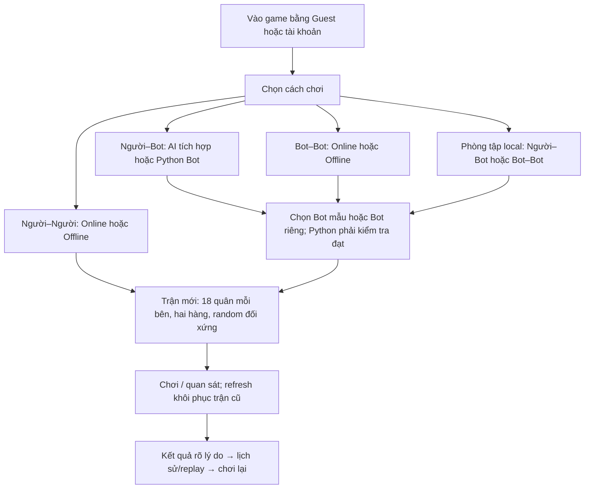
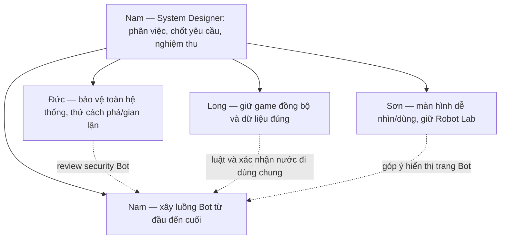
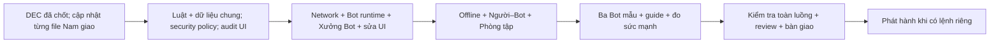

# BT01 — Tổng quan tính năng và phân công

Cập nhật: 2026-10-09 · Source đã rà soát: `a56e77bf5646222b8f7ddb224152e6ffec1b585f`.

| Nội dung | Trạng thái |
|---|---|
| Yêu cầu sản phẩm | **DEC-01…12 ĐÃ DUYỆT**, xem [01-QUYET-DINH](01-QUYET-DINH.md) |
| Phạm vi hiện tại | Phân tích/cập nhật tài liệu phân công và FRS; chưa phải lệnh triển khai code, migration hoặc deploy |
| Deadline chung | Nam, Long, Đức, Sơn: 48 giờ lịch, từ 00:00 thứ Bảy 10/10/2026 đến 00:00 thứ Hai 12/10/2026, giờ Việt Nam (UTC+7) |
| Website trên Render | Nam xác nhận deploy thành công, `PORT=10000`; lỗi PORT đã giải quyết |
| Tính năng mới/được sửa | Chưa nghiệm thu; deploy thành công không chứng minh mọi tính năng đã chạy đúng |
| File cá nhân và FRS | Còn **DRAFT**; chỉ cập nhật từng file khi Nam giao, chưa phải lệnh triển khai |

File này trả lời: **Sản phẩm cần làm gì? Ai làm? Làm theo thứ tự nào? Thế nào là xong?** Chi tiết kỹ thuật nằm trong FRS {đặc tả yêu cầu từng tính năng} sau khi được giao xử lý.

## 1. Người chơi sẽ sử dụng game như thế nào?

AI tích hợp hiện có chạy local; Người–Python Bot sẽ hỗ trợ Online và Offline. Online do server xác nhận bàn cờ, nước đi, đồng hồ, quyền và kết quả. Offline/Phòng tập chạy trên trình duyệt, không dùng kết quả local để cộng Elo {điểm xếp hạng}.

## 2. Tính năng cần giữ, cải thiện hoặc bổ sung

“Đã có” là kết quả đọc source, chưa chứng nhận hoạt động đầy đủ trên Render. **Cải thiện** là sửa/mở rộng phần hiện có; **Bổ sung** là hành vi mới phải làm.

| Nhóm tính năng | Việc cần làm | Tác động người chơi/hệ thống | Người chính |
|---|---|---|---|
| Luật và khởi tạo bàn | **Cải thiện:** 18 quân/bên, mỗi hàng 3R+3P+3S; Blue hàng 1–2, Red hàng 8–9; random đối xứng 180°, khác trận liền trước | Mỗi ván có bố trí mới. Mọi mode/Bot dùng cùng luật; không chỉ đổi hình bàn | Long; Nam/Sơn cập nhật phần sử dụng |
| Trận bị khóa nước | **Bổ sung:** bên đến lượt không có nước hợp lệ thì thua, mọi mode | Trận kết thúc đúng lý do; không treo hoặc báo lỗi Python thay tình huống luật | Long; Nam tích hợp Bot |
| Người–Người Online | **Giữ và kiểm tra:** phòng, ghép trận, Ready, lượt, đồng hồ, đầu hàng, chơi lại, mất mạng/vào lại | Hai người thấy cùng trận; refresh không đổi bàn hoặc nhân đôi nước đi | Long |
| Offline hai người và AI tích hợp | **Giữ và cập nhật luật:** chơi cùng máy hoặc với AI hiện có | Mode cũ còn chơi được; phiên đã lưu không bị ép đổi sang bàn mới | Long luật; Sơn UI; Nam phối hợp Bot/AI |
| Bot–Bot Online | **Cải thiện/kiểm chứng:** nộp Python, kiểm tra, chọn phiên bản, Ready, tự đấu, đổi code đúng lượt | Bot chạy trên server khi chủ rời UI theo policy; lỗi code khác lỗi hạ tầng | Nam; Long lifecycle; Đức review |
| Bot–Bot Offline | **Cải thiện/kiểm chứng:** tải bộ chạy, hai Bot độc lập, Run/Pause/Step/Speed, lưu/khôi phục | Chơi mất mạng sau khi chuẩn bị; khôi phục ở trạng thái dừng để kiểm tra | Nam |
| Người–Python Bot | **Bổ sung:** người tự đi quân đấu Bot mẫu hoặc Bot riêng, Online/Offline, không Ranked | Có cách đấu với chương trình; phân biệt bên người và bên Bot | Nam; Long phần dùng chung |
| Phòng tập | **Bổ sung luồng dễ dùng:** chọn Người–Bot/Bot–Bot, bên/Bot, bàn mới, tạm dừng, từng nước, tốc độ | Luyện không ảnh hưởng xếp hạng. Từng nước/tốc độ cho lượt Bot; chưa tự đặt quân/đi lại nước | Nam; Sơn UI dùng chung |
| Xưởng Bot và Library | **Cải thiện:** nộp/quản lý các bản code, kiểm tra, chọn bản đấu, xuất/xóa, xem lỗi riêng | Biết code nào đang chọn/đang đấu; bản mới lỗi không làm mất bản đang chạy | Nam; Đức review quyền riêng tư |
| Guideline và ba Bot mẫu | **Bổ sung:** hướng dẫn biến/input/output, bộ nhớ, giới hạn, bảng lỗi; mẫu tối giản → chiến thuật → nâng cao | Người mới đọc hiểu và tự viết Bot; mẫu chạy thật, không chỉ minh họa | Nam |
| Đo sức mạnh Bot | **Bổ sung:** kiểm tra kỹ thuật trước; 10 người × 4 trận, chia đều hai bên, mục tiêu ít nhất 30/40 thắng | Dùng số liệu thay quảng cáo “expert”; kết luận chỉ áp dụng nhóm thử đó | Nam; Long hỗ trợ số liệu |
| Lịch sử và replay | **Cải thiện:** lưu bàn ban đầu/phiên bản luật và nước được chấp nhận; giữ trận cũ | Xem lại đúng bàn random và lý do kết quả; không dựng trận cũ bằng luật mới | Long; Sơn hiển thị; Nam dữ liệu Bot |
| Guest, tài khoản, bạn bè, hồ sơ, cài đặt | **Giữ và kiểm tra ảnh hưởng:** đăng nhập/khôi phục, tên Guest, mời bạn, dữ liệu riêng, theme | Mode mới không phá luồng cũ hoặc đổi chủ Bot khi Guest đăng nhập | Đức auth; Long dữ liệu/network; Sơn UI |
| Trọng tài và khán giả | **Giữ và kiểm tra:** quyền khác host, xem trận, Start/Stop/Resume theo phạm vi đã duyệt | Khán giả không đi quân; trọng tài không đọc code riêng; dừng trận khóa hành động/đồng hồ đúng | Long; Đức review; Nam tích hợp Bot |
| Giao diện Robot Lab | **Cải thiện:** lỗi hiển thị, bố cục, chữ/nút, mobile, bàn hai hàng, thông báo lỗi | Dễ nhìn/dùng; giữ design-pattern, găng tay và hướng bàn đã duyệt | Sơn; Nam sửa trang Bot |
| Security và vận hành | **Kiểm tra/cải thiện xuyên suốt:** quyền, code độc hại, tài nguyên, dữ liệu riêng; hướng dẫn kiểm tra/triển khai/khôi phục | Chặn hành động trái phép; một Bot không làm hỏng game; team vận hành theo checklist | Đức security; Long vận hành; Nam runtime Bot |

Board vẫn 9×9; BLUE đi trước; A1/I9 vẫn chơi bình thường. Không thêm quân đặc biệt, redesign, IDE soạn code, giải đấu/bracket hoặc dịch vụ trả phí. Các luật cũ không bị DEC thay thế vẫn giữ nguyên.

## 3. Ai làm gì và hoàn thành khi nào?

DoD = Definition of Done {điều kiện để xác nhận hoàn thành}. Dưới đây là DoD cấp nhóm; từng task/FRS sẽ có checklist chi tiết khi Nam giao sửa file.

| Người | Việc làm dễ hiểu | Tác động chính | DoD cấp nhóm | File xử lý riêng |
|---|---|---|---|---|
| Nam | Làm trải nghiệm Bot: màn hình, nhận code, chạy an toàn, kết quả, Offline/Phòng tập, guide/mẫu | Người mới tự đưa Bot vào game, biết sửa lỗi | Luồng Bot chạy thật; guide giúp người mới tự làm; ba mẫu chạy được; Bot nâng cao đạt ít nhất 30/40 trận thắng theo quy trình đã chốt; review liên quan hoàn tất | [NAM.md](NAM.md) |
| Long | Giữ luật, lượt, đồng hồ, phòng/dữ liệu thống nhất; hướng dẫn kiểm tra/triển khai/khôi phục | Không có hai bàn khác nhau; refresh không nhân đôi nước/kết quả; replay đúng | Luật mới đúng; hai client hội tụ; ca mất mạng/lệnh lặp/lưu/khôi phục/replay đạt; runbook {hướng dẫn vận hành từng bước} đã được thử theo | [LONG.md](network-core/LONG.md) |
| Đức | Tìm cách phá/gian lận/lấy dữ liệu; làm hoặc yêu cầu owner sửa; kiểm tra lại | Người không có quyền bị chặn; Python không đọc dữ liệu riêng hoặc chiếm tài nguyên vô hạn | Có rủi ro/cách thử/kết quả; lỗi nghiêm trọng đã sửa/retest; giới hạn chưa kiểm chứng rõ, không hứa an toàn tuyệt đối | [DUC.md](security/DUC.md) |
| Sơn | Sửa chữ/nút/bàn/layout, màn lớn nhỏ, loading/lỗi; giữ phong cách | Đọc được thông tin, tìm đúng nút và biết làm gì khi lỗi | Có ảnh trước/sau; kiểm tra viewport, sáng/tối, bàn phím, trạng thái liên quan; không che nút/chữ/quân, không thay luật/quyền | [SON.md](SON.md) |

Nam vừa phân việc vừa viết Bot; phần Nam viết cần người khác review. Đức phụ trách Security toàn hệ thống; Nam vẫn phải triển khai security trong module Bot. Sơn góp ý trang Bot; Nam sửa, hoặc bàn giao writer rõ ràng cho Sơn.

**Phần việc chung Long–Đức giao Long triển khai:** code/config/harness tích hợp LD-01…LD-06, candidate và integration fixes theo [LONG.md](network-core/LONG.md#10-thực-thi-song-song-longđức). Đức giữ auth/security modules riêng, policy/attack fixtures và review/retest; code Đức viết cần reviewer khác. Effort tích hợp nằm trong 48 giờ của Long.

**Không cần vai trò DevOps riêng.** Long viết hướng dẫn: mở ở đâu → nhập/chạy gì → kết quả đúng → lỗi thì xử lý/báo ai. Nam quyết định phát hành; Đức kiểm tra secrets/quyền. Deploy đã thành công không thay hướng dẫn cho lần cập nhật sau.

## 4. Cách viết task để thành viên mới làm được

| Phần trong task | Phải trả lời được |
|---|---|
| Mã + mục tiêu | Task nào? Giải quyết vấn đề gì cho người chơi? |
| Trước khi bắt đầu | Cần file/đầu vào/quyết định nào, ai cung cấp, cách biết đã đủ? |
| Việc làm theo thứ tự | Bước 1, 2, 3 cụ thể; file được sửa; ví dụ bắt đầu; chưa làm phần nào |
| Kết quả và tác động | Người chơi thấy/làm được gì? Ảnh hưởng phần nào, cần phối hợp ai? |
| Lỗi và quyền | File sai, mất mạng, thiếu quyền, bộ chạy bận thì hiện gì/làm gì? |
| DoD | Thao tác/lệnh kiểm tra, kết quả mong đợi, ảnh/log/report phải nộp, người review |

**Ví dụ N-01 — kiểm tra Python Bot Online:**

| Nội dung | Cách viết dễ thực hiện |
|---|---|
| Mục tiêu | Python hợp lệ kiểm tra/chạy được; lỗi code và lỗi bộ chạy báo khác nhau |
| Việc làm | Dùng mẫu hợp lệ tái hiện → tìm bước thất bại → sửa → thử lại; thử file sai/chạy quá lâu trong sandbox {môi trường cô lập} |
| Tác động | Nút Kiểm tra/Ready dùng đúng lúc; Bot không đọc dữ liệu server hoặc làm treo website |
| DoD | Mẫu hợp lệ đạt kiểm tra và tạo nước được chấp nhận; mẫu sai báo đúng lỗi; chương trình quá lâu bị dừng; website còn dùng được; có bằng chứng và Đức review |

Kỹ thuật chi tiết đi sau phần giải thích. Thành viên dùng AI viết code vẫn phải tự chạy checklist và hiểu kết quả mình nộp.

| Thuật ngữ gặp trong bộ tài liệu | Hiểu ngắn gọn |
|---|---|
| Runtime / SDK | Bộ chạy Python / giao ước về dữ liệu Bot nhận và kết quả Bot trả |
| Contract | Cấu trúc dữ liệu thống nhất để các phần nói chuyện đúng với nhau |
| Lifecycle | Các bước của trận, từ tạo/phòng chờ đến đang chơi/dừng/kết thúc |
| Auth / session | Xác định ai đang dùng hệ thống / phiên đăng nhập hoặc Guest |
| Policy / scope | Quy định phải tuân theo / phạm vi công việc được giao |
| Evidence / retest | Bằng chứng đã kiểm tra / thử lại sau khi sửa lỗi |

## 5. Thứ tự giao việc

| Giai đoạn | Đầu vào/việc làm | Đầu ra để chuyển bước |
|---|---|---|
| 0 — Tài liệu | DEC đã chốt; Nam chọn từng file cá nhân/FRS để sửa | File đúng DEC, dễ hiểu, đủ DoD/owner; Nam giao READY từng task |
| 1 — Nền tảng | Long luật/dữ liệu chung; Đức rủi ro/policy; Sơn ghi lỗi UI; Nam input/output Bot | Luật, cấu trúc dữ liệu, quyền và ca kiểm tra thống nhất |
| 2 — Luồng hiện có | Long Network/lifecycle; Nam runtime/Xưởng Bot; Đức auth/security; Sơn UI | Candidate {bản để kiểm tra} chạy được; lỗi có thông báo/cách khắc phục |
| 3 — Mode mở rộng | Nam Offline/Người–Bot/Phòng tập; Long/Sơn tích hợp phần chung | Bắt đầu → chơi → lỗi/khôi phục → kết quả/lịch sử đúng |
| 4 — Học và đo | Hoàn thiện mẫu/guide; khóa quy trình trước đo kỹ thuật và 40 trận | Người mới tự tạo được Bot; có số liệu. Chưa đạt 30/40 thì tiếp tục cải thiện, chưa nghiệm thu mục tiêu Bot nâng cao |
| 5 — Bàn giao | Owner nộp evidence; sửa lỗi review; Long hướng dẫn vận hành; Nam nghiệm thu | DoD đạt theo scope; mục chưa đạt ghi rõ, không gọi toàn bộ DONE |
| 6 — Phát hành | Candidate đã kiểm tra; lệnh remote/database đúng phạm vi | Deploy đúng bản, kiểm tra lại luồng/khôi phục; không chỉ nhìn build xanh |

Các giai đoạn trên là thứ tự phụ thuộc trong deadline chung 48 giờ, không phải mỗi giai đoạn một ngày. Việc độc lập làm song song nếu không trùng file. **Reviewer bắt đầu khi có candidate**, tác giả sửa/retest rồi mới DONE. Policy security là đầu vào sớm; verdict đến sau implementation, không đợi nhau thành vòng.

| Checkpoint chung | Nam | Long | Đức | Sơn |
|---|---|---|---|---|
| 10/10 — nền tảng và candidate | Runtime/SDK và Bot consumer; đưa candidate cho review ngay khi có | Contracts/rules, commit/persistence seam; baseline/admission/sync | Threat/auth/CSRF và external abuse controls; chuẩn bị/chạy runtime fixtures | Audit UI, board/shared layout và error states; review candidate |
| 11/10 — tích hợp và nghiệm thu | Hoàn thiện luồng Bot/Offline/Phòng tập, samples/guide/benchmark và sửa findings | Recovery/replay, consumer/load/failure retest, runbook | Attack/runtime regression, retest findings, scoped sign-off | UI integration, viewport/theme/accessibility regression và evidence |

Bàn giao interface/fixture và candidate sớm; không chờ hết ngày 10/10 mới phối hợp. Báo thiếu dependency ngay khi phát hiện; không tự bỏ tính năng/gate để kịp giờ. Đến deadline, từng task phải có verdict/evidence thật; thiếu evidence không gọi DONE. Phát hành vẫn cần lệnh riêng.

## 6. Quy tắc sửa file chung

Writer = người đang được giao sửa file. Mỗi thời điểm chỉ một writer cho file chung; người khác gửi yêu cầu hoặc nhận bàn giao trước khi sửa.

| Phạm vi | Writer | Phối hợp |
|---|---|---|
| `packages/game-rules/**` | Long | Nam nêu yêu cầu Bot/AI; Sơn render kết quả, không tự xếp quân |
| `packages/contracts/**`, `prisma/**`, `apps/server/src/app.ts` | Long | Nam/Đức yêu cầu field/quyền; Long tích hợp dữ liệu chung |
| Backend `match/room/matchmaking/realtime/history` | Long | Nam dùng nơi xác nhận nước chung; Đức review quyền/lệnh đồng thời |
| Backend `bot-library/bot-online`, `packages/bot-sdk/**` | Nam | Đức kiểm tra an toàn; Long review lifecycle |
| Bot pages, frontend services Bot, sandbox/Worker | Nam | Sơn đề xuất hiển thị hoặc nhận writer trước khi sửa |
| Router, board/UI dùng chung, styles/theme, trang ngoài Bot | Sơn | Logic ngoài hiển thị phối hợp owner; không tự đổi luật/clock/result |
| Auth/session, policy/plugin security mới | Đức | Long tích hợp chung; Nam kiểm tra Guest Bot |
| Env/build/release scripts, deployment docs | Long | Nam yêu cầu probe Bot; Đức review secrets/quyền |

Mỗi task ghi file sẽ sửa. Chuyển writer ghi người nhận và commit {mốc phiên bản code}; file mới chưa có owner thì Nam phân trước. Không reset/xóa thay đổi người khác để lấy bản “sạch”.

## 7. FRS nào mô tả tính năng nào?

Các link dưới vẫn là **bản nháp cũ**. DEC được duyệt không tự biến FRS thành bản đã cập nhật hoặc task READY; cần bổ sung DEC-08…12 khi Nam giao sửa file tương ứng.

| FRS | Nội dung cần đặc tả dễ hiểu | Owner | Đầu vào chính |
|---|---|---|---|
| [FRS-L01](network-core/FRS-L01-GAME-RULES-SETUP.md) | Hai hàng random, refresh, luật bí nước, giữ trận cũ | Long | DEC-01/02/03/11 |
| [Network Core](network-core/README.md) | Cùng trận/quyền/lượt/clock; mất mạng, lưu/khôi phục/replay | Long | Luật/mode mới; DEC-06/11 |
| [FRS-03](frs/FRS-03-WORKBENCH-SDK.md) | Nộp/quản lý code; kiểm tra; hướng dẫn biến/trả nước/sửa lỗi | Nam | Luật/input/output chung; DEC-09 |
| [FRS-04](frs/FRS-04-BOT-ONLINE.md) | Python an toàn trên server; Ready/revision/lỗi/dừng/khôi phục | Nam | Network + SDK + policy Đức; DEC-11 |
| [FRS-05](frs/FRS-05-BOT-OFFLINE.md) | Bộ chạy, hai Bot, điều khiển, lưu/khôi phục mất mạng | Nam | Luật + SDK + policy Đức; DEC-11 |
| [FRS-06](frs/FRS-06-NGUOI-DAU-BOT.md) | Người–Python Bot/Phòng tập; điều khiển đúng bên | Nam | DEC-04/05/08/11; runtime/luật chung |
| [FRS-07](frs/FRS-07-BOT-MAU-BENCHMARK.md) | Ba mẫu, giải thích, kiểm tra kỹ thuật và 40 trận | Nam | DEC-07/09/10/12; runtime/luật đã kiểm tra |
| [Security — FRS-D01…D07](security/README.md) | Threat model, auth/quyền, sandbox, anti-cheat/privacy, chống automation phá hoại và nghiệm thu | Đức | Policy sớm; attack/runtime tests khi có candidate; handoff Long–Đức cuối DUC.md |
| [FRS-09](frs/FRS-09-UI-USABILITY.md) | Màn hình/thao tác/bố cục/lỗi/mobile/keyboard/theme | Sơn | Robot Lab và state/luồng đã chốt |
| [FRS-L07](network-core/FRS-L07-CAPACITY-INTEGRATION-RUNBOOK.md) | Kiểm tra/evidence/hướng dẫn vận hành/điều kiện phát hành | Long điều phối | Candidate, DoD và review scope bàn giao |

Không dùng số task/requirement cũ làm chứng nhận “đã cover hết” DEC mới. [03-TRACEABILITY](03-TRACEABILITY.md) cần đồng bộ khi sửa task/FRS; hiện chưa bao phủ đầy đủ DEC-08…12.

## 8. DoD chung trước khi trả task cho Nam

| Kiểm tra | Thành viên phải chứng minh |
|---|---|
| Đúng yêu cầu | Đúng task/DEC; không tự thêm tính năng/đổi luật |
| Chạy được | Đi hết luồng bình thường bằng UI/API/runtime thật đúng phần được giao; build chưa đủ |
| Xử lý lỗi | Có ca dữ liệu sai/thiếu quyền/mất mạng/bộ chạy lỗi phù hợp; thông báo và cách khắc phục rõ |
| Không phá phần khác | Kiểm tra consumer {phần dùng dữ liệu/code chung} bị ảnh hưởng; dữ liệu/replay cũ còn đúng |
| Bàn giao đủ | File sửa, cách thử lại, ảnh/log/report, phiên bản/môi trường; PASS/FAIL/NOT RUN/SKIP rõ |
| Review/dọn dẹp | Reviewer đã xem/thử evidence; lỗi cần sửa đã retest; chỉ xóa code cũ sau khi xác định không còn dùng |

Bằng chứng có thể là ảnh trước/sau, video thao tác, log đã bỏ dữ liệu riêng, test report. AI viết code không thay evidence. Test ghi dữ liệu phải dùng database test riêng xác định rõ. Không chạy player Python trong process ứng dụng hoặc bằng native Python không giới hạn.

| Trạng thái task | Nghĩa dễ hiểu |
|---|---|
| DRAFT | File cần phân tích/cập nhật; chưa giao triển khai |
| READY | Nam đã giao; đủ yêu cầu/đầu vào/file ownership để bắt đầu |
| IN_PROGRESS | Đang thực hiện, chưa nghiệm thu |
| BLOCKED | Có vướng mắc cụ thể; rõ đang chờ ai/điều gì |
| REVIEW | Có bản và evidence để người khác kiểm tra |
| DONE | DoD/review task đã đạt; không đồng nghĩa toàn dự án xong |

## 9. Hiện trạng cần tiếp tục xác minh

| Phát hiện source/log trước | Hiểu đúng ở thời điểm cập nhật | Việc tiếp theo khi được giao |
|---|---|---|
| Setup 9 quân cố định; replay gọi setup hiện tại; chưa rule bí nước riêng | Chưa đáp ứng DEC-01/02/03/11 | Long luật/data/replay; Nam/Sơn cập nhật consumer |
| Log Render cũ có PORT100000 và consumer preflight fail | **Nam xác nhận sửa PORT và deploy thành công.** Bot preflight chưa có kết quả mới trong chat | Không sửa PORT tiếp; Nam xác minh Bot trên đúng bản deploy |
| Offline có sandbox/kit/attestation/restore | Có nền tảng/evidence cũ; cần kiểm tra bản bàn giao | Nam/Đức kiểm chứng luồng và isolation {cô lập} thật |
| Template chọn nước hợp lệ đầu tiên; chưa benchmark mới | Chưa có đủ ba mẫu/guide và kết quả30/40 theo DEC mới | Nam SDK/guide/reference bot/phép đo |
| PlayHTML adapter còn skeleton; room/match có SSE trực tiếp | Đối chiếu tài liệu/capability với đường đang chạy, không kết luận toàn bộ Online hỏng | Long kiểm tra theo DEC-06 |
| Auth/social/referee/UI có source/evidence lịch sử | Cần regression {kiểm tra phần cũ vẫn đúng} khi thêm luật/mode | Owner đưa ca kiểm tra vào task/FRS được giao |

[02-HIEN-TRANG](02-HIEN-TRANG.md) là snapshot audit ban đầu; dòng PORT trong đó là lịch sử. [04-REVIEW-DRAFT](04-REVIEW-DRAFT.md) chỉ review bản nháp trước lượt này, không chứng nhận 00/01 mới hoặc ứng dụng đã đạt.

## 10. Cách tiếp tục cùng Nam

**Chọn file → phân tích việc/tác động/DoD → MCQ trong chat nếu có quyết định mới → sửa đúng file được giao → kiểm tra và báo kết quả.** Không hỏi lại DEC đã chốt. Chi tiết triển khai cần làm rõ trong đúng task/FRS, không tự điền thành quyết định sản phẩm.

Yêu cầu đã duyệt; quyền sửa file theo từng lệnh Nam. Push, phát hành tiếp theo, thay đổi database dùng chung/production hoặc dịch vụ trả phí không được suy ra từ lệnh cập nhật tài liệu.
