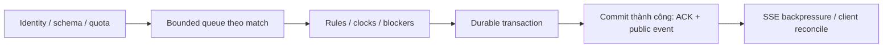

# BT01 — Các quyết định đã chốt

Cập nhật: 2026-10-09 · Người quyết định: Nam (System Designer).

**DEC-01 đến DEC-20 đã duyệt; deadline hiện hành theo DEC-29/30 dưới đây.** Các quyết định là yêu cầu, chưa phải bằng chứng tính năng/capacity đã đạt. Security được đặc tả theo lựa chọn đã chốt tại [DUC.md](security/DUC.md) và bộ FRS tương ứng.

| ID | Quyết định hiện hành | Áp dụng |
|---|---|---|
| DEC-29 | 48 giờ lịch: 00:00 thứ Bảy 10/10/2026 → 00:00 thứ Hai 12/10/2026, UTC+7 | Toàn bộ ngày thứ Bảy và Chủ nhật |
| DEC-30 | Deadline áp dụng cho tất cả thành viên: Nam, Long, Đức, Sơn | Thay lịch ba ngày trước đó; giữ ownership, scope và gates; báo dependency/blocker sớm |
| DEC-31 | Long là owner duy nhất phần code tích hợp chung LD-01…LD-06, config/budgets, candidate và integration fixes; khóa interfaces sớm, bàn giao/retest liên tục | Đức giữ auth/security modules riêng, policy/attack fixtures và review/retest. Code Đức viết cần reviewer khác; nghiệm thu vẫn đủ dependencies/evidence. Effort tích hợp thuộc lịch 48 giờ của Long |

## 1. Luật bàn cờ và trận đấu

| ID | Quyết định đã duyệt | Người chơi thấy gì? | Tác động cần xử lý |
|---|---|---|---|
| DEC-01 | Giữ ba loại R/P/S, không có quân chính đặc biệt. Mỗi bên 18 quân trên hai hàng: Blue hàng 1–2, Red hàng 8–9; mỗi hàng 3 quân mỗi loại | Bàn cờ dày hơn, mỗi bên có 6R + 6P + 6S | Long sửa luật khởi tạo/số quân; Nam cập nhật Bot và bài kiểm tra; Sơn kiểm tra hiển thị |
| DEC-02 | Refresh trình duyệt khôi phục đúng trận cũ. Chỉ Tạo trận mới/Chơi lại/Reset mới random bàn | Tải lại trang không mất trận hoặc được đổi bàn để tìm lợi thế | Phải lưu bàn ban đầu, lượt, đồng hồ và trạng thái; Online không cho một phía reset bằng reload |
| DEC-03 | Hoán vị quân trong từng hàng; hai bên đối xứng bằng phép quay 180°. Bàn trận mới phải khác bàn trận liền trước | Mỗi ván có bố trí mới nhưng hai bên có cách xếp tương ứng | Sinh/lưu seed {giá trị để tái tạo bố trí} và version; kiểm tra không lặp ngay; không hứa không bao giờ lặp trong lịch sử |
| DEC-11 | Bên đến lượt không còn nước hợp lệ sẽ thua vì **bị khóa nước**, áp dụng mọi mode | Trận tự kết thúc với lý do rõ ràng thay vì đứng im chờ | Long thêm điều kiện kết thúc dùng chung; kiểm tra trước khi gọi Bot; không quy thành lỗi code Python |

Đây là thay đổi mới so với setup cố định 9 quân/bên và luật kết thúc cũ. Bàn vẫn 9×9; A1/I9 vẫn là ô chơi có quân ban đầu. Các luật di chuyển, ăn quân, goal, BLUE đi trước và quy tắc giới hạn Bot đã duyệt trước đây giữ nguyên, trừ phần được các DEC trên thay thế.

## 2. Người–Bot, Phòng tập và Bot mẫu

| ID | Quyết định đã duyệt | Người chơi làm được gì? | Tác động cần xử lý |
|---|---|---|---|
| DEC-04 | Người–Python Bot Online thuộc đợt này, có FRS riêng, chơi Unranked {không tính điểm xếp hạng} | Người tự đi quân, Bot tự tính nước trên server | Phân biệt bên do người điều khiển/bên do Bot điều khiển; cùng dùng luật và nơi xác nhận nước đi |
| DEC-05 | Đối thủ Python là Bot mẫu hệ thống hoặc Bot riêng của người chơi. Phòng tập chạy local {trên trình duyệt}, không Elo; giữ phân biệt AI tích hợp và Python Bot | Chọn đối thủ phù hợp, luyện tập mà không ảnh hưởng xếp hạng | Không tự lấy code riêng của người khác; nguồn Bot, quyền đọc và lịch sử phải rõ |
| DEC-08 | Phòng tập hỗ trợ Người–Bot và Bot–Bot; chọn bên/Bot, tạo bàn mới, tạm dừng, từng nước, tốc độ quan sát. Chưa thêm tự đặt quân hoặc đi lại nước | Quan sát và thử chiến thuật theo các bước dễ hiểu | Từng nước/tốc độ dùng cho lượt Bot; lượt người vẫn do người chọn nước. Điều khiển luyện tập không cấp quyền reset/undo trận Online |
| DEC-09 | Cung cấp ba Bot mẫu: tối giản để học, có chiến thuật, nâng cao để thi đấu; giải thích từng phần | Bắt đầu bằng ví dụ ngắn rồi nâng cấp dần code của mình | Nam giao ba file chạy được, hướng dẫn, bài kiểm tra; không chỉ đưa một đoạn code dài khó hiểu |

## 3. Đánh giá sức mạnh Bot

| ID | Quyết định đã duyệt | Cách hiểu khi giao việc |
|---|---|---|
| DEC-07 | Tách kiểm tra kỹ thuật khỏi đo sức mạnh. Thống nhất nhóm thử, số trận/bàn, đổi bên, thời gian và cách tính trước khi đo | Bot phải chạy đúng/an toàn trước; thắng Bot ngẫu nhiên chưa chứng minh mạnh hơn người. DEC-10/12 cụ thể hóa phép đo |
| DEC-10 | Mục tiêu là **thắng ít nhất 75% số trận với nhóm người chơi thử đã thống nhất** | Không diễn giải thành “mạnh hơn 75% toàn bộ người chơi”; chưa có kết quả thì chưa gắn nhãn expert |
| DEC-12 | Sau kiểm tra kỹ thuật: **10 người × 4 trận = 40 trận**; mỗi người chơi hai bên bằng nhau; mục tiêu **ít nhất 30 trận thắng** | Người thử biết luật và chơi thử trước. Lưu từng trận và tổng kết; đây là mục tiêu, chưa phải kết quả đã đạt |

Nam cần khóa danh sách người thử, cấu hình thời gian, các bàn thử và cách ghi nhận trận lỗi/hạ tầng trước khi chạy benchmark {đợt đo có quy trình}. Chi tiết này sẽ được viết khi xử lý FRS-07; không tự thêm/bớt trận để đạt tỷ lệ mong muốn.

## 4. Phân công và cách làm tài liệu

| ID | Quyết định |
|---|---|
| DEC-06 | Long giữ quyền sửa các phần dùng chung về luật, dữ liệu trao đổi và trận đấu; Đức audit/triển khai auth + security. HTTP/SSE hiện có là nền tảng, chưa đổi cách truyền dữ liệu nếu chưa được Nam duyệt |
| HUMAN-01 | Nam phụ trách Bot end-to-end; Long Network Core; Đức Security toàn hệ thống; Sơn sửa hiển thị/bố cục, giữ design-pattern Robot Lab |
| HUMAN-02 | Nam phân phối và nghiệm thu nhiệm vụ. Thành viên nhận file có thứ tự, đầu vào, việc cần làm, đầu ra và DoD {điều kiện hoàn thành} |
| HUMAN-03 | Yêu cầu random và thêm hàng áp dụng các mode liên quan; cách thực hiện chính xác theo DEC-01/02/03, không random lại chỉ vì refresh |
| HUMAN-04 | Tài liệu tiếng Việt, ngắn gọn; ưu tiên lược đồ → bảng → bullet. Giải thích thuật ngữ ngay nơi dùng; kỹ thuật phải gắn với việc làm và tác động |
| HUMAN-05 | Guideline giúp người mới tự viết/nộp/sửa Bot; code sinh viên chạy trong môi trường cô lập, có kiểm soát tài nguyên và chống truy cập trái phép |
| HUMAN-06 | Trao đổi MCQ + khuyến nghị trực tiếp trong chat. Chỉ phân tích/sửa file khi Nam chỉ định; không tự sửa cả bộ tài liệu hoặc ứng dụng |

## 5. Network Core — phạm vi, capacity và How

| ID | Quyết định đã duyệt | Tác động / điều kiện nghiệm thu |
|---|---|---|
| DEC-13 | Chia phạm vi Long thành **7 FRS**: Rules/Setup; Contracts; Room/Matchmaking; HTTP/SSE/Sync; Match Authority/Clocks; Persistence/Recovery/Replay; Observability/Integration/Runbook | Một spec chính cho mỗi nhóm; có mapping chuyển FR/AC từ FRS-01/02/10 cũ. Chưa tạo/chuyển/xóa FRS trong lượt này |
| DEC-14 | Long sở hữu cả server và **shared client network**: API client, SSE subscription, state reconciliation. Nam/Sơn tích hợp vào trang thuộc ownership của mình | Long giữ network service/store; Nam giữ Bot runtime/SDK/private Bot API; Sơn giữ router/layout/Robot Lab. Thay page đang có network logic phải bàn giao writer |
| DEC-15 | Đo riêng **lobby, PvP và Python Bot**; báo CCU, active matches, streams, requests/s; khóa mixed-workload profile trước test | Không gộp người duyệt trang với người đang đấu; không dùng mock Bot để chứng nhận capacity Python; ghi tỷ lệ actor, tần suất nước và spectator |
| DEC-16 | Giữ **1.000 / 5.000 / 10.000** làm mục tiêu benchmark. Admission theo capacity an toàn đã đo | Báo từng mốc đạt/không đạt/chưa chạy; ghi offered/admitted/completed/rejected/timeout. Xếp hàng hoặc từ chối không tính là phục vụ đủ; chưa có kết quả capacity |
| DEC-17 | Tối đa throughput trong giới hạn latency/memory, **có headroom**; so CPU/nước đi, RAM/kết nối và bytes/event với baseline | Không đặt sustained CPU/RAM 95–98% làm mục tiêu. Đo tài nguyên toàn instance gồm Bot subprocess; ngưỡng quota/admission lấy từ evidence, không đoán |
| DEC-18 | ACK nước **người**: server p95 ≤300ms, p99 ≤1s; không sai, mất hoặc nhân đôi nước đã ACK. Không tính Internet RTT hoặc Python compute | Tính cả auth/validation, queue wait, xử lý và durable commit trước ACK; không bỏ queue wait hoặc giấu timeout để đạt số. Bot latency báo riêng |
| DEC-19 | **Snapshot bàn gọn + clock pulse riêng**; full snapshot khi join/reconnect/resync. Chưa dùng delta patch cho từng thay đổi | Live snapshot không gửi lặp toàn bộ moves/timeline; pulse không ghi durable event/checkpoint mỗi giây. Client chỉ hiển thị clock từ server anchor, server vẫn xử timeout |
| DEC-20 | Giữ **topology deployment hiện tại trong đợt thực thi 48 giờ**; tối ưu điểm nghẽn đo được trước khi cân nhắc tách frontend | Không tự tách Render Static, đổi transport, thêm cluster/microservices/dịch vụ ngoài hoặc trả phí trong đợt này. Thay production vẫn cần lệnh riêng |

### How chuyển vào nhiệm vụ của Long

Các cơ chế dưới đây là thiết kế để đáp ứng DEC đã duyệt; chưa phải implementation hoặc số đo. Field names/timeout/quota/algorithm chi tiết phải khóa trong FRS/contract trước khi Dev.

| Cơ chế | Cách làm / tác dụng |
|---|---|
| Serialized commit + idempotency | Một lane hữu hạn theo trận; command ID/version được xác minh. Retry cùng command không ghi hai nước; không dùng global lock khiến trận khác chờ |
| Durable-before-ACK | Tính next state riêng; transaction DB hiện có lưu move/checkpoint/command outcome và Bot memory/revision liên quan. Commit xong mới công bố/ACK; unknown outcome phải đối chiếu trước retry |
| Clock / stream tạm thời | Tách pulse/heartbeat khỏi durable domain event; scheduler do server sở hữu, không phụ thuộc subscriber; live payload gọn, public/private projection độc lập |
| Capacity controller | Quota riêng cho gameplay/lobby/history/Bot; NORMAL/PRESSURE/RECOVERY có hysteresis. Ưu tiên trận đang chạy; chặn admission mới khi hết ngân sách, queue không vô hạn |
| Backpressure / fault isolation | Bounded buffers, deadline và cleanup theo stream/queue/subsystem; listener lỗi không ngắt fan-out khác; cache/coalesce tác vụ phụ, retry có giới hạn |
| Recovery | Backoff + jitter; xác thực lại role; restore setup/clock/blockers cùng revision/memory; bỏ invocation cũ. Không phục hồi an toàn thì neutral abort theo policy, không xử thua do hạ tầng |

**Ranh giới bảo vệ:** lỗi cục bộ/traffic ngoài trận phải được cô lập trong ngân sách đã đo. Process crash/OOM/restart hoặc dependency chung mất có thể gián đoạn nhiều trận; dùng bounded recovery, không hứa zero interruption trên một instance. Nếu chưa ghi bền được thì không ACK thành công để rồi mất nước.

**Deadline chung 48 giờ không phải chứng nhận đủ capacity hoặc quyền tự cắt scope.** Baseline/harness bắt đầu sớm; payload-clock → admission/backpressure/isolation → durable recovery + retest. Thiếu gate thì ghi FAIL/NOT RUN/BLOCKED, không âm thầm bỏ tính năng.

## 6. Ghi nhận phê duyệt và trạng thái thực tế

| Nguồn xác nhận trong chat | Nội dung được xác nhận |
|---|---|
| “Từ DEC-01 đến DEC-07 chọn theo khuyến nghị” | Duyệt chung DEC-01…07; không ghi thành bảy lần trả lời riêng |
| “08 - 10 A” | Duyệt DEC-08A, DEC-09A, DEC-10A |
| “DEC-11A 12A” | Duyệt DEC-11A, DEC-12A |
| “13A 14A” | Duyệt chung DEC-13A/14A: bảy FRS và ownership cả shared client network |
| “15 - 18A” | Duyệt chung DEC-15A…18A; không ghi thành bốn lần trả lời riêng |
| “19A 20A” | Duyệt chung DEC-19A/20A: payload gọn/pulse và giữ topology hiện tại |
| “Đã deploy thành công lên Render.com Port 10000 nhé.” | Nam xác nhận đã deploy thành công; lỗi PORT được giải quyết |
| “Xử lí 01, 00” | Cho phép cập nhật đúng hai tài liệu này; không phải lệnh lập trình/deploy/migration |
| “Okay, bắt đầu sửa” sau đề xuất sửa 01 và LONG.md | Cho phép cập nhật đúng 01/LONG.md ở lượt này; chưa phải lệnh sửa bảy FRS, lập trình hoặc thay production |

Thông tin deploy do Nam xác nhận; lượt cập nhật tài liệu không tự chạy lại kiểm tra production. Việc website đã lên không tự chứng minh Python Bot hoặc các tính năng mới đã đạt nghiệm thu.

## 7. Áp dụng khi xử lý file tiếp theo

1. Dùng quyết định trong file này làm đầu vào; không hỏi lại điều đã chốt nếu chưa có mâu thuẫn mới.
2. 00/02/03/04, file cá nhân khác và FRS chưa được đồng bộ DEC-13…20 trong lượt này. Khi Nam giao file nào, sửa status/mapping/ownership và bổ sung giải thích/DoD cho file ấy; không dùng giới hạn DEC cũ để coi DEC mới chưa duyệt.
3. Đồng bộ luật, contract {cấu trúc dữ liệu thống nhất}, test và tài liệu lịch sử theo phiên bản khi được giao triển khai. Giữ evidence cũ; không coi chúng là bằng chứng cho luật mới.
4. Phê duyệt yêu cầu khác với nghiệm thu. Task chỉ DONE khi đạt DoD, có kiểm tra và review đúng phạm vi. Push/deploy tiếp theo hoặc thay đổi database dùng chung vẫn cần lệnh riêng.
