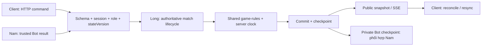

# BT01 — Hiện trạng source và phần cần hoàn thiện

Cập nhật: 2026-10-09 · Source: `a56e77b` và working tree tại thời điểm đọc.

Đối chiếu [DEC-01…12 đã duyệt](01-QUYET-DINH.md). Đây là **source audit có mục tiêu**, chưa chạy application/runtime/browser/DB tests trong lượt sửa tài liệu này. “Có source” không có nghĩa “đã nghiệm thu”.

## 1. Cách đọc hiện trạng

| Nhãn | Ý nghĩa khi giao việc |
|---|---|
| BỔ SUNG | Chưa thấy cơ chế đáp ứng yêu cầu mới trong phần source đã đọc |
| CẢI THIỆN | Có cơ chế nền; cần sửa hoặc mở rộng cho scope mới |
| KIỂM CHỨNG | Có implementation; cần chạy ca thực tế để biết có đạt hay không |
| ĐÃ XÁC NHẬN BỞI NAM | Thông tin Nam báo trong chat; không phải lượt kiểm thử độc lập |

## 2. Luật, mode và replay

| Mã / nguồn | Hiện tại | Cần làm → tác dụng | Owner / điều kiện nghiệm thu |
|---|---|---|---|
| SRC-01 · [setup.ts](../../packages/game-rules/src/setup.ts) | `createInitialState()` không nhận seed; cố định 9 quân/bên, 3 mỗi loại | **BỔ SUNG deterministic setup + version:** 18 quân/bên; mỗi hàng 3R+3P+3S; đối xứng 180°; khác ván liền trước → tái tạo đúng bàn random | Long; cùng seed/version cho cùng bàn; đủ quân, không đè ô; DEC-01/03 |
| SRC-02 · [engine.ts](../../packages/game-rules/src/engine.ts), [coordinates.ts](../../packages/game-rules/src/coordinates.ts) | `applyMove()` xử extinction/goal; chưa có terminal rule khi bên kế tiếp hết nước hợp lệ | **BỔ SUNG blocked-move adjudication:** xác định bên đến lượt bị khóa nước → kết thúc tự động, không gọi Bot rồi xử lỗi tác giả | Long; fixture bị khóa kết thúc đúng, fixture còn nước tiếp tục; DEC-11 |
| SRC-03 · [match.manager.ts](../../apps/server/src/modules/match/match.manager.ts), [ReplayPanel.tsx](../../apps/web/src/components/history/ReplayPanel.tsx), [history.ts](../../packages/contracts/src/history.ts) | Tạo/rematch/replay dùng setup cố định; replay contract chưa mang initial setup/version | **CẢI THIỆN versioned replay:** lưu bàn đầu, luật, nước accepted → trận mới và trận cũ đều xem lại đúng | Long data/contract; Sơn replay UI; Nam Bot consumer. Final board replay phải bằng bản lưu |
| SRC-04 · [rooms.ts](../../packages/contracts/src/rooms.ts), [LocalGamePage.tsx](../../apps/web/src/pages/LocalGamePage.tsx) | `playMode` là MANUAL/BOT; có AI và hai người local, có restore local | **BỔ SUNG per-slot controller:** HUMAN/PYTHON/BUILTIN_AI theo mode → cho Người–Python Bot hoạt động đúng bên | Long shared contract/lifecycle; Nam mode Bot; test không gửi lệnh người thay lượt Bot; DEC-04/05 |

Giữ bàn 9×9, BLUE đi trước, A1/I9 là ô chơi bình thường, movement/capture/goal và quy tắc Bot đã duyệt. DEC-01/03/11 thay thế đúng phần setup và terminal rule cũ; không thêm quân đặc biệt.

## 3. Network Core — kỹ thuật hiện có và việc của Long

Sơ đồ là luồng đích cần đặc tả/test; không xác nhận mọi bước đã hoàn chỉnh. Network Core gồm giao thức, đồng bộ trạng thái, xử lý lệnh, lifecycle và recovery; phần luật/data là dependency Long đã được giao theo DEC-06.

| Mã / nguồn | Thuật ngữ / hiện trạng | Long cần xử lý → hệ thống được gì | DoD tối thiểu |
|---|---|---|---|
| SRC-10 · [match.route.ts](../../apps/server/src/modules/match/match.route.ts), [room.route.ts](../../apps/server/src/modules/room/room.route.ts), [playhtml.adapter.ts](../../apps/server/src/realtime/playhtml.adapter.ts) | **HTTP commands / SSE:** có route SSE trực tiếp; PlayHTML adapter vẫn `not_implemented` | Khóa transport contract, heartbeat/cleanup/backpressure và snapshot resync → client đồng bộ sau đứt stream, không báo sai capability | Hai browser hội tụ sau mất event/reconnect; adapter status phản ánh đúng đường chạy |
| SRC-14 · [match.manager.ts](../../apps/server/src/modules/match/match.manager.ts), [envelope.ts](../../packages/contracts/src/envelope.ts) | **Optimistic concurrency:** có `stateVersion`, `sequence`, stale-state conflict | Đặc tả fencing + serialized commit cho human/Bot/referee → lệnh cũ hoặc hai lệnh đồng thời không cùng đổi bàn | Hai move cùng version chỉ một accepted; late Bot result không sửa ván mới |
| SRC-15 · [room.manager.ts](../../apps/server/src/modules/room/room.manager.ts), [matchmaking.manager.ts](../../apps/server/src/modules/matchmaking/matchmaking.manager.ts) | **Idempotency / matchmaking reconciliation:** có key cho create/join; queue có xử cancel vs matched | Audit phạm vi chống lặp và race create/join/cancel/Ready/rematch → retry không tạo phòng/slot/trận trùng | Retry cùng operation cho kết quả theo contract; cancel thua race trả room/match đã ghép |
| SRC-16 · [match.manager.ts](../../apps/server/src/modules/match/match.manager.ts) | **Server-authoritative clock / state machine:** có scheduler/tick, Ready, pause/referee, active-tab lock | Test scheduler khi đóng hết stream; giữ clock, pause và disconnect blocker độc lập → trạng thái không phụ thuộc tab/animation | Stop vs move chỉ một outcome; pause đóng băng clock; Resume không xóa blocker khác |
| SRC-17 · [match.persistence.ts](../../apps/server/src/modules/match/match.persistence.ts), [app.ts](../../apps/server/src/app.ts) | **Checkpoint / durability:** có memory/file adapters; file adapter được chọn khi có `MATCH_PERSISTENCE_DIR` | Xác minh storage cấu hình thật và restart recovery → chỉ khôi phục từ checkpoint nhất quán, không hứa durability từ interface/schema | Kill/restart ở các mốc commit; resume đúng hoặc neutral abort; ghi rõ backend lưu và giới hạn |
| SRC-18 · [bot-online.service.ts](../../apps/server/src/modules/bot-online/bot-online.service.ts) | **Cross-checkpoint consistency:** private Bot checkpoint tách khỏi public match checkpoint | Long + Nam đặc tả commit/reconcile board, sequence, revision, memory → không chạy Bot trên hai bản trạng thái lệch nhau | Crash giữa hai lần lưu không dẫn đến commit từ mixed state; private payload không phát SSE |
| SRC-19 · [history.service.ts](../../apps/server/src/modules/history/history.service.ts), [rating.service.ts](../../apps/server/src/modules/rating/rating.service.ts) | **Transactional result / retry:** history có retry; Elo có transaction và đọc lại kết quả trùng | Kiểm tra terminal idempotency, DB outage, Unranked và rule reason mới → kết quả/điểm không cộng hai lần | Retry không nhân đôi history/Elo; Người–Python Bot và Bot không có Elo |
| SRC-20 · [match.route.ts](../../apps/server/src/modules/match/match.route.ts), [room.manager.ts](../../apps/server/src/modules/room/room.manager.ts) | **Authorization / revocation / projection:** có member/ref/spectator checks, Guest principal và session-revocation hooks | Áp policy Đức ở HTTP/SSE, đóng stream bị thu hồi, whitelist public fields → không chiếm slot hoặc đọc dữ liệu riêng | Actor/role/cross-room matrix PASS; public snapshot/history/audit không chứa source/memory/log |

Các mục trên là yêu cầu hoàn thiện/kiểm chứng; chưa phải báo cáo vulnerability. Không tự chuyển WebSocket/PlayHTML hoặc thêm hạ tầng khác chỉ vì có adapter skeleton.

## 4. Bot, SDK, Security và UI

| Mã / nguồn | Hiện tại | Khoảng trống / owner |
|---|---|---|
| SRC-05 · [bot-online.service.ts](../../apps/server/src/modules/bot-online/bot-online.service.ts) | Active/pending revision, private memory, checkpoint, seed lượt, version guard, author/infra error | Nam kiểm chứng runtime + lifecycle thật; Long giữ commit authority; owner UI disconnect đơn thuần không hủy Bot |
| SRC-06 · [wasmtime.adapter.ts](../../apps/server/src/modules/bot-online/wasmtime.adapter.ts), [python.runner.ts](../../apps/server/src/modules/bot-online/python.runner.ts) | Hash pins, bounded Wasmtime subprocess, AST/builtins/allowlist, startup/compute timer | Nam triển khai; Đức test isolation/quota/cancel. AST không thay sandbox; không chạy player Python native unrestricted |
| SRC-07 · [r3-render-provider-probe.mjs](../../scripts/r3-render-provider-probe.mjs), [bot-runtime.ts](../../apps/server/src/config/bot-runtime.ts) | Consumer preflight là gate; build thông thường có thể tiếp tục khi probe fail, strict gate dùng `--require-pass` | Bot Online readiness cần consumer PASS đúng candidate; website Live chưa chứng minh gate này |
| SRC-08 · [botOfflineRunner.ts](../../apps/web/src/services/bot-offline/botOfflineRunner.ts), [offlineCompartment.ts](../../apps/web/src/services/bot-offline/offlineCompartment.ts), [offlineKit.ts](../../apps/web/src/services/local/offlineKit.ts) | Hash/kit gate, opaque-origin iframe + Worker, memory attestation, fail closed | Nam/Đức kiểm chứng cold Offline, restore paused, hai Bot độc lập; thêm Người–Bot/Phòng tập theo DEC-08 |
| SRC-09 · [types.ts](../../packages/bot-sdk/src/types.ts), [manifest.ts](../../packages/bot-sdk/src/manifest.ts), [bot-library.service.ts](../../apps/server/src/modules/bot-library/bot-library.service.ts) | TS camelCase/Python aliases; mẫu chọn nước đầu; preflight trên initial board; budget preflight 250ms, per-turn 500ms | Nam làm guideline + ba mẫu theo DEC-09; kiểm tra 18 quân; benchmark 10 người × 4 trận, đạt ≥30/40 theo DEC-10/12, chưa có kết quả |
| SRC-11 · [auth.http.ts](../../apps/server/src/modules/auth/auth.http.ts), [auth.throttle.ts](../../apps/server/src/modules/auth/auth.throttle.ts), [cors.ts](../../apps/server/src/plugins/cors.ts) | Cookie flags, auth throttle, origin allowlist | Đức audit auth/session/CSRF/ACL/rate limits; không kết luận toàn hệ thống an toàn chỉ từ các control này |
| SRC-21 · [00-TONG-QUAN.md](00-TONG-QUAN.md), [visual plan](../implementation_plan_robot_lab_visual_rebuild.md) | Robot Lab là design đã duyệt; nhiệm vụ Sơn giới hạn hiển thị/bố cục/usability | Sơn kiểm tra board hai hàng, theme/viewport/permission/error; Nam giữ UI Bot. Chưa chạy browser/visual audit mới |

## 5. Deploy và evidence

| Mã / nguồn | Trạng thái hiện tại | Cách dùng khi giao việc |
|---|---|---|
| SRC-12 · [r20-final-acceptance-evidence.md](../r20-final-acceptance-evidence.md), [guest-bot-online-acceptance.md](../guest-bot-online-acceptance.md) | Evidence lịch sử, theo scope/commit/môi trường của từng report | Tham khảo regression; không dùng làm PASS random/hybrid/blocked-move mới |
| SRC-13 · Chat của Nam | **ĐÃ XÁC NHẬN BỞI NAM:** deploy Render thành công, PORT `10000`. Log trước sửa ghi `100000` và R3 fail `verify-application-consumer` | PORT đã giải quyết. Chưa có evidence mới chứng minh Bot consumer PASS; sanitized error cũ chưa đủ xác định root cause |

Long viết runbook env/build/start/readiness/restart/rollback. Nam chịu trách nhiệm sửa lỗi Python consumer; Đức review secrets/runtime. Các thao tác production tiếp theo vẫn cần approval riêng đúng phạm vi.

## 6. Khoảng trống cần chuyển thành nhiệm vụ/FRS

| Gap | Việc cần đặc tả | Đầu ra nghiệm thu | Nơi cập nhật sau khi Nam chỉ định |
|---|---|---|---|
| GAP-01 | Setup mới + terminal bị khóa nước + thứ tự xử terminal | Rules fixtures/property/parity; cùng rule reason mọi mode | FRS-01; Long chính, Nam consumer |
| GAP-02 | Controller từng slot + DTO/version/error + compatibility | Contract matrix/schema/examples; forged controller bị chặn | FRS-02/06; Long + Nam/Đức |
| GAP-03 | HTTP/SSE + reconnect/resync + session/role revocation | Hai client hội tụ; mất quyền không nhận thêm dữ liệu | FRS-02; Long + Đức/Sơn |
| GAP-04 | Room/queue/Ready/rematch + serialized commit + clocks/referee | State transitions + race harness; một outcome hợp lệ | FRS-02; Long chính |
| GAP-05 | Durable checkpoint + Bot memory consistency + result/replay legacy | Crash/retry/restart fixtures; không mixed state hoặc duplicate result | FRS-01/02/10; Long + Nam |
| GAP-06 | Bot Online consumer gate + runtime/lifecycle | Pinned runtime và real consumer PASS đúng candidate | FRS-04/08/10; Nam + Đức |
| GAP-07 | Offline/Người–Bot/Phòng tập Pause/Step/Speed | Local real-browser flow, reset/restore đúng DEC | FRS-05/06; Nam + Long/Sơn |
| GAP-08 | Guideline + ba Bot mẫu + benchmark ≥30/40 | Mẫu runnable, người mới tự làm, protocol/raw results | FRS-03/07; Nam chính |
| GAP-09 | Auth/permission/privacy/resource abuse | Negative tests, finding/fix/retest; không lộ source/memory/log | [Security — FRS-D01…D07](security/README.md) và từng module; implementation chưa nghiệm thu |
| GAP-10 | UI Robot Lab và trạng thái lỗi | Browser/visual matrix, expected/actual, ảnh trước/sau | FRS-09; Sơn + Nam |
| GAP-11 | Capacity/observability/runbook/recovery/release evidence | Số đo, thao tác có expected output, rehearsal môi trường test | FRS-10; Long điều phối |

`Gap` là mã theo dõi phân tích, **không thay requirement/AC ID**. Bộ FRS hiện còn DRAFT và một số dòng chưa theo DEC-08…12; xem [03](03-TRACEABILITY.md) và [04](04-REVIEW-DRAFT.md). Chưa sửa LONG.md/FRS trong lượt này; phạm vi chia file của Long sẽ chốt tại chat trước.
