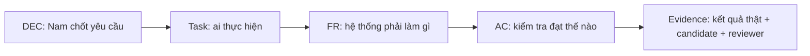

# BT01 — Theo dõi quyết định, nhiệm vụ và nghiệm thu

Cập nhật: 2026-10-09 · DEC-01…12 đã duyệt; các task/FRS chưa được coi là hoàn thành.

## 1. Đọc bảng này để làm gì?

| Thuật ngữ | Dùng để trả lời | Ví dụ |
|---|---|---|
| DEC | Đã thống nhất hành vi nào? | DEC-02: refresh giữ trận cũ |
| Task | Ai làm phần này? | L-05: checkpoint/restore/history |
| FR {Functional Requirement} | Cần triển khai hành vi gì? | L-03.SYNC-03: reconcile khi mất/sai thứ tự event |
| AC {Acceptance Criteria} | Thao tác nào chứng minh đạt? | Hai browser hội tụ sau resync, không mất hoặc nhân đôi nước |
| Evidence | Kết quả kiểm tra nằm đâu, trên bản nào? | Commit/diff hash + môi trường + log/report + verdict |

**Trạng thái nghiệm thu: NOT RUN cho scope mới.** Long dùng FRS-L01…L07 trong `network-core/`; Đức dùng [Security](security/README.md), FRS-D01…D07 đã đặc tả. Mapping Nam/Sơn cập nhật khi xử lý từng mảng. Số lượng task/FR/AC không phải tỷ lệ hoàn thành; mỗi mục cần evidence và verdict đúng candidate.

## 2. Quyết định đã chốt → khoảng trống cần cập nhật FRS

| DEC | Task chịu trách nhiệm / phối hợp | FRS hiện có | Phần cần khóa hoặc bổ sung trước khi giao Dev |
|---|---|---|---|
| 01 · 18 quân/bên | L-01; N-03/05; S-02 | 01,03,05,07,09 | Bỏ văn “đề xuất”; counts/row/property tests + ảnh hưởng SDK/search/UI |
| 02 · refresh giữ trận | L-04/05; N-04/05/06 | 01,02,04,05,06 | Phân biệt restore/new/rematch/reset; refresh một phía không random lại |
| 03 · random đối xứng | L-01/02/05; D-04 | L01,L02,L06,08 | Rank/unrank/seed/version/signature, context non-repeat và replay compatibility |
| 04 · Người–Python Online Unranked | N-06; L-02/04; D-02 | 02,04,06 | Slot-controller + Ready/clock/referee/error transitions; không chặn vì DEC chưa duyệt |
| 05 · Bot mẫu/Bot riêng, practice local | N-02/05/06; L-02; D-02 | 03,05,06,08 | Ownership/nguồn Bot; HUMAN_PYTHON khác BUILTIN_AI; local không Elo |
| 06 · ownership/HTTP-SSE | L-02/03/04; D-02; N-00 | 02,08,10 | Khóa DTO/error/event matrix; writer shared file; transport ADR đúng source |
| 07 · đúng kỹ thuật tách sức mạnh | N-07; L-07; D-03 | 07,10 | Hai gate riêng; protocol khóa trước chạy; không suy sức mạnh người từ baseline Bot |
| 08 · Phòng tập | N-05/06; L-02; S-04 | 05,06,09 | Người–Bot/Bot–Bot; chọn bên/Bot; Pause/Step/Speed chỉ điều khiển lượt Bot; chưa undo/đặt quân |
| 09 · ba mẫu chạy được | N-03/07; N-02 | 03,07 | Ba deliverable tối giản/chiến thuật/nâng cao + guide/snippets + AC riêng |
| 10 · thắng ≥75% trận cohort | N-07; L-07 | 07,10 | Metric win rate, không percentile; target ≥30/40, chưa có kết quả |
| 11 · bị khóa nước thì thua | L-01/02/04/05; N-03/04/05/06/07; S-02/03; D-04 | L01,L02,L05,L06; 03…09 | Long đã đặc tả rule/reason/schema/replay và check trước Bot; SDK/UI consumers cần đồng bộ và nghiệm thu |
| 12 · 10 người × 4 trận | N-07; L-07 | 07,10 | Protocol 40 trận, mỗi người hai trận mỗi bên; khóa cohort/seeds/time/infra handling trước đo |

Đã duyệt DEC không có nghĩa mọi thuật toán, field/API và tiêu chí hiệu năng đã khóa. Các chi tiết còn mở được hỏi khi phân tích FRS tương ứng. Owner chính theo từng phần kỹ thuật; cộng tác không có nghĩa nhiều người cùng sửa shared file.

## 3. Task → FRS → nghiệm thu

| TASK_ID | FRS của Long | Requirement / acceptance |
|---|---|---|
| L-01 | [FRS-L01](network-core/FRS-L01-GAME-RULES-SETUP.md) | RULE-01…18 → RULE-AC01…15 |
| L-02 | [FRS-L02](network-core/FRS-L02-API-DATA-CONTRACTS.md) | L-02.01…14; điều kiện đạt tại từng task |
| L-03 | [FRS-L03](network-core/FRS-L03-ROOM-MATCHMAKING.md) | L-03.ROOM-01…09; điều kiện đạt tại từng task |
| L-03 | [FRS-L04](network-core/FRS-L04-HTTP-SSE-SYNC.md) | L-03.SYNC-01…09; điều kiện đạt tại từng task |
| L-04 | [FRS-L05](network-core/FRS-L05-MATCH-AUTHORITY-CLOCKS.md) | L-04.01…11; điều kiện đạt tại từng task |
| L-05 | [FRS-L06](network-core/FRS-L06-PERSISTENCE-RECOVERY-REPLAY.md) | L-05.01…12; điều kiện đạt tại từng task |
| L-06A/L-07/L-06B | [FRS-L07](network-core/FRS-L07-CAPACITY-INTEGRATION-RUNBOOK.md) | L-06A.01…02, L-07.01…09, L-06B.01…02 |

Mapping các mảng còn lại:

Mỗi khoảng ID bao gồm cả hai đầu. Task đầu chịu trách nhiệm phần việc; task sau phối hợp/review theo ownership. Giữ ID để không mất liên kết bản nháp; yêu cầu mới cần ID mới hoặc delta rõ, không tái sử dụng ID cho nghĩa khác.

| FRS | Task | Requirement IDs | Acceptance IDs |
|---|---|---|---|
| 03 | N-02 | SDK-01,02 | SDK-AC01,03,04 |
| 03 | N-02; N-01 | SDK-03,04 | SDK-AC02,05 |
| 03 | N-04; N-05 | SDK-05 | SDK-AC05 |
| 03 | N-02; D-02 | SDK-06 | SDK-AC03,04 |
| 03 | N-02; S-04 | SDK-07 | SDK-AC01,04 |
| 03 | N-03 | SDK-08 | SDK-AC01,02 |
| 04 | N-01 | BON-01…04 | BON-AC01,02,06 |
| 04 | N-04; D-03 | BON-05 | BON-AC02 |
| 04 | N-04; L-04 | BON-06,07 | BON-AC03 |
| 04 | N-04 | BON-08 | BON-AC04 |
| 04 | N-04; L-05 | BON-09 | BON-AC05 |
| 04 | N-04; D-03 | BON-10 | BON-AC02,05 |
| 04 | N-04; L-01 | BON-11 | BON-AC06 |
| 04 | N-04; S-04 | BON-12 | BON-AC03,04 |
| 05 | N-05; D-03 | BOF-01,02 | BOF-AC01,03 |
| 05 | N-05 | BOF-03,04 | BOF-AC02 |
| 05 | N-05; D-03 | BOF-05 | BOF-AC03,04 |
| 05 | N-05; L-05 | BOF-06,07 | BOF-AC04,05 |
| 05 | N-05; S-04 | BOF-08…10 | BOF-AC01,04,05 |
| 06 | N-06; L-02/D-02 | MIX-01 | MIX-AC01,02 |
| 06 | N-06; S-04 | MIX-02 | MIX-AC01,03 |
| 06 | N-06; L-04 | MIX-03…05 | MIX-AC02,04 |
| 06 | N-06; L-01 | MIX-06 | MIX-AC03 |
| 06 | N-06; L-05 | MIX-07 | MIX-AC01,03 |
| 06 | N-06; S-04 | MIX-08 | MIX-AC01 |
| 07 | N-07; N-03 | REF-01,04 | REF-AC01,04 |
| 07 | N-07 | REF-02,03,05 | REF-AC01,02 |
| 07 | N-07; L-07 | REF-06…09 | REF-AC03 |
| 07 | N-07; N-02 | REF-10 | REF-AC01,03 |
| 09 | S-03; N-00 | UI-01,03,11 | UI-AC01,05 |
| 09 | S-02 | UI-02 | UI-AC03 |
| 09 | S-04; N-02 | UI-04 | UI-AC01,04 |
| 09 | S-05 | UI-05,07,09,10 | UI-AC02,04 |
| 09 | S-03; S-06 | UI-06,08 | UI-AC01,02,03 |

Mapping Security theo [DUC.md](security/DUC.md); các TASK_ID dưới có yêu cầu/điều kiện đạt trong FRS, chưa có evidence implementation:

| TASK_ID | FRS Security | Phạm vi / điều kiện đạt cấp task |
|---|---|---|
| D-01 | [FRS-D01](security/FRS-D01-THREAT-MODEL-POLICY.md) | D-01.01…05; risk D-01.R01…R14 → control → owner → test |
| D-02 | [FRS-D02](security/FRS-D02-AUTH-SESSION-ACCESS.md) | D-02.01…09; actor ACL, CSRF, rotation/recovery/revocation, automation/mixed attack regression |
| D-03 | [FRS-D03](security/FRS-D03-ONLINE-SANDBOX.md), [FRS-D04](security/FRS-D04-OFFLINE-SANDBOX.md) | D-03.ON-01…09 và D-03.OFF-01…09; runtime/isolation/quota/cancel, cold Offline và privacy |
| D-04 | [FRS-D05](security/FRS-D05-ANTI-CHEAT-PRIVACY.md) | D-04.01…08; tampering/race/retry/crash không sai trận hoặc lộ dữ liệu |
| D-05 | [FRS-D06](security/FRS-D06-OPERATIONS-DATA-SECURITY.md) | D-05.01…06; secrets/cache/integrity/retention, metrics/runbook và incident rehearsal |
| D-06 | [FRS-D07](security/FRS-D07-SECURITY-ACCEPTANCE.md) | D-06.01…06; final-candidate coverage/evidence, attack regression và sign-off |

Long là owner toàn bộ code/config/harness tích hợp chung LD-01…LD-06 và integration fixes, theo [LONG.md](network-core/LONG.md#10-thực-thi-song-song-longđức). [DUC.md](security/DUC.md#long-duc) ghi modules/policy/fixtures Đức cung cấp và điều kiện review/retest. LD không tạo task implementation trùng; TASK_ID nghiệm thu giữ nguyên. Implementation/integration/retest vẫn NOT RUN.

| Handoff | FRS Long liên quan | Phần Security / nghiệm thu |
|---|---|---|
| LD-01 | L02/L04/L07 | D02 guards/CSRF; D06 config; HTTP/browser fixtures |
| LD-02 | L02/L03/L04/L05/L06 | D02 session/ACL; D05 permission/race; HTTP/SSE/recovery retest |
| LD-03 | L02/L03/L04/L05/L07 | D02 anti-abuse; D06 metrics; legitimate + attack workloads |
| LD-04 | L02/L05/L06/L07 | D03 runtime + Nam adapter; D05 authority/privacy; DB/runtime race/crash tests |
| LD-05 | L02/L04/L06/L07 | D05 projection; D06 retention/ops; privacy/expiry/runbook checks |
| LD-06 | L07 | D07 matrix/findings; final-candidate retest/sign-off |

## Vai trò task điều phối/review

| Task | Output ngoài implementation FR |
|---|---|
| N-00 | Ghi nhận DEC-01…12 đã duyệt; chốt delta scope/contract và READY từng task sau khi FRS đủ rõ; không tự ký review độc lập cho code Bot |
| D-01 | Threat model/policy đầu vào N-01/N-05/L-02; D-01.01…05 và risk D-01.R01…R14 trong FRS-D01 |
| D-06 | Review/retest scoped, coverage và release findings; D-06.01…06 trong FRS-D07 |
| S-01 | Repro defect matrix UI-01…11 trước sửa |
| S-06 | Browser/visual evidence UI-AC01…05; Nam chốt visual acceptance |
| N-08 | SDK/demo/known limits+review fixes, input cho L-06B |

## 4. Network Core của Long → kỹ thuật → tác dụng → kiểm tra

Các nhóm dưới là đối chiếu khoảng trống ban đầu; bộ yêu cầu hiện hành của Long là FRS-L01…L07 tại mục 3. TASK_ID giữ nguyên; mapping Nam/Sơn tiếp tục cập nhật khi được giao.

| Nhóm / task hiện có | Kỹ thuật cần đặc tả | Tác dụng với hệ thống | FR/AC nền hiện có | Delta còn thiếu |
|---|---|---|---|---|
| Rules · L-01 | Deterministic setup, rules/setup version, legal-move adjudication | Bàn random tái tạo được; xử bị khóa nước thống nhất mọi mode | RULE-01…04/08/10; RULE-AC01/02/04/06 | DEC-11 FR/AC; terminal precedence; SDK consumer parity |
| Contracts · L-02 | Zod schemas, per-slot controller, protocol/error/visibility matrix | Nam/Sơn gửi/đọc cùng cấu trúc; server từ chối payload sai | RULE-05/06; NET-11; MIX-01; RULE-AC03/05; NET-AC03/06; MIX-AC01/02 | New reason/mode/version compatibility; examples và contract AC riêng |
| Transport/sync · L-03 | HTTP/SSE, heartbeat, sequence, snapshot reconciliation, backpressure | Hai browser hội tụ; stream chậm/mất event không làm client đi sai trạng thái | NET-01/05/06; NET-AC01/03/07 | Retry/resync/slow-client/revocation limits và client integration |
| Room/queue · L-03/04 | Room lifecycle, idempotency, matchmaking cancel-vs-match, active-tab lock | Không tạo phòng/slot/trận trùng khi retry hoặc nhiều tab | NET-02…06; NET-AC01…03 | State/actor matrix và AC riêng create/join/leave/invite/queue/Ready/rematch |
| Match authority · L-04 | Serialized commit, optimistic concurrency, server clocks, pause blockers | Human/Bot/referee không ghi đè lẫn nhau; clock/result do server quyết định | NET-02…07; MIX-03…05; NET-AC02/03; MIX-AC02/04 | Controller transitions; zero-subscriber scheduler; DEC-11 integration |
| Data/replay · L-05 | Durable checkpoint, transactional result, idempotent retry, versioned replay | Restart không đọc mixed state; history/Elo không trùng; replay đúng bàn cũ/mới | RULE-09; NET-08…11; RULE-AC05; NET-AC04…06 | Storage thực, cross-checkpoint recovery, schema/retention/legacy migration matrix |
| Ops/acceptance · L-06A/07/06B | Health vs readiness, capacity, observability, restart/rollback runbook | Biết capability nào chạy được; team có cách kiểm tra/khôi phục có evidence | NET-12; REL-01…10; NET-AC07; REL-AC01…05 | Ngưỡng đo chốt trước test; candidate/config thật; thao tác remote cần approval riêng |

## 5. Mẫu ghi kết quả khi thực thi

| Task / FR / AC | Candidate | Môi trường | Thao tác + expected/actual | Artifact | Verdict / reviewer |
|---|---|---|---|---|---|
| Ví dụ L-03 / NET-05 / NET-AC01 | SHA hoặc dirty-diff hash | Hai browser, server test, DB test nếu dùng | Ngắt stream → reconnect → cả hai cùng board/version | Link report/log đã sanitize | NOT RUN cho đến khi chạy thật; ghi reviewer thực tế |

| Trạng thái | Dùng khi nào? |
|---|---|
| DRAFT | Requirement/AC còn cần phân tích hoặc đồng bộ DEC |
| READY | Nam chốt giao việc; contract/dependency/AC đủ rõ |
| IN PROGRESS | Đang thực hiện, chưa đủ evidence |
| NOT RUN / BLOCKED | Chưa kiểm tra / thiếu điều kiện cụ thể để kiểm tra |
| PASS / FAIL | Kết quả một check trên candidate/môi trường xác định |
| DONE | Task đủ DoD và review liên quan; không chỉ vì build xanh |

## 6. Quy tắc cập nhật

1. Khi Nam chỉ định sửa FRS/task, cập nhật mapping tương ứng trong cùng đợt được giao; giữ ID cũ hoặc ghi migration ID rõ. Không tự sửa file ngoài phạm vi đã giao.
2. Khi chia FRS của Long, lập bảng old FRS/FR/AC → new file/section trước khi di chuyển; tránh hai bản spec cùng có hiệu lực hoặc link hỏng.
3. Mỗi AC ghi candidate, môi trường, expected/actual, artifact, verdict và reviewer. Fixture/mock không thay runtime/browser/DB evidence thật.
4. DEC mới phải có FR và AC thực sự kiểm tra hành vi; chỉ trỏ tới FRS hoặc một AC rộng chưa đủ. Các delta mục 2/4 hiện **chưa được tính là đã cover đầy đủ**.
5. Evidence lịch sử chỉ dùng trong scope cũ; không chuyển PASS/DONE cho scope mới hoặc tự tạo kết quả 30/40.
