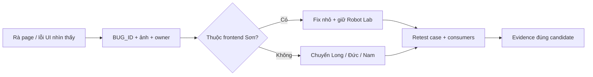

# 01 — Rà soát và sửa frontend ngoài Bot

| TASK_ID | Writer | Đầu ra |
|---|---|---|
| S-01…S-06 | Sơn | Frontend fixes có repro, ảnh trước/sau và kiểm tra phần sửa trong 48 giờ |

## 1. Nguyên tắc thực hiện



Chỉ sửa lỗi frontend tái hiện được; giữ Robot Lab, mode/luật và lỗi backend thật. Phạm vi theo [SON.md](SON.md); thực hiện độc lập với bộ manual functional test. Ba trang Bot ngoài scope. Shared UI ảnh hưởng Bot gửi Nam review, không mở rộng việc test của Sơn.

Trước khi sửa, ghi branch/commit hoặc diff hash, URL local/test, viewport/theme và actor hoặc fixture. Long cung cấp backend test khi cần; dùng tài khoản/dữ liệu test riêng, không tự thay DB/migration để dựng state. Ảnh/log không chứa password/token/recovery code.

## 2. Mức ưu tiên và ranh giới

| Mức | Ví dụ / hành động |
|---|---|
| P0 | Lộ dữ liệu, thao tác sai owner, mất dữ liệu: dừng đúng ca nguy hiểm, báo Nam + owner ngay, giữ evidence đã sanitize |
| P1 | Màn trắng, không login/join/chơi, board không thao tác được, sai result/clock hiển thị gây chơi sai, mất draft quan trọng: sửa/chuyển owner ngay |
| P2 | Một chức năng phụ hỏng, mobile che control, retry/focus/modal lỗi nhưng có workaround: sửa sau blocker, trước polish |
| P3 | Spacing/copy/icon chưa nhất quán không chặn dùng: xử lý sau, vẫn ghi nếu còn mở |

| Sơn sửa | Chuyển owner |
|---|---|
| JSX/CSS/tokens, page state/render, form validation theo contract, focus/aria, route mapping và navigation | Long: rules/contracts/shared HTTP/SSE/network store/API/server/persistence/config tích hợp chung |
| Caller trong page ngoài Bot do Sơn sở hữu nếu request khác contract đã thống nhất | Đức: auth/session/CSRF/limiter module hoặc security policy; Long làm wiring chung |
| Shared board/HUD ở lớp presentation: sizing/orientation mapping/labels | Nam: Bot và ảnh hưởng shared UI lên Bot. Không viết lại AI thuật toán/SDK/runtime hoặc sửa canonical rules |

Sửa caller không được đổi schema/header policy hoặc bỏ guard. Server trả sai thì gửi owner; UI phải hiển thị lỗi thật, không thay bằng dữ liệu mock hoặc success toast. Root cause chưa rõ: ghi khả năng, gửi request/response và evidence; không đoán thành lỗi backend đã xác nhận.

## 3. Rà page theo thứ tự

Mỗi hàng: mở page/state sẵn có → chụp lỗi → sửa frontend → kiểm tra lại phần sửa. Gặp P0/P1 thì xử lý/chuyển owner ngay. Chỉ dùng dữ liệu test; thao tác đổi password/xóa dữ liệu không cần chạy như một bộ test chức năng trong đợt này.

| Thứ tự / TASK_ID | Page / source | Điểm rà frontend |
|---|---|---|
| 1 · S-01/03 | `app/App`, `app/router`, `layouts/AppLayout`, HomePage, NotFoundPage | Header/menu/avatar/tab/CTA, error/loading, URL/Back/aliases; text và focus |
| 2 · S-03/04/05 | GuestSetupPage; LoginPage/RegisterPage/ForgotPasswordPage | Label/error gần field, show password, pending, recovery panel, draft; form/modal không tràn hoặc lộ secrets |
| 3 · S-02 | `components/board/**`, HUD/result presentation | Board vuông 81 ô, hai hàng quân không che nhau, găng nguyên bản; A1/I9 trong board; sizing/touch/highlight |
| 4 · S-02/04/05 | LocalGamePage: OFFLINE rồi AI | Setup/names/timer, handoff/thinking/input lock, restore/error, result/rematch controls |
| 5 · S-03/04/05 | OnlineRoomsPage; CreateRoomForm/WaitingRoom | Search/list/empty; tên/mã/password; MANUAL config; slots/Ready/Start/modal/leave states |
| 6 · S-03/05 | QueuePage | Ranked/Unranked MANUAL; search/cancelling/matched/error presentation và pending controls |
| 7 · S-02/04/05 | GameRoomPage; result/referee panels | Own HUD dưới cố định; clocks/allowed actions/feed; paused/reconnecting/result/rematch không che nút chính |
| 8 · S-03/05 | SpectatorPage | Blue dưới, read-only controls; missing/full/forbidden/disconnected presentation |
| 9 · S-03/04/05 | HistoryPage; ReplayPanel/ResultPanel | Filters/source badge/list/detail/pagination/replay controls, final-only/corrupt/empty; text dài |
| 10 · S-03/04/05 | ProfilePage; ProfileForm | Own/other/Guest/missing layouts; avatar/name/stats/edit/unsaved; không thêm private fields |
| 11 · S-03/04/05 | FriendsPage → FriendsPageR12 | Tabs/search/list/request/invite/modal, pending/expired/block/stale presentation |
| 12 · S-03/04/05 | SettingsPage ngoài Bot | Tab/query/keyboard, theme/audio/privacy/account/blocked/local-data panels và confirmations |
| 13 · S-05/06 | Shared loading/empty/error | Nhãn/message/retry/focus; lỗi quyền không logout; không fake success hoặc toast flood |

Source nằm trong [apps/web/src](../../../apps/web/src); chỉ sửa components có consumer. Backend chưa tạo được state thì ghi dependency, tiếp tục page/component độc lập. Fixture/story UI chỉ phục vụ kiểm tra rendering, không thay luồng thật hoặc đưa fake state vào production. Không sửa shared contracts/network để làm UI chạy tạm.

## 4. Checklist áp dụng mỗi page

| Nhóm | Cách kiểm tra / điều kiện đạt |
|---|---|
| Responsive | 1366×768 baseline; mọi page ở 375px và Light/Dark. 320/768/1920px: shell/form/modal/board + page vừa sửa. Không horizontal overflow, cắt dấu, controls ngoài màn; list/rail cuộn được |
| Board/HUD | Desktop thử chiều cao 768/900px; board vuông, quân/coordinates rõ; Online player own side dưới cố định, Local/AI/Ref/Spectator Blue dưới; không xoay theo turn |
| Nội dung | Tên dài/dấu tiếng Việt, room code, time/stat, empty/list dài. Không placeholder giả, text kỹ thuật thừa hoặc thông báo không có cách xử lý |
| State | Loading có nhãn; empty có hướng đi; error/retry thật; pending/disabled ngăn hành động trùng; action mở lại khi đúng điều kiện |
| Forms | Label liên kết input; lỗi đúng field; Enter submit; pending rõ; sửa lỗi không mất phần nhập cần giữ; clipboard thất bại có fallback |
| Modal/keyboard | Tab/Shift+Tab không thoát modal, Escape theo policy, focus quay lại trigger; tablist dùng phím mũi tên; focus visible, không có keyboard trap |
| Theme/design | Giữ tokens/font/spacing/panel/găng Robot Lab; Light/Dark đều đọc được; System và preference cũ không bị reset |
| Motion/audio | Reduced motion/Low không hiệu ứng nặng tự lặp; animation không giữ/chặn lượt; âm thanh lỗi không chặn UI |
| Permissions | Controls theo allowedActions/session/resource; ẩn nút không thay server guard; không đọc private fields để trang trí |
| Network/lifecycle | Mất mạng có banner; reconnect/resync rồi mới mở actions theo server; unmount/remount không duplicate request/timer/subscription; shared-network lỗi chuyển Long |
| Console/Network | Ghi lỗi liên quan repro, request fail và duration; không yêu cầu mạng im lặng khi cố tình ngắt. Không log Cookie/Authorization/source/secrets |

Chuẩn hình thức: [Robot Lab visual plan](../../implementation_plan_robot_lab_visual_rebuild.md). Emulation ghi EMULATED; fixture UI ghi rõ FIXTURE, không chứng minh device/backend/provider thật. Giới hạn kiểm tra ghi trong report.

## 5. Fix → test → review

| Bước | Việc làm | Bàn giao |
|---|---|---|
| 1. Reproduce | Mở page và thao tác gây lỗi UI; chụp before; ghi actor/URL/state/viewport/theme + candidate | BUG_ID, expected/actual và root cause nếu xác minh được |
| 2. Ownership | Xác định files/consumers; báo owner khi shared change hoặc backend dependency | Danh sách files Sơn sửa; request cho Long/Đức/Nam |
| 3. Fix | Sửa nhỏ theo contract; giữ behavior đúng/design; lỗi logic có focused regression nếu phù hợp | Patch có mục đích rõ, không refactor rộng hoặc nâng dependencies hàng loạt |
| 4. Retest | Thao tác UI vừa sửa + consumers ngoài Bot bị ảnh hưởng; chụp after cùng kích thước/theme | PASS/FAIL đúng candidate; ghi giới hạn backend/fixture |
| 5. Review | Người khác xem patch/evidence; phần mình viết không tự gọi independent PASS | Reviewer thực tế, findings và fix/retest |
| 6. Cleanup | Dọn debug/temp/fixture đã xác minh; giữ source assets/evidence và dữ liệu người dùng | Không code bypass/mock-success/dead component mới |

Focused commands từ root repo, sau khi dependency packages đã build sẵn:

```powershell
corepack pnpm --filter @ottv2/web typecheck
corepack pnpm --filter @ottv2/web lint
corepack pnpm --filter @ottv2/web exec vitest run src/pages/LocalGamePage.test.tsx
corepack pnpm --filter @ottv2/web build
```

Dòng Vitest là ví dụ cho LocalGamePage; thay bằng tests của component/page thực sự sửa. Thiếu dependency build thì phối hợp Long theo setup hiện có; không sửa config để lách check. Không chạy root build/test/DB scripts chưa kiểm tra side effects. Build/unit PASS không thay test browser, nhiều actor hoặc backend thật.

## 6. Bàn giao frontend và DoD

| Gate | Điều kiện |
|---|---|
| Page coverage | Mỗi page trong scope đã rà layout/interaction hoặc ghi rõ state bị dependency chặn; không yêu cầu hoàn thành end-to-end hệ thống |
| Fix coverage | Mọi BUG frontend đã đóng có before/after và kiểm tra phần sửa; không còn P0/P1 frontend đã biết mở |
| Shared change | Consumers ngoài Bot bị ảnh hưởng được kiểm tra; Nam nhận shared delta ảnh hưởng Bot; thiếu review ghi rõ |
| Quality | Focused checks phù hợp đạt; keyboard/theme/responsive/error states đã rà; không còn regression đã biết chưa khai báo |
| Handoff | FRONTEND-RESULTS + ảnh before/after + files/candidate/commands + open BUG/owner/next action |

Report chỉ kết luận phần frontend đã kiểm tra. Test tay hệ thống thuộc đợt riêng; thiếu backend/review ghi rõ, không kết luận hệ thống DONE. Lỗi còn lại ghi mức độ/owner/workaround; không đổi mức để đạt DoD. Phát hành/DB production cần lệnh riêng.

Sơn tạo `FRONTEND-RESULTS.md` khi bắt đầu rà, dùng hai bảng:

| Page / TASK_ID | Bản code / state / viewport / theme | Đã rà / bị chặn | BUG_ID / ảnh |
|---|---|---|---|
| Ghi page và task tương ứng | Ghi thực tế; fixture có nhãn | Ghi phạm vi đã kiểm tra, dependency còn thiếu | Link evidence đã sanitize |

| BUG_ID / mức độ | Repro + expected/actual | Owner / files sửa | Before/after + kiểm tra lại | Còn thiếu |
|---|---|---|---|---|
| BUG-S-001 / P1 | Các bước gây lỗi UI | Sơn hoặc owner nhận lỗi | Candidate + ảnh + PASS/FAIL thực tế | Dependency/review/next action |
