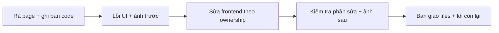

# Sơn — Rà soát và sửa frontend

| Phụ trách | Thời hạn | Đầu ra |
|---|---|---|
| Sơn | 00:00 10/10 → 00:00 12/10/2026, UTC+7; 48 giờ lịch | Frontend fixes, ảnh trước/sau, kiểm tra phần sửa và lỗi chuyển owner |

## 1. Phạm vi

Rà từng page ngoài Bot, sửa lỗi hiển thị và tương tác frontend. Giữ design-pattern Robot Lab, tiếng Việt; luật/quyền/trạng thái lấy từ contract và nguồn có thẩm quyền. Kiểm tra trực tiếp phần vừa sửa và shared UI bị ảnh hưởng.

| Trong phạm vi | Ngoài phạm vi |
|---|---|
| Frontend Home/shell, auth/Guest, Người–Người Online/Offline, AI `/ai`, phòng/queue, Referee/Spectator, history/replay, profile/friends/settings, 404 và aliases | Bot Online `/dau-chuong-trinh/online`, Bot Offline `/dau-chuong-trinh/offline`, Thư viện Bot `/bot-lab`: không rà/test/sửa |
| Layout, typography, responsive/theme, board/HUD, form/modal/navigation, loading/empty/error/retry, focus/keyboard và motion | Test tay toàn bộ tính năng/end-to-end hệ thống; backend/network/security/runtime; Python/Phòng tập, Offline kit và dữ liệu Bot |

Menu có link Bot chỉ rà vị trí/nhãn/URL từ shell. Settings/history có controls Bot thì bỏ qua đúng phần đó. Shared UI ảnh hưởng Bot gửi Nam review; Sơn kiểm tra consumers ngoài Bot mình sửa, không nhận thêm việc kiểm thử Bot.

## 2. Đọc và làm theo thứ tự

Tài liệu thực hiện: [01-FRONTEND-AUDIT-FIX.md](01-FRONTEND-AUDIT-FIX.md). Làm lần lượt danh sách page và checklist trong file này; không cần bộ manual functional test để bắt đầu.

## 3. TASK_ID và ownership

| TASK_ID | Sơn làm / bàn giao | DoD |
|---|---|---|
| S-01 | Inventory page/state; chụp baseline UI và lập danh sách lỗi | Mỗi page trong scope có trạng thái rà soát; lỗi có repro/ảnh/owner |
| S-02 | Board/HUD/controls ngoài Bot; quân, hướng nhìn, touch/keyboard | Bàn không tràn/che; A1/I9 playable; không đổi luật/clock để sửa hiển thị |
| S-03 | Shell/router/shared UI/styles; page ngoài Bot | Điều hướng và thao tác đúng; giữ tokens/layout Robot Lab; không sửa shared network |
| S-04 | Sửa tương tác frontend: form/modal/tab/navigation, pending/disabled/draft | Kiểm tra trực tiếp interaction vừa sửa; không đổi contract hoặc nhận test end-to-end hệ thống |
| S-05 | Loading/empty/error/retry; quyền, reconnect UI, focus/reduced motion | Không fake success, mất draft hoặc logout vì lỗi quyền; không tạo loop hành động |
| S-06 | Kiểm tra frontend vừa sửa và shared consumers; bàn giao cho Nam | Ảnh/checks đúng bản code, lỗi còn lại có owner; không dùng làm kết luận hệ thống đã qua test tay |

| Lỗi thuộc phần nào? | Writer sửa | Sơn làm tiếp |
|---|---|---|
| Render/layout/form/page interaction/router/shared UI | Sơn | Reproduce → fix → retest; báo consumers nếu đổi shared component |
| Contracts/rules/HTTP client/SSE/store/room/match/queue/persistence/config tích hợp chung | Long | Gửi BUG_ID/repro đã loại secrets; tiếp tục page độc lập; kiểm tra rendering khi dependency có bản mới |
| Auth/session/CSRF/limiter/security policy và modules riêng | Đức; Long tích hợp chung | Gửi repro; không sửa policy hoặc thêm bypass |
| Bot/runtime/Library và ảnh hưởng shared UI lên Bot | Nam | Chuyển Nam; không tự test/sửa các trang hoặc luồng Bot |

Một writer/file. Sơn không sửa backend. Nếu UI gọi API sai nhưng thay đổi nằm trong page Sơn sở hữu, sửa caller theo contract hiện hành; thay schema/endpoint/shared adapter chuyển Long. Source của [router](../../../apps/web/src/app/router.tsx) và [routes](../../../apps/web/src/app/routes.ts) dùng xác định trang; source hiện tại không thay yêu cầu đã chốt.

## 4. Checkpoint 48 giờ

| Mốc tính từ lúc bắt đầu | Kết quả cần có |
|---|---|
| 0–6 giờ | Đọc router/design; xác định files sở hữu; rà shell/page và ghi lỗi UI ưu tiên |
| 6–24 giờ | Sửa shared UI, board/HUD và các page theo thứ tự; kiểm tra từng phần sửa |
| 24–40 giờ | Hoàn thiện responsive/theme/interaction/error states; xử lý regressions frontend |
| 40–48 giờ | Kiểm tra bản frontend bàn giao; tổng hợp ảnh/files/checks và lỗi còn lại |

Đây là checkpoint trong 48 giờ lịch, không yêu cầu làm liên tục 48 giờ. Backend chưa sẵn sàng thì ghi dependency, tiếp tục phần UI độc lập; không chờ cả nhóm hoàn thành mới sửa frontend.

## 5. Điều kiện bàn giao

- Mỗi page trong scope đã rà frontend hoặc ghi rõ dependency chặn; giữ Robot Lab và ownership, không còn P0/P1 frontend đã biết chưa xử lý.
- Fixes có kiểm tra trước/sau, focused checks và review thực tế; shared UI ảnh hưởng Bot có phản hồi của Nam hoặc ghi thiếu review.
- Bàn giao `FRONTEND-RESULTS.md`: bản code, files sửa, ảnh before/after, checks và BUG_ID/owner/next action. Thiếu backend/fixture phải ghi rõ giới hạn kiểm tra.
- DoD chỉ xác nhận phần frontend được giao; test tay toàn hệ thống và kết luận các luồng backend thuộc đợt riêng.
- Giữ dữ liệu/evidence cần thiết; chỉ dọn dữ liệu test đã nhận diện. Push/deploy hoặc thay DB chung/production cần lệnh riêng.

Chuẩn thiết kế: [Robot Lab visual plan](../../implementation_plan_robot_lab_visual_rebuild.md). Hành vi nền: [Robot Lab plan](../../implementation_plan_ott_v0.2_robot_lab.md); áp dụng cùng phạm vi frontend trong tài liệu thực hiện.
