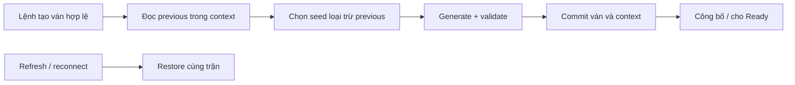

# FRS-L01 — Game Rules & Setup

| TASK_ID | Phụ trách | Phạm vi |
|---|---|---|
| L-01 | Long | Luật dùng chung, khởi tạo bàn, kiểm tra nước đi, kết thúc trận và tương thích dữ liệu |

## 1. Mục tiêu và phạm vi

Mọi chế độ Người–Người, Người–Bot, Bot–Bot, Online, Offline và Phòng tập dùng chung `@ottv2/game-rules`. Người chơi nhận bàn hai hàng quân, bố trí mới khi tạo ván; refresh giữ nguyên trận.

| L-01 thực hiện | Bàn giao |
|---|---|
| Pure functions {hàm không I/O, không sửa input}: setup, legal moves, terminal, validation, version | API, constants, fixtures và tests |
| Thuật toán chọn bố trí và nhận diện bàn trùng | Server/local controller quản lý context, quyền và lưu dữ liệu |
| Tương thích luật cũ, dữ liệu replay | Contract, persistence, SDK và UI tích hợp theo TASK_ID |

## 2. Yêu cầu chức năng

| ID | Yêu cầu | AC |
|---|---|---|
| RULE-01 | Generator xác định bởi seed/version; không đọc clock, entropy hoặc thực hiện I/O trong rules | 01,07,14 |
| RULE-02 | Bàn 9×9; BLUE hàng 1–2, RED hàng 8–9; mỗi hàng 3R/3P/3S; mỗi bên 18 quân; hai bên đối xứng 180° | 01,02,09 |
| RULE-03 | Seed nguyên `0…2_822_399`; rank/unrank và golden vectors thống nhất giữa server/browser | 01,02,07 |
| RULE-04 | Ván mới khác initial board ngay trước trong cùng context; chọn đều trong các bố trí còn lại | 04,08 |
| RULE-05 | Server chọn setup Online; local controller chọn setup Offline. Client Online không có quyền chọn seed/board | 03,04,10 |
| RULE-06 | Public setup không chứa Python source, memory, logs hoặc invocation seed riêng của Bot | 10,15 |
| RULE-07 | New/rematch/reset tạo setup mới theo quyền; refresh/reconnect/Ready/đổi revision giữ setup; retry không tạo trùng | 03,04,08 |
| RULE-08 | Manual/AI/Python/preflight/Phòng tập/replay cùng dùng rules; loại bỏ giả định cố định 9 quân/bên | 06,11,12,15 |
| RULE-09 | Trận và replay cũ giữ luật/setup cũ; không tự nâng version hoặc suy version từ số quân | 05,07,13 |
| RULE-10 | Giữ BLUE đi trước, di chuyển/capture/goal và orientation quy định tại mục 3 | 02,09,11,12 |
| RULE-11 | Bên đến lượt không còn nước hợp lệ thua với `NO_LEGAL_MOVES`; kiểm tra trước gọi Bot | 11,12,15 |
| RULE-12 | Legal moves có thứ tự xác định, khớp validate/apply; phân tích chiến thuật không cấp quyền thực thi | 09,14,15 |
| RULE-13 | Validation phân biệt initial/midgame/legacy; dữ liệu sai bị từ chối, không tự sửa | 07,13,14 |
| RULE-14 | Input bất biến; piece ID xác định và giữ sau di chuyển; signature chỉ phản ánh vị trí/side/type | 01,08,09,14 |
| RULE-15 | Lưu initial board, descriptor và accepted moves; replay đúng version và đối chiếu final board | 03,05,13 |
| RULE-16 | Previous setup là initial board gần nhất đã commit trong context; cập nhật cùng transaction tạo ván | 03,04,08 |
| RULE-17 | Entropy có giới hạn thử và báo lỗi; không modulo bias, seed mặc định hoặc retry để chọn bàn thuận lợi | 04,07,08 |
| RULE-18 | Chi phí xử lý giới hạn theo 81 ô; không lưu toàn bộ không gian bố trí hoặc quét lịch sử để random | 02,06,14 |

Cột AC sử dụng tiền tố `RULE-AC`; ví dụ `01` là `RULE-AC01`.

## 3. Quy tắc bàn và kết quả

| Thành phần | Đặc tả |
|---|---|
| Tọa độ | File `a…i`, rank `1…9`; A1/I9 là ô thường có quân trong setup mới; hàng 3–7 trống |
| Đối xứng | BLUE tại `(x,r)` → RED cùng type tại `(8-x,10-r)` |
| Bắt đầu | `currentTurn=BLUE`, `status=PLAYING`, `winner=null`, `resultReason=null` |
| Di chuyển | Một ô theo 8 hướng; không vào quân mình hoặc quân cùng type |
| Capture | R ăn S, P ăn R, S ăn P; attacker yếu bị từ chối |
| Goal | BLUE tới `i9`, RED tới `a1`; quân phòng thủ đứng trên goal đối phương không tự thắng |
| Orientation | Online: bên mình ở dưới, cố định cả trận. Offline/AI/Bot/Referee/Spectator: canonical BLUE dưới |
| Thứ tự kết quả | Move hợp lệ → EXTINCTION → GOAL_REACHED → đổi lượt → NO_LEGAL_MOVES → tiếp tục |
| Terminal | `status=FINISHED`, `currentTurn=null`; winner/reason nhất quán; không nhận move hoặc gọi Bot tiếp |

`evaluateTurnStart` xử lý lượt bị khóa trước invocation. Chỉ bên đang đến lượt thua; không suy kết quả từ legal list của trận đã terminal. UI hiển thị **“Bị khóa nước”**, không quy thành lỗi tác giả Bot.

Authority kiểm tra quyền, clock và blockers trước core rules. Timeout, surrender, Stop và giới hạn trận Bot thuộc lifecycle; kết quả core đã chấp nhận không bị scorer ghi đè.

## 4. Dữ liệu và thuật toán setup

### 4.1 Version và descriptor

| rulesVersion | setupVersion | Hành vi |
|---|---|---|
| `rps-v1` | `rps-fixed9-v1` | Legacy 9 quân/bên; extinction/goal, không thêm blocked rule |
| `rps-v2` | `rps-rows2-index-v1` | Setup 18 quân/bên; thêm NO_LEGAL_MOVES |

| Field | Ràng buộc |
|---|---|
| `rulesVersion/setupVersion` | Pair được hỗ trợ, cố định trong trận |
| `setupSeed` | Integer trong miền quy định; legacy fixed9 không dùng seed |
| `initialState` | Actual initial board/counts/turn/status/winner/reason |
| `setupSignature` | Canonical placement key, không phải chữ ký mật mã |
| `setupContextId/previousInitialSetup` | Metadata do server/local controller giữ |
| `matchId/stateVersion/sequence` | Metadata lifecycle; rules không sinh hoặc tự tăng |

Seed suy được từ board công khai; bảo vệ công bằng bằng authority, không dựa vào giữ seed bí mật.

### 4.2 Sinh bố trí

Một hàng có `9!/(3!³)=1_680` hoán vị; hai hàng có `N=1_680²=2_822_400` bố trí.

| Bước | Xử lý |
|---|---|
| 1 | Khóa thứ tự symbol `R,P,S`; `row1Index=floor(seed/1680)`, `row2Index=seed%1680` |
| 2 | Unrank mỗi index: counts ban đầu 3/type; tại từng vị trí, xét R→P→S; tạm trừ count, tính block `remaining!/(R!P!S!)`; nếu index nhỏ hơn block thì chọn, nếu không thì trừ block và hoàn count |
| 3 | Gán BLUE vào `a1…i1`, `a2…i2`; RED quay 180° và đổi side |
| 4 | Gán IDs, đếm quân, validate và trả state |

`rankRow` đảo ngược unrank: cộng các block đứng trước symbol thực tế rồi giảm count symbol đó. `rankSetup=rankRow(row1)×1680+rankRow(row2)`. Dùng factorial 0…9; không precompute toàn bộ rows/boards trong production.

### 4.3 Chọn bố trí và context

| Trường hợp | Xử lý |
|---|---|
| Chưa có previous | Uniform draw `k∈[0,N)`; seed=k |
| Previous rows2 có rank p | Draw `k∈[0,N-1)`; seed=k nếu k<p, ngược lại seed=k+1 |
| Previous legacy fixed9 hợp lệ | Draw trong [0,N); so placement key sau generate |
| Previous không hỗ trợ/mâu thuẫn | Từ chối tạo mới; giữ dữ liệu trước |
| Online | So trong cùng room lifetime/generation và chuỗi rematch; không nối context chỉ vì trùng room code |
| Local | So trong cùng phiên chơi; phiên/mode khác không so xuyên context |
| Retry/nhiều tab | Một operation chỉ commit một setup; local serialize hoặc chặn writer thứ hai |
| Lưu thất bại | Giữ ván/previous cũ; không công bố setup mới hoặc cho Ready |

Previous luôn là **initial board đã commit**, không phải terminal board. Setup preflight không cập nhật context trận thật. Hai hàng có thể giống nhau; chỉ toàn bố trí phải khác ván ngay trước.

Entropy do server/browser crypto cung cấp. Browser đọc uint32, nhận khi `u<floor(2³²/b)×b`, trả `u%b`; tối đa 8 lần đọc. Thất bại báo lỗi, không dùng clock/Math.random/fallback seed. Pure rules chỉ nhận uniform index đã kiểm tra.

### 4.4 IDs, signature và vectors

| Thành phần | Quy tắc |
|---|---|
| Traversal | Rank 1→9, file a→i |
| Piece ID | Ordinal theo side/type: `blue-r-1…6`, `red-s-1…6`; giữ ID sau move/capture; toàn hệ thống kèm matchId |
| Signature | `board9x9:` + 81 token: `..`, `BR/BP/BS`, `RR/RP/RS`; bỏ IDs/version/seed/clock |
| Non-repeat | So signature của initial board; đổi ID hoặc version không tạo bố trí mới |

| Seed | BLUE row1 | BLUE row2 | RED row8 | RED row9 |
|---|---|---|---|---|
| 0 | RRRPPPSSS | RRRPPPSSS | SSSPPPRRR | SSSPPPRRR |
| 1 | RRRPPPSSS | RRRPPSPSS | SSPSPPRRR | SSSPPPRRR |
| 1679 | RRRPPPSSS | SSSPPPRRR | RRRPPPSSS | SSSPPPRRR |
| 1680 | RRRPPSPSS | RRRPPPSSS | SSSPPPRRR | SSPSPPRRR |
| 1411200 | PPPSRRRSS | RRRPPPSSS | SSSPPPRRR | SSRRRSPPP |
| 2822398 | SSSPPPRRR | SSSPPRPRR | RRPRPPSSS | RRRPPPSSS |
| 2822399 | SSSPPPRRR | SSSPPPRRR | RRRPPPSSS | RRRPPPSSS |

## 5. API, validation và lỗi

| API nội bộ | Trách nhiệm |
|---|---|
| `createInitialState(descriptor)` | Sinh state theo explicit version/seed; no-arg chỉ qua legacy adapter |
| `rankSetup/unrankRow/selectSetupSeed` | Mapping thuần; kiểm tra integer/bounds, không clamp |
| `getSetupSignature` | Placement key chuẩn |
| `validateInitialSetup/validateRuleState` | Kiểm tra initial/midgame/legacy, tối đa 16 issues + truncated flag |
| `getLegalMoves/getLegalDestinations/hasLegalMove` | Actual turn; terminal trả []/false; legal moves sắp canonical from→to; hasLegalMove dừng sớm |
| `evaluateTurnStart/applyMove` | Blocked terminal/áp move theo version; invalid move không sửa state hoặc mất lượt |

Phân tích mobility dùng helper riêng; không giả chuyển terminal thành PLAYING để thực thi Bot. Adapter legacy có thể giữ thứ tự destinations cũ.

| Validation | Kiểm tra |
|---|---|
| Initial | Đủ 81 keys; side/type/IDs hợp lệ; counts, rows, symmetry, start state và regenerated descriptor khớp |
| Midgame | Counts khớp board và không vượt initial bounds; ID unique, đúng side/type, ordinal v2 1…6; cho phép gaps, quân rời hàng và mất symmetry |
| Status | Winner/reason/turn nhất quán; PLAYING không chứa extinction/goal chưa xử lý; terminal lifecycle qua adapter riêng |
| Legacy/replay | Đúng version/provenance; initial descriptor và move chain/final board khớp; unknown/corrupt giữ dữ liệu, chặn execution |
| Dữ liệu thiếu | Known fixed9 có thể dựng từ constants cũ; chỉ có final board thì xem vị trí cuối, không tạo replay giả; rollback giữ reader v2 |

| Logical code | Hành vi |
|---|---|
| `SETUP_SEED_INVALID` | Từ chối seed sai; “Không thể tạo bàn hợp lệ. Hãy thử lại.” |
| `SETUP_VERSION_UNSUPPORTED` | Chặn Start/resume/replay sai luật; “Phiên bản bàn cờ chưa được hỗ trợ.” |
| `SETUP_PREVIOUS_INVALID` | Chặn tạo mới trong context, giữ bản lưu |
| `SETUP_ENTROPY_UNAVAILABLE` | Dừng sau giới hạn đọc; retry hữu hạn tại controller |
| `SETUP_PERSIST_FAILED` | Không Ready/Start; “Chưa lưu được bàn cờ. Hãy thử lại.” |
| `RULE_STATE_INVALID` | Không execute từ state hỏng; diagnostics giới hạn, không private data |
| Move rejection hiện có | Giữ state; trả lỗi riêng cho caller, không broadcast lỗi spam toàn phòng |

`NO_LEGAL_MOVES` là result reason, không phải API error. TASK_ID L-02 quy định HTTP status/retryability.

## 6. Tiêu chí nghiệm thu

Các AC dưới đây là điều kiện phải kiểm chứng, không phải kết quả đã đạt.

| AC_ID | Điều kiện đạt |
|---|---|
| RULE-AC01 | Bảy golden seeds cho board/count/ID/signature giống nhau trên server và browser |
| RULE-AC02 | Exhaustive 1.680 row rank/unrank unique/inverse; corpus 10.000 seeds đúng 36 quân, symmetry/counts và cả hai side có nước đầu |
| RULE-AC03 | Hai client và local restore giữ match/setup/turn/version qua refresh, reconnect, Ready, revision |
| RULE-AC04 | Mapping p=0/mid/max bao phủ mọi seed trừ p; rematch/reset khác bàn trước; context độc lập |
| RULE-AC05 | Legacy/new restore và replay đúng initial/final state; rematch mới dùng v2 |
| RULE-AC06 | Benchmark 18 quân/heavy positions có chi phí hữu hạn; actual Python preflight/turn đạt runtime budget |
| RULE-AC07 | Seed/rank/version sai, entropy reject/throw bị chặn đúng giới hạn; không fallback hoặc mất previous |
| RULE-AC08 | Duplicate create/nhiều tab/crash/save failure chỉ tạo một setup hoặc giữ bản cũ; context commit nguyên tử |
| RULE-AC09 | Move/capture/goal/owner/turn/bounds đúng; legal list khớp apply; IDs giữ sau capture; rotations và thứ tự ổn định |
| RULE-AC10 | Giả seed/context/board/role bị deny; match không đổi; public payload không lộ private Bot data |
| RULE-AC11 | Fixture khóa nước cho đúng winner/reason; rotate+swap đúng; bỏ blocker thì trận tiếp tục; không gọi Bot sau terminal |
| RULE-AC12 | EXTINCTION ưu tiên GOAL_REACHED, GOAL_REACHED ưu tiên blocked; terminal giữ nguyên; v1 không áp blocked |
| RULE-AC13 | Seed/board/key mismatch, count/ID hỏng, unknown provenance hoặc chain gãy bị từ chối; giữ dữ liệu |
| RULE-AC14 | Frozen/aliased input không bị sửa; output độc lập object order; không allocate toàn không gian; có báo cáo chi phí xử lý |
| RULE-AC15 | Manual/AI/Python Online/Offline/Phòng tập/preflight/replay thống nhất luật và reason; kiểm tra browser/sandbox thật |

Fixture RULE-AC11: trước move BLUE, các ô còn lại trống; IDs unique, counts theo board.

| Side | R | P | S |
|---|---|---|---|
| RED | c1,c2,a3,b3,c3 | a1,b1 | a2,b2 |
| BLUE | d1,d3,a4,c4 | d2,b4,d4 | h8 |

BLUE `h8→h7`: BLUE thắng NO_LEGAL_MOVES. Bỏ BLUE d2: RED còn nước, trận tiếp tục. BLUE `h8→i9`: GOAL_REACHED. Rotate 180° và swap side để kiểm tra RED.

## 7. Phụ thuộc và DoD

| TASK_ID | Bàn giao / trách nhiệm tích hợp |
|---|---|
| L-01 | Rules API/constants, versioned fixtures, unit/property tests |
| L-02 | Contract/schema/error/projection nhập từ rules |
| L-03 | Room context, idempotency, refresh/reconnect/shared client |
| L-04 | Authority, clocks/blockers, terminal commit và guard trước Bot |
| L-05 | Initial/context persistence, atomic commit, legacy restore/replay |
| N-03/N-04/N-05/N-06/N-07 | SDK/guideline, Bot consumers, preflight, Phòng tập và Bot mẫu |
| S-02/S-03/S-04 | Board hai hàng, result/replay và giao diện Bot |
| D-04 | Kiểm tra giả setup, reroll, authority và rò rỉ dữ liệu |

Thứ tự: **Plan → Harness → Dev → Test → Review → Clean Rubbish Code**. L-01 tạo candidate để các task tích hợp; không chờ nhau DONE theo vòng.

**DoD L-01:**

- RULE-01…18 và RULE-AC01…15 có evidence đúng candidate; pure tests, typecheck/lint/build và integration liên quan đạt.
- Server/browser/SDK/replay đồng nhất; runtime thật giữ budget/isolation; UI đúng board/result; legacy không mất dữ liệu.
- Review xử lý hết lỗi chặn; nộp diff, commands/report, fixtures, compatibility matrix và gaps. Chỉ ghi independent review khi có reviewer/evidence.
- Chỉ dọn hardcode/dead consumers sau kiểm tra tương thích. Gate thiếu ghi NOT RUN/BLOCKED/IN PROGRESS; chưa DONE toàn task.
