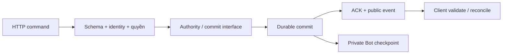

# FRS-L02 — API & Data Contracts

| TASK_ID | Phụ trách | Đầu ra |
|---|---|---|
| L-02 | Long | Schemas/types, command/event/error contracts, actor matrix, commit/restore interfaces và contract tests |

## 1. Mục tiêu và phạm vi

Thống nhất dữ liệu giữa server, shared client, Bot SDK và replay qua `@ottv2/contracts`. Người chơi gửi thao tác đúng quyền, nhận cùng trạng thái và có hướng xử lý khi lỗi; retry không tạo thêm nước hoặc trận.



L-02 định nghĩa contract; room, transport, clock, persistence và Python runtime thực hiện qua task phụ thuộc. Giữ HTTP/SSE và routes hiện có; không tạo transport hoặc authority thứ hai.

## 2. Mode, controller và actor

| Chế độ | Controller BLUE/RED | Authority | Ranked |
|---|---|---|---|
| Người–Người Online | HUMAN/HUMAN | Server | Có, account bắt buộc |
| Người–Người Offline | HUMAN/HUMAN | Local | Không |
| Bot–Bot Online | PYTHON/PYTHON | Server + sandbox | Không |
| Bot–Bot Offline | PYTHON/PYTHON | Local + sandbox | Không |
| Người–AI | HUMAN/BUILTIN_AI, cho phép đổi bên | Local | Không |
| Người–Python Online | HUMAN/PYTHON, cho phép đổi bên | Server + sandbox | Không |
| Người–Python Offline | HUMAN/PYTHON, cho phép đổi bên | Local + sandbox | Không |
| Phòng tập | HUMAN/PYTHON hoặc PYTHON/PYTHON | Local + sandbox | Không |

DTO tách `environment=ONLINE/OFFLINE`, `mode=RANKED/UNRANKED`, `controllers` theo side và `training` boolean. Guest là principal, không phải mode. `playMode` cũ chỉ dùng qua compatibility adapter; không suy hybrid từ MANUAL/BOT.

| Actor/capability | Được phép | Điều kiện |
|---|---|---|
| Player HUMAN | Ready, own move, surrender, rematch | Own slot/turn; lifecycle, clock và blockers cho phép |
| Player sở hữu PYTHON slot | Chọn/nộp Bot, Ready, rematch và thao tác player hợp lệ | Sample hệ thống hoặc revision được phép dùng; không gửi move thay Bot |
| Trusted Bot adapter | Gửi kết quả invocation vào authority nội bộ | Đúng match/turn/revision/token; không có public endpoint cấp quyền này |
| Referee | Start, Stop, Resume, Hold và luồng thay thế | Account được bổ nhiệm; phòng custom Online; không sửa bàn/thời gian hoặc chọn winner |
| Spectator | Xem public snapshot/events/replay được phép | Spectator bật, còn quyền truy cập; không mutation hoặc private Bot data |
| Host capability | Quản lý phòng/mời theo policy | Không tự có quyền Referee hoặc quyền đi quân |
| Replacement candidate | Xem dữ liệu tối thiểu, chấp nhận bổ nhiệm | Đúng lời mời còn hạn; chưa có quyền Referee trước commit |

Mỗi principal chỉ giữ một role trong phòng; host là capability riêng. Session/membership quyết định actor/side, không lấy từ URL/body. Guest không Ranked/Referee; principal đang đấu giữ nguyên khi đăng nhập. Referee không có trong matchmaking, Ranked hoặc Offline.

## 3. HTTP command và ACK

### 3.1 Request

| Field/nhóm | Kiểu và ràng buộc |
|---|---|
| `protocolVersion` | Literal `0.2` cho contract mới |
| `commandId` | UUID; một ID cho một thao tác, giữ khi retry |
| Match mutation | Bắt buộc `matchId` UUID + `stateVersion` safe integer ≥0; roomId lấy từ route, đối chiếu match |
| Room mutation | Bắt buộc `roomGeneration` UUID + `roomVersion` safe integer ≥0; đọc generation/version trước join hoặc chỉnh phòng |
| Queue cancel | Queue ID từ route + `queueVersion`; join queue/create room chưa có target, dedup theo principal/operation/commandId |
| Payload | Schema riêng theo route/operation: move `{from,to}`, Ready `{ready}`, select `{botId,revisionId}`, Stop `{category}`… |
| Identity/configuration | Actor từ session; cấu hình controller lúc tạo phòng được kiểm tra theo mode matrix; move không nhận side/controller/seed/board/winner |

Các mutation lifecycle, revision selection, Ready, Start/Stop/Resume, rematch và role replacement đều mang identity/version của target. Server recheck điều kiện tại commit; schema hợp lệ chưa đủ cấp quyền.

GET/SSE thuộc contract mới dùng query `protocolVersion=0.2`; thiếu hoặc không hỗ trợ trả 409 trước khi mở stream/phát DTO. Không tự gửi payload 0.2 cho client 0.1.

Ví dụ `POST /matches/:roomId/moves`:

```json
{
  "protocolVersion": "0.2",
  "commandId": "11111111-1111-4111-8111-111111111111",
  "matchId": "22222222-2222-4222-8222-222222222222",
  "stateVersion": 17,
  "from": "b2",
  "to": "b3"
}
```

### 3.2 Idempotency và kết quả

| Trường hợp | Hành vi |
|---|---|
| Cùng principal/target/operation/commandId, cùng payload | Tra outcome trước stale-version check; trả ACK đã lưu, không thực thi lại |
| Cùng key, payload khác | `409 CONFLICT`, reason `COMMAND_ID_REUSED` |
| Hai command khác ID cùng version | Chỉ một mutation commit; command còn lại conflict hoặc bị từ chối theo state mới |
| Mất phản hồi/unknown commit | Đối chiếu durable outcome; retry cùng ID/payload, không sinh ID mới hoặc chạy Bot lại |
| Rematch/reused room code | Match ID/generation cũ không tác động target mới |
| Outcome hết hạn | Trả `COMMAND_EXPIRED`; không coi command cũ là operation mới. Retention/tombstone do persistence thực hiện |

ACK mutation gồm `protocolVersion`, `commandId`, `outcome=COMMITTED`, target IDs, `stateVersion`, `sequence` và response DTO riêng theo operation. Chỉ gửi success sau durable commit. ACK retry giữ outcome/version gốc; snapshot mới tải riêng, client không rollback vì ACK cũ.

`stateVersion` tăng theo logical commit; `sequence` tăng theo durable domain event trong từng stream scope. Một commit có thể tạo nhiều events cùng stateVersion; ACK mang sequence cuối commit. Durable event giữ messageId khi resend/replay. Room/queue có version và sequence riêng, không dùng lẫn match sequence.

## 4. Snapshot, events và visibility

### 4.1 Public DTO

Public nghĩa là dữ liệu dành cho viewer đã được cấp quyền, không đồng nghĩa mọi phòng đều công khai.

| DTO/nhóm | Required fields và semantics |
|---|---|
| Lobby summary | Room ID/generation/version, tên, visibility, mode/controllers, status, số slot/spectator, preset; không password/source hoặc board/history chi tiết |
| Match identity/setup | Match/room IDs, mode/controllers/training, rulesVersion/setupVersion từ rules; setupSeed/context/previous không cần phát live |
| Current state | Board đủ 81 keys, counts khớp, currentTurn, status, winner/resultReason; reason dùng chung, gồm `NO_LEGAL_MOVES` |
| Slots | BLUE/RED; controller, display identity, Ready/connected; Bot có tên và public active/pending revision reference/number. Slot trống chỉ trong pregame, Ready=false |
| Lifecycle | Referee identity/connectivity, blockers[], pause category/actor/phase, pausedAt, resumeEndsAt, replacement state/expiry, rematch state |
| Clock anchor | serverTime, clocksMs BLUE/RED, runningSide, countdownEndsAt/resumeEndsAt, active-duration budget; paused giữ clocks/budget, pauseElapsedMs vẫn tăng |
| Viewer response | Role, viewerSide, host capability và allowedActions do server tính; tách khỏi snapshot share giữa viewers |
| Full sync/replay | Full sync: current state + actual initialState/version và watermark. Replay: initial setup, accepted moves/public timeline phân trang, final state, available/fallback reason |

Live snapshot mang current board/lifecycle cần thiết; không gửi lại initial board, toàn bộ moves hoặc timeline mỗi event. Clock pulse không chứa board/history. Surrender/Ready/revision changes bị khóa khi Stop; lưu Library riêng vẫn được phép, không thay active/pending của trận. Resume không xóa blocker khác.

### 4.2 Event matrix

Envelope domain: `protocolVersion,messageId,type,timestamp,scope,target IDs,sequence,stateVersion,payload`; timestamp là UTC epoch ms. Payload dùng discriminated union theo type, không `unknown` ở public boundary.

| Nhóm event | Trigger/payload | Viewer / xử lý |
|---|---|---|
| `MATCH_SNAPSHOT/STATE_RESYNC` | Join/reconnect/resync → full sync + watermark | Player/Referee/Spectator hợp lệ; thiết lập baseline |
| Match domain | Move/Ready/start/pause/resume/revision/result/replacement → compact snapshot + public transition metadata | Viewer của match; sequence tăng, không private diagnostics |
| `CLOCK_TICK` | Anchor clock mới → match ID, stateVersion, sequence tham chiếu, serverTime, clocks/deadlines, pauseElapsedMs, pulseSequence | Ephemeral; không tăng domain sequence hoặc ghi checkpoint mỗi tick |
| Queue domain | Joined/matched/cancelled → queue state/version/sequence + assignment nếu matched | Principal sở hữu queue; không phát lobby |
| Room domain | Slot/config/role thay đổi → room version/sequence + public room state | Viewer đúng quyền; lobby chỉ summary |
| Heartbeat | Giữ kết nối | SSE comment; không mutation hoặc domain sequence |

SSE domain event có `id=<scope>:<targetGeneration>:<sequence>`; generation là matchId/queueId/roomGeneration theo scope. Reconnect gửi Last-Event-ID; cursor khác scope, hết backlog hoặc gap → full resync. Duplicate/stale không áp lại; out-of-order/gap khóa thao tác chưa an toàn.

Pulse chỉ áp khi match/version khớp, pulse mới hơn và serverTime không cũ hơn anchor hiện tại; version mới chưa có snapshot thì resync. `pulseSequence` tăng trong connection, reset khi full resync; bỏ callback của connection cũ. Mất quyền/session phải đóng stream, không phát tiếp dữ liệu.

### 4.3 Phân tách dữ liệu

| Projection | Được chứa | Không được chứa |
|---|---|---|
| Lobby/public match/SSE/referee/spectator/replay/audit | Board, lifecycle, public revision metadata và kết quả | Source, memory, private logs, invocation seed/token, runtime stack hoặc secrets |
| Owner-only Bot HTTP | Source/revisions/test report/log của chính owner, theo retention/quota | Dữ liệu Bot khác; không gộp vào public snapshot |
| Internal runtime/checkpoint | Source reference, pinned revision, memory, invocation seed/token, measurements | Không serialize sang public DTO |

Tạo projection bằng whitelist, không spread object nội bộ. Private HTTP dùng `Cache-Control: no-store`; cache/viewer state tách theo principal, xóa khi mất quyền. Source hệ thống công khai qua Library/docs riêng, không qua match snapshot.

## 5. Bot ABI và commit/restore interfaces

| Interface | Contract bắt buộc |
|---|---|
| Python ABI | `choose_move(state, memory)` → move `{from,to}` + JSON memory; version riêng `sdkVersion/schemaVersion`, không đồng nhất protocol/rules version |
| Bot state | Own side, board, legal_moves, turn_number, clocks_ms, public history; SDK ánh xạ camelCase nội bộ ↔ snake_case Python; không opponent memory/log |
| Trusted invocation | Match ID, stateVersion/turn token, active revision, invocationId và budgets; source/memory/seed riêng, không cho Python tự sửa metadata |
| Trusted result | Move/memory từ sandbox + computeMs do supervisor đo; late/cancelled/stale token bị từ chối; hết legal moves không gọi runtime |
| `commitTransition` | Command key, expected version, next state, domain events và private Bot checkpoint liên quan → COMMITTED/CONFLICT/UNKNOWN |
| Atomic boundary | State/move/outcome/checkpoint/revision-memory cùng logical transaction; không HTTP/Python trong transaction; commit thành công mới publish/ACK |
| `readOutcome/restoreMatch` | Tra outcome theo principal/target/key; restore cùng version/sequence, setup, role bindings, clocks/blockers và private Bot revision/memory |

Public restore tách private checkpoint; không mixed board/memory. Candidate revision lỗi giữ active revision; pending hợp lệ áp tại own turn tiếp theo. Stop/Resume giữ pinned revision/pre-turn memory/seed; Resume nhận đủ budget lượt, không tự kích hoạt pending hoặc xử author fault. Local restore giữ phiên/setup và trạng thái paused; thiếu runtime không fallback sang server.

## 6. Lỗi và hành động client

Error envelope: `code,message,retryable,severity,details`; message tiếng Việt. Details theo schema: `reason`, target/version an toàn, `retryAfterMs`, issues tối đa 16 + truncated; không raw input/source/stack. Severity chỉ `INVALID/RECOVERABLE/FATAL_SESSION`.

| HTTP/code | Reason/trường hợp | Client xử lý |
|---|---|---|
| 400 `VALIDATION_ERROR` | Sai schema, field thừa, bounds hoặc illegal move | Không retry nguyên payload; sửa dữ liệu/đồng bộ bàn |
| 401 `UNAUTHORIZED` | Phiên thiếu/hết hạn/revoked trên route cần session | Re-auth; giữ draft, dừng stream/actions; FATAL_SESSION |
| 401 `UNAUTHORIZED` | Sai thông tin đăng nhập | INVALID; báo lỗi tại form, không tự logout session hiện có |
| 403 `UNAUTHORIZED` | Sai role/controller hoặc Ranked cần account | Không tự retry/đăng xuất; chỉ dẫn đúng quyền; INVALID |
| 404 `NOT_FOUND` | Target không có hoặc cần che sự tồn tại | Ngừng action, quay lại danh sách; không phân biệt private resource của người khác |
| 409 `CONFLICT` | STALE_VERSION, WRONG_TURN, COMMAND_ID_REUSED, COMMAND_EXPIRED, MATCH_PAUSED/TERMINAL | Resync hoặc tạo thao tác mới sau xác nhận trạng thái; không tự áp lại move |
| 409 `PROTOCOL_VERSION_MISMATCH` | Protocol không hỗ trợ; rules/setup có reason SETUP_VERSION_UNSUPPORTED | Giữ dữ liệu, yêu cầu client tương thích; không fallback luật |
| 413 `VALIDATION_ERROR` | Vượt payload/source/memory limit | Giảm dữ liệu theo giới hạn; không retry nguyên payload |
| 429 `RATE_LIMITED` | Rate/queue quota | Retry sau Retry-After/retryAfterMs với backoff, giữ command ID |
| 503 `SERVICE_UNAVAILABLE` | SETUP_ENTROPY_UNAVAILABLE, SETUP_PERSIST_FAILED, runtime/capacity/DB unavailable | Retry hữu hạn; unknown outcome phải reconcile trước, không xử author fault |
| 503 `SERVICE_UNAVAILABLE` | SETUP_PREVIOUS_INVALID hoặc checkpoint chưa phục hồi an toàn | Không auto-retry mutation; giữ dữ liệu, báo không thể tiếp tục |
| 500 `INTERNAL_ERROR` | RULE_STATE_INVALID hoặc SETUP_SEED_INVALID từ internal generator | Dừng mutation/resync; không đổ lỗi người chơi; diagnostics riêng |

`retryable` quyết định việc retry, không suy chỉ từ HTTP status. 400/403/404/409/413 mặc định false; 429 true; 500/503 chỉ true khi retry/reconcile an toàn. Network timeout có thể đã commit: không hiển thị thành công hoặc thất bại cuối cùng khi chưa xác minh. Bot author fault và NO_LEGAL_MOVES là kết quả domain, không phải lỗi HTTP chung.

## 7. Validation và compatibility

- Request schema strict, không coercion tùy tiện; phân biệt omitted/null; số finite safe integer, tọa độ `a1…i9`, IDs/strings bounded. Validate body trước xử lý, response/SSE trước dùng hoặc publish.
- Board phải đủ 81 ô; counts/IDs/status cross-field theo rules. Sau COUNTDOWN bắt đầu phải đủ hai slot hợp lệ; PYTHON cần source authorization + preflight/runtime readiness, HUMAN không có Bot revision.
- Limits source/memory/SDK nhập từ package sở hữu; byte size tính UTF-8. HTTP/event/query limits hữu hạn, history/replay phân trang; L-07 cung cấp resource budget, không lặp constants ở pages.
- Writer phát protocol 0.2; client 0.1 không nhận payload mới. Legacy reader/adapter chỉ cho format/version đã biết; unknown enum/version chặn thao tác, không tự gán default MANUAL/BLUE/READY.
- `protocolVersion`, `rulesVersion`, `setupVersion`, `sdkVersion`, `schemaVersion` độc lập. Wire 0.2 dùng UTC epoch ms; adapter chuyển timestamp ISO cũ khi đọc legacy.
- Client có thể bỏ qua response field bổ sung an toàn; field/enum/semantics bắt buộc đổi thì tăng protocol và có compatibility tests. Không cache JSON chưa validate hoặc đưa private data qua adapter.

## 8. Nhiệm vụ và nghiệm thu

| TASK_ID | Hạng mục | Điều kiện đạt |
|---|---|---|
| L-02.01 | Mode/controller/actor schemas | Mọi dòng mode matrix có positive/negative fixtures; Guest/account, cả hai side và hybrid đúng |
| L-02.02 | Shared DTO/types | Server/client/SDK dùng chung schema; thiếu/null/field thừa, board thiếu ô, count/ID sai bị chặn |
| L-02.03 | Command identity/version | Mọi mutation ràng target; giả actor/side/controller hoặc cross-room/generation không đổi state |
| L-02.04 | Idempotency/ACK | Retry trả outcome gốc; ID đổi payload conflict; concurrent commands một accepted; unknown outcome không double commit |
| L-02.05 | Snapshot/clock contracts | Live không moves/timeline/initial board; pulse không board; full sync có watermark/setup, UI hội tụ |
| L-02.06 | Event union/cursor | Từng type đúng payload; duplicate/gap/out-of-order/stale pulse/reconnect xử lý đúng trên hai client |
| L-02.07 | ACL/revocation | Role/session revoke đóng stream; host/referee/spectator/candidate không vượt quyền |
| L-02.08 | Visibility projections | Scan HTTP/SSE/replay/audit/cache không private data; owner-only chỉ đúng owner; viewer fields không share nhầm |
| L-02.09 | Bot ABI/terminal | Adapter giữ versions/field names; blocked không gọi Python; private memory và supervisor measurements không bị payload giả |
| L-02.10 | Commit/restore interface | Disposable DB: crash sau commit trước ACK retry không trùng; board/revision/memory restore cùng commit |
| L-02.11 | Error contracts | Mỗi hàng lỗi có fixture; status/reason/retryability/copy và client action đúng, không raw diagnostics |
| L-02.12 | Version/legacy compatibility | Old/new/unknown protocol và saved records có tests; không diễn giải hybrid/new setup bằng schema cũ |
| L-02.13 | Bounds/pagination | Oversized/deep JSON, source UTF-8, history cursor/limit và malformed SSE bị chặn, không unbounded allocation |
| L-02.14 | Consumer integration | Real API/SSE/browser và sandbox consumer dùng cùng contract; typecheck/lint/build, contract/integration tests đạt |

## 9. Phụ thuộc và DoD

| TASK_ID | Phần phối hợp |
|---|---|
| L-01 | Rules/setup versions, board validation, NO_LEGAL_MOVES |
| L-03/L-04/L-05 | Room/shared network, authority/clocks và durable persistence/recovery |
| L-07 | Payload/resource budgets và integration harness |
| N-03/N-04/N-05/N-06 | SDK/ABI, private Bot DTO, Online/Offline/hybrid consumers |
| D-02/D-04 | Session/ACL, authority và privacy review |
| S-02/S-03/S-04/S-05 | Board/history/Bot UI, quyền và trạng thái lỗi |

Thứ tự: **Plan → Harness → Dev → Test → Review → Clean Rubbish Code**. Long giữ writer `packages/contracts/src/**`; consumers sửa theo ownership, không định nghĩa DTO bản sao.

**DoD L-02:**

- L-02.01…14 có schemas/types, valid/invalid examples và evidence đúng candidate; interface rõ trước consumer Dev.
- Contract tests và integration liên quan đạt; actor/error/visibility/compatibility được review, không còn lỗi chặn.
- Nộp contract catalog, examples, commands/report và known gaps. Runtime/DB/browser chưa chạy ghi NOT RUN; interface/mock chưa đủ để DONE tích hợp.
- Chỉ dọn schema/adapters cũ sau xác định consumers và kiểm tra compatibility; giữ reader cho dữ liệu đã lưu.

## 10. Phối hợp Long–Đức

Long là owner code tích hợp chung/contracts và sửa integration findings; Đức giữ security modules riêng, policy/fixtures và review/retest. Khóa interface trước consumer Dev. Checklist: [LD-01…LD-06](../security/DUC.md#long-duc).

| TASK_ID / handoff | Long triển khai | Đức bàn giao | Điều kiện tích hợp |
|---|---|---|---|
| L-02.02/.11/.14 · LD-01 | API boundary/error contract và examples cho shared client | Signature guards; CSRF/body/origin fixtures | Mutation dùng `X-OTT-Request: 1`, JSON; unsafe routes kể cả auth/Guest không bypass. 403 không logout; chỉ 401 `FATAL_SESSION` yêu cầu đăng nhập lại |
| L-02.01/.07 · LD-02 | ACL theo resource, quyền được kiểm tra lại tại commit/fan-out | Revocation/expiry hooks: session IDs, scope, thời điểm hiệu lực | Rotation giữ principal; token cũ mất quyền; dependency auth lỗi trả unavailable, không fallback actor |
| L-02.08 · LD-05 | Public/private whitelist cho snapshot/SSE/history/replay/diagnostics | Projection policy và private canaries | Không source/memory/log/private diagnostics trong public DTO; quyền owner vẫn kiểm tra ở server |
| L-02.03/.04/.09/.10 · LD-04 | Command outcome, invocation/version fence, atomic commit/restore interface | Tampering/race fixtures; Nam cung cấp Bot adapter | Retry không double commit; late output không đổi board/memory; infrastructure failure không thành lỗi tác giả |
| L-02.13/.14 · LD-03/06 | Bounds, retry errors và consumer contract tests | Limiter signature/config units, attack fixtures | `429` có `retryAfterMs`; full/unknown có retryability rõ; fixtures đi qua guards thật |

**Checkpoint:** interface + examples → mỗi candidate tích hợp → Đức retest. Contract/mock PASS chỉ cho phép phát triển phần riêng; DoD vẫn cần API/SSE/browser/runtime evidence tương ứng.
