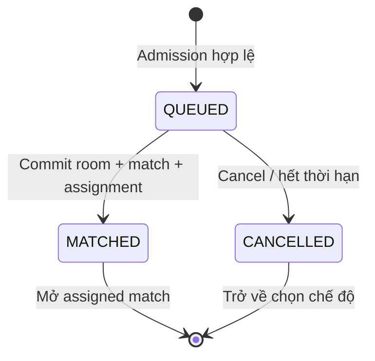

# FRS-L03 — Room & Matchmaking

| TASK_ID | Phụ trách | Phạm vi |
|---|---|---|
| L-03 | Long | Phòng, slot, lời mời, hàng chờ, admission và bàn giao vào trận |

## 1. Mục tiêu

Người chơi tạo/join phòng hoặc tìm đối thủ, hủy được khi chưa ghép và vào đúng trận khi đã ghép. Không tạo phòng/trận trùng, chiếm sai slot hoặc nhận thêm trận khi thiếu tài nguyên.

QUEUED/MATCHED/CANCELLED là trạng thái public của queue. Reservation khi ghép là trạng thái nội bộ, có deadline và fencing; không công bố MATCHED trước commit. Schemas/errors theo L-02; luật/setup theo L-01.

## 2. Phòng, slot và quyền

| Luồng | Xử lý bắt buộc | Người dùng / lỗi |
|---|---|---|
| Tạo phòng | Validate visibility/password, preset, controllers, Referee/Spectator; sinh generation mới; dedup command | Trả room/version và quyền thực; thiếu capacity trả unavailable |
| Join | Kiểm tra generation/version, password, slot, principal, active-match lock tại commit | Hai người tranh slot: chỉ một thành công; người còn lại nhận trạng thái mới |
| Player/controller | Hai side; HUMAN chỉ đi side được cấp; owner source Bot không tự có quyền đi quân | Hybrid dùng Bot mẫu/được phép, không tạo account giả cho Bot |
| Host | Capability quản lý riêng; host chọn Player hoặc Referee khi tạo | Host Referee để trống hai player slots; cấu hình Public/Private theo room schema |
| Referee | Account được mời và chấp nhận; tối đa một; không đồng thời Player/Spectator | Invite sai người/hết hạn/đã dùng bị từ chối; không cấp role từ link |
| Spectator | Kiểm tra toggle, capacity và role; stream chỉ sau grant | Player/Referee không tự trở thành spectator; leave thu hồi stream |
| Ready | Đủ controller/source authorization; Python preflight và runtime sẵn sàng; pin preset/setup | Thiếu người/Bot/Referee cần thiết: không countdown, nêu lý do |
| Rời phòng | Pregame bỏ slot/Ready và hủy countdown; sau start giao lifecycle xử lý | Không xóa trận đang chạy chỉ vì host đóng trang; Bot tự đấu tiếp khi hạ tầng cho phép |
| Refresh/reconnect | Trả cùng generation/match/principal/slot/setup | Không tạo phòng, đổi side hoặc random lại |

Guest chơi Unranked, không Referee/Ranked. Referee chỉ ở custom Online. Membership, principal binding, Ready và role changes phải ghi bền qua L-05 trước ACK.

## 3. Matchmaking và admission

| Hạng mục | Cách xử lý |
|---|---|
| Queue partition | Tách Ranked, manual Unranked và Python; không ghép HUMAN/HUMAN vào PYTHON/PYTHON. Hybrid dùng luồng phòng/chọn đối thủ |
| Tìm đối thủ | Index theo mode và bucket phù hợp; giữ policy Elo/range hiện có; duyệt batch hữu hạn, ưu tiên thời gian chờ; không full-scan mọi entry mỗi request |
| Reservation | Reserve cả hai principals và capacity theo thứ tự lock xác định; kiểm tra lại active-match lock; không giữ global lock qua DB await |
| Commit ghép | Cùng logical transaction: room/generation, match/setup, memberships, assignments và queue outcomes của hai bên |
| Rollback | Commit thất bại: giải phóng reservation/capacity; giữ queue còn hợp lệ hoặc kết thúc có reason. Không để phòng mồ côi |
| Cancel thắng race | Queue CANCELLED đã commit → không được ghép sau đó; giải phóng entry/lease |
| Match thắng race | Cancel trả assignment đã commit; client mở trận, không rollback match hoặc báo đã hủy |
| Unknown outcome | Tra command/assignment theo L-02/L-05; không tạo queue mới khi chưa xác minh queue cũ |
| Lease/deadline | Server giữ queue lease và absolute wait deadline, gia hạn qua kết nối/request hợp lệ; không phụ thuộc beforeunload gửi thành công |
| Cleanup | Hết lease/deadline: kết thúc entry chưa ghép; dọn timer/listener/index theo batch; không xóa assignment đã commit |
| Capacity | Chỉ reserve ngân sách sau kiểm tra quota; lobby, PvP và Python có pool riêng. Python Online ban đầu tối đa một trận active; tăng cần số đo/review |

Queue depth, lease, max wait, reservation deadline và quotas nằm trong budget profile L-07; phải có giá trị hữu hạn trước chạy candidate. Queue đầy trả 429 hoặc 503 đúng L-02, không nhận vô hạn. Không tính người đang chờ/bị từ chối là đã được phục vụ gameplay.

## 4. Shared client và trạng thái lỗi

| Trạng thái | UI / hành vi |
|---|---|
| Joining/queued | Một admission lease cho cùng intent; remount/StrictMode không tạo queue thứ hai |
| Cancelling | Hiển thị “Đang hủy tìm trận”; chờ authoritative outcome, không báo thành công sớm |
| Matched | Mở room/match được server gán, kể cả khi người dùng vừa bấm hủy |
| Offline/unknown | Giữ queueId/commandId, reconnect rồi tra assignment; không auto-join mới |
| Expired/full/conflict | Nêu lý do, cho tìm lại sau khi queue cũ đã kết thúc; giữ lựa chọn chế độ |
| Nhiều tab | Dùng principal/target binding; tab thứ hai đồng bộ hoặc bị chặn theo active lock, không chiếm slot mới |

API client/admission service thuộc Long; page/router thuộc owner giao diện. Chỉ navigation sau outcome hợp lệ; không dùng URL để cấp role.

## 5. Nhiệm vụ và nghiệm thu

| TASK_ID | Hạng mục | Điều kiện đạt |
|---|---|---|
| L-03.ROOM-01 | Create/join schemas và commit | Duplicate create một room; concurrent join một slot; reused code không nhận generation cũ |
| L-03.ROOM-02 | Membership/role/invite | Guest/account, host/referee/spectator/candidate đúng quyền; invite replay/cross-room bị chặn |
| L-03.ROOM-03 | Ready/start handoff | Thiếu slot/source/preflight/referee không start; leave/reset Ready không reroll setup |
| L-03.ROOM-04 | Partition/index/fairness | Không ghép sai mode/controller; bucket/range đúng; batch hữu hạn, không starvation trong profile thử |
| L-03.ROOM-05 | Reservation/atomic assignment | Hai joins/cancel/create đồng thời không double match; lỗi DB không room/lock/capacity mồ côi |
| L-03.ROOM-06 | Cancel race | Cancel trước commit → CANCELLED; match trước → assigned match; phản hồi mất vẫn reconcile đúng |
| L-03.ROOM-07 | Lease/cleanup | Reload/đóng tab/mất stream không để queue tồn tại vô hạn; cleanup không xóa match đã ghép |
| L-03.ROOM-08 | Admission/resource release | Create burst/cooldown, waiting-room/queue/lease caps hữu hạn theo baseline; reserve nguyên tử, giải phóng đúng một lần; spam nhiều tài khoản không vượt total budget hoặc chiếm pool PvP |
| L-03.ROOM-09 | Client/multi-tab integration | Hai browser start→match→cancel/reconnect đúng; StrictMode/remount không tạo admission mới |

## 6. Phụ thuộc và DoD

| TASK_ID | Phối hợp |
|---|---|
| L-01/L-02 | Setup và contract/actor/error |
| L-03.SYNC / L-04 / L-05 | Shared network, lifecycle và atomic persistence |
| L-07 | Quota/lease/deadline profile và load harness |
| N-02/N-04/N-06; D-02/D-04; S-03/S-05 | Bot authorization, security và page states |

**DoD:** L-03.ROOM-01…09 có unit/race/API/browser evidence; queue/room consistency kiểm tra trên disposable DB; typecheck/lint/build liên quan đạt. Bàn giao state table, failure fixtures, cleanup metrics và known gaps. Mock không thay durable race tests; chưa chạy ghi NOT RUN, chưa DONE.

## 7. Phối hợp Long–Đức

Long là owner code tích hợp chung room/queue/lifecycle, budgets/config và integration fixes. Đức giữ auth/limiter modules riêng, policy/abuse fixtures và review/retest. Checklist: [LD-02/03](../security/DUC.md#long-duc).

| TASK_ID / handoff | Long triển khai | Đức bàn giao | Điều kiện tích hợp |
|---|---|---|---|
| L-03.ROOM-02/.03/.09 · LD-02 | Recheck membership/role khi Ready/start/join; client xử lý quyền bị thu hồi | Actor/resource matrix, revoke/expiry hooks và fixtures | Token/invite/Ref cũ không chiếm slot hoặc start; login không đổi principal trận Guest |
| L-03.ROOM-01/.04/.07/.08 · LD-03 | Atomic reserve, leases/TTL, room/queue caps và gameplay reserve | Action/principal limiter; IP bổ trợ, shared-IP/multi-account workload | Chốt config names/units và số từ L-07 baseline. Đổi tài khoản/command ID không né total caps; cleanup không xóa trận đang chạy |
| L-03.ROOM-05/.06/.09 · LD-02/03 | Cancel-vs-match/retry/reconnect tích hợp guards | Race + spam fixtures qua HTTP thật | Một assignment/outcome, không orphan reservation; người hợp lệ dùng chung IP vẫn chơi được trong ngân sách đã đo |

**Checkpoint:** khóa ACL/limiter interface → baseline budgets → candidate room/queue → Đức retest với traffic hợp lệ + spam. Không đợi FRS Security DONE mới xây room/queue.
