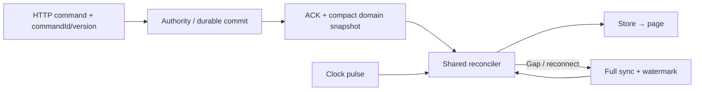

# FRS-L04 — HTTP, SSE & Client Sync

| TASK_ID | Phụ trách | Phạm vi |
|---|---|---|
| L-03 | Long | HTTP/SSE, shared network client, reconcile, reconnect và backpressure |

## 1. Mục tiêu

Các client hội tụ về cùng trận sau mất mạng hoặc sự kiện đến sai thứ tự. Client chậm/lỗi chỉ ảnh hưởng kết nối của nó; traffic lobby/history không chiếm hết tài nguyên trận đang chạy.

Payload, protocol, cursor và errors dùng L-02. Giữ HTTP/SSE; realtime capability phải phản ánh adapter thực, không dùng trạng thái PlayHTML giả sẵn sàng.

## 2. Server transport

| Hạng mục | Yêu cầu |
|---|---|
| HTTP boundary | Validate schema/version, session, origin/CSRF và target quyền theo security policy; deadline/cancel không mặc định hủy transaction đã bắt đầu |
| Success/error | ACK sau durable commit; lỗi có retryability; disconnect trước response là unknown outcome, không tự kết luận chưa commit |
| SSE subscribe | Kiểm tra protocol/actor/membership trước mở stream; gửi full sync; theo dõi session expiry/role revocation |
| Full sync | Capture current snapshot/watermark nhất quán, đăng ký stream không có khoảng hở. Buffer hữu hạn sự kiện phát sinh lúc sync; vượt buffer thì sync lại |
| Domain fan-out | Serialize public projection một lần cho nhóm cùng quyền; listener lỗi được bắt riêng; không share viewer/private fields |
| Clock pulse | Anchor nhỏ, không board/history; coalesce pulse cũ; không tăng domain sequence/DB write mỗi tick |
| Backpressure | Theo dõi write=false/drain, bytes và wait deadline từng stream; queue hữu hạn; vượt ngưỡng đóng stream đó, yêu cầu resync |
| Durable domain events | Không drop/coalesce âm thầm; backlog hữu hạn, thiếu cursor thì full snapshot + history/timeline tải riêng |
| Heartbeat/cleanup | Heartbeat tạm thời; close/error/revoke dọn listener, buffer, timer, metrics đúng một lần |
| Pool isolation | Reserve gameplay budget; lobby summary cache/coalesce, history phân trang; chặn admission/subscription mới khi pressure |

Giới hạn stream/principal, backlog bytes/age, heartbeat, request timeout và reconnect lấy từ profile L-07. Scheduler trận không thuộc subscription; đóng stream không dừng clocks hoặc Bot đã chạy.

## 3. Reconciliation

| Input | Xử lý |
|---|---|
| Full sync hợp lệ | Pin principal/room generation/match/rules versions; thay current store và watermark nguyên tử; giữ viewer projection riêng |
| Domain event tiếp theo | Validate type/payload/scope; sequence liên tục, stateVersion không lùi; cùng version được phép khi cùng commit |
| Duplicate/stale | Bỏ event đã áp; không nhân đôi animation/history; ACK cũ không rollback store |
| Gap/out-of-order | Khóa mutation chưa an toàn, lấy full sync; không tự đoán move hoặc nhảy sequence |
| Pulse | Match/version khớp, pulse mới hơn và anchor không cũ; không ghi đè board/status; phiên kết nối cũ bị fencing |
| Pulse vượt version | Chờ/lấy snapshot; không tự đổi currentTurn hoặc xử timeout từ UI |
| Rematch | Đổi matchId; ngừng stream/callback cũ, bỏ pending intent cũ; bind setup/side mới từ server |
| Pause/terminal | Clock hiển thị theo anchor; gameplay bị khóa; terminal không hồi PLAYING vì late response/pulse |
| Version/schema sai | Dừng action, giữ bản đã validate, hiển thị yêu cầu cập nhật/resync; không cache JSON chưa validate |

Full sync sau reconnect bao phủ các event trước watermark; event sau watermark phải được tiếp nhận hoặc phát hiện gap. Snapshot đúng không đồng nghĩa timeline đã đủ; timeline đồng bộ riêng khi xem history/replay.

## 4. Shared client và reconnect

| Thành phần | Trách nhiệm |
|---|---|
| HTTP client | Credentials, schema parse, command identity, timeout, error/retry policy; không tự replay mutation với ID mới |
| Subscription manager | Một subscription/consumer group theo principal/scope/target, ref-count cleanup; page không tự tạo EventSource trùng |
| Network store | CONNECTING/SYNCED/RECONNECTING/READ_ONLY/FATAL; page đọc snapshot/actions, không sửa canonical board |
| Reconnect controller | Một vòng reconnect duy nhất, exponential backoff + jitter + cap; không đồng thời dùng hai cơ chế auto-reconnect |
| Cursor | Native Last-Event-ID khi có; EventSource mới không gửi được cursor header thì bắt đầu full sync, không giả resume đã đủ |
| Multi-tab/session | Tab identity không cấp quyền; re-auth và pinned match principal theo policy; logout/revoke xóa private/viewer cache |
| Page adapter | Bàn giao network logic khỏi page theo writer; Nam/Sơn giữ router/layout và presentation |

| Trạng thái người dùng | Hiển thị / action |
|---|---|
| Connecting/resync | “Đang đồng bộ trận”; khóa action cần authority |
| Reconnecting | “Mất kết nối. Đang kết nối lại”; giữ board cuối có nhãn trạng thái |
| Conflict/unknown command | Tra outcome rồi resync; không báo move thành công trước ACK/commit xác minh |
| Forbidden/expired | Dừng stream/actions; lỗi quyền không tự logout; session hết hạn mới yêu cầu đăng nhập lại |
| Recovered | Xóa banner sự cố, mở action theo allowedActions; không phát lại capture/âm thanh cũ |

## 5. Nhiệm vụ và nghiệm thu

| TASK_ID | Hạng mục | Điều kiện đạt |
|---|---|---|
| L-03.SYNC-01 | HTTP schema/auth/error adapter | Mọi browser mutation kể cả auth/Guest có `X-OTT-Request: 1` và JSON; malformed/forged/version mismatch bị chặn; 403 không logout, chỉ 401 `FATAL_SESSION` yêu cầu đăng nhập lại; retry giữ command ID |
| L-03.SYNC-02 | Atomic full sync/subscribe | Inject event giữa snapshot và subscribe: không mất event, hoặc gap được resync |
| L-03.SYNC-03 | Event/pulse reconciler | Duplicate/reorder/gap/stale ACK/pulse cho hai browser hội tụ, không rollback/duplicate move |
| L-03.SYNC-04 | Stream backpressure | Slow reader đạt limit bị đóng riêng; memory/buffer bounded, client khác vẫn nhận đúng |
| L-03.SYNC-05 | Fan-out isolation/privacy | Listener throw không ngắt fan-out khác; public/viewer/owner fields không lẫn |
| L-03.SYNC-06 | Reconnect/lease cleanup | Storm/remount/multi-tab không nhân stream/loop; close/revoke dọn hết tài nguyên sau cửa sổ cleanup |
| L-03.SYNC-07 | Session/role revocation | Thu hồi quyền chặn HTTP và ngừng SSE đang mở; cache riêng được xóa |
| L-03.SYNC-08 | Page/store integration | Pause/terminal/rematch/network states đúng; không mutation từ UI clock/animation; keyboard không mất focus khi banner đổi |
| L-03.SYNC-09 | Load/resource regression | Bytes/event, buffers, streams và event-loop lag có baseline/candidate report; đạt SLO trong profile an toàn |

## 6. Phụ thuộc và DoD

L-02 cung cấp schemas; L-03.ROOM cung cấp membership/assignments; L-04/L-05 cung cấp commit/snapshot; L-07 khóa budgets. D-02/D-04 review auth/privacy; Nam/Sơn tích hợp pages theo ownership.

**DoD:** L-03.SYNC-01…09 có contract/unit/API/SSE/browser evidence, slow-client và revoke tests thật; typecheck/lint/build liên quan đạt. Nộp adapter/store API, cursor fixtures, cleanup/resource report và gaps. Không lấy mocked EventSource chứng minh mạng/provider thật đã đạt.

## 7. Phối hợp Long–Đức

Long là owner code tích hợp chung shared HTTP/SSE/store/app và integration fixes. Đức cung cấp security guards/hooks trong module riêng, policy/fixtures và review/retest. Checklist: [LD-01/02/03/05](../security/DUC.md#long-duc).

| TASK_ID / handoff | Long triển khai | Đức bàn giao | Điều kiện tích hợp |
|---|---|---|---|
| L-03.SYNC-01/.08 · LD-01 | Shared client gắn header/JSON; app đăng ký guards đúng thứ tự; callers theo page owner | CSRF middleware, exact Origin/Referer allowlist, body bounds và preflight fixtures | Login/logout/Guest/gameplay hợp lệ chạy; thiếu header/cross-site bị chặn. SSE GET không cần custom header; vẫn auth/ACL và kiểm tra Origin khi có |
| L-03.SYNC-05/.06/.07 · LD-02 | Session-indexed stream cleanup, recheck quyền trước fan-out, cache clear/re-auth/resync | Revoked session IDs/scope + expiry hooks; rotation/role fixtures | Token cũ mất HTTP/SSE quyền; token mới resync đúng principal. Không query DB mỗi clock pulse; không hứa thu hồi bytes đã gửi |
| L-03.SYNC-04/.06/.09 · LD-03 | Bounded stream count/buffer/retry/cleanup, resync reserve | Limiter signature và reconnect/slow-reader/shared-IP workloads | Một stream lỗi/chậm không ngắt stream khác; storm không tạo buffer/subscription vô hạn; budgets từ L-07 |
| L-03.SYNC-02/.05/.08 · LD-05 | Viewer-specific projection cho snapshot/events; cache không lẫn principal | Whitelist/private canaries | Scan HTTP/SSE/reconnect không lộ source/memory/log/private diagnostics |

**Checkpoint:** khóa guard/hook interface → candidate HTTP/SSE → Đức chạy CSRF/revoke/privacy fixtures → retest load. Nam/Sơn tích hợp page của mình; không thêm writer cùng file.
