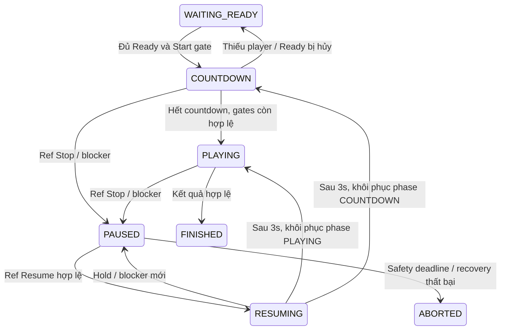

# FRS-L05 — Match Authority & Clocks

| TASK_ID | Phụ trách | Phạm vi |
|---|---|---|
| L-04 | Long | Serialized match lifecycle, quyền, clocks/deadlines, blockers và Human/Bot/Referee commit |

## 1. Mục tiêu

Server quyết định trạng thái, lượt, thời gian và kết quả. Lệnh đồng thời chỉ tạo một outcome hợp lệ; Stop khóa trận nguyên tử; Bot trả muộn không thay đổi trận hoặc memory.

Sơ đồ rút gọn; terminal deadline có thể kết thúc mọi nonterminal phase. Blocker tự phục hồi chỉ khôi phục phase khi policy cho phép; Ref Stop/referee loss không tự Resume.

## 2. Authority và commit lane

| Bước/cơ chế | Yêu cầu |
|---|---|
| Per-match lane | Human move, Ready, revision activation, referee action, deadline và Bot result đi cùng lane; queue hữu hạn, không global lock |
| Recheck | Xác minh principal/controller/target/version, current status/turn, blockers và deadline tại đầu xử lý; queue wait có tính vào thời gian |
| Stage | Tính next state riêng; không mutate public state hoặc memory đang commit; rules dùng L-01 |
| Durable commit | CAS expected version, lưu state/events/outcome/private checkpoint qua L-05; không chạy Python hoặc fan-out trong transaction |
| Publish/ACK | Commit thành công mới đổi store/publish/ACK; commit unknown khóa mutation liên quan và đối chiếu outcome |
| Fairness | Batch hữu hạn/yield và quota theo match; một trận spam không giữ event loop/DB pool vô hạn |
| Terminal | Một transition cuối; deadline callback kiểm tra matchId/epoch/status; không ghi đè kết quả đã commit |

Human chỉ đi HUMAN slot/own turn. Python chạy ngoài lane trong sandbox; kết quả phải khớp matchId, turn token, invocationId, active revision và expected stateVersion. ComputeMs do supervisor đo; Python không tự khai winner, quyền hoặc thời gian hợp lệ.

## 3. Clocks, blockers và deadlines

| Timer/blocker | Quy tắc |
|---|---|
| Gameplay clock | Server anchor; chạy khi gameplay active; đóng băng lúc pause/resume countdown, player grace hoặc infrastructure recovery. UI chỉ nội suy |
| Deadline scheduler | Độc lập subscriber; xử deadline gần nhất theo batch hữu hạn; recheck khi xử command, không dựa vào tick UI |
| Bot budgets | Per-invocation và whole-match active compute theo manifest; không đổi budget vì tăng số quân hoặc áp lực tải |
| Resume countdown | 3s sau Ref Resume hợp lệ; còn khóa gameplay; Stop/Hold/blocker mới hủy countdown |
| Ref disconnect | Auto-pause; giữ slot 60s; replacement sau 60s; recovery deadline tuyệt đối 5 phút từ mất kết nối đầu tiên |
| Ref Stop allowance | Tối đa 10 phút mỗi lần liên tục, tổng 30 phút/trận; tính cả thời gian chuẩn bị Resume khi còn frozen; hết hạn neutral abort |
| Cảnh báo pause | Còn 60s/10s trước hết allowance; nêu rõ trận sẽ hủy trung lập, không tuyên bố người chơi thua |
| HUMAN disconnect | Grace 30s wall-clock, độc lập Ref pause; clock gameplay frozen. Một bên vắng quá hạn thua DISCONNECT_TIMEOUT; cả hai hết grace thì neutral abort |
| Grace lệch nhau | Khi bên đầu hết grace mà bên kia vẫn vắng trong grace: chờ bounded deadline còn lại. Bên kia kịp về → bên quá hạn thua; cả hai quá hạn → abort |
| PYTHON owner rời UI | Bot đã start tiếp tục nếu hạ tầng cho phép; không mở grace xử thua của HUMAN cho Bot slot |
| Infrastructure | Freeze phần liên quan, bounded recovery; không quy thành author fault hoặc disconnect forfeit do outage |

Blockers là tập độc lập; Resume không xóa infrastructure/player/referee blockers khác. Duplicate Stop, reconnect flapping, replacement hoặc đổi revision không gia hạn safety deadline. Timeout đã hợp lệ trước command không được hồi sinh bởi timestamp client.

## 4. Referee, Bot và rematch

| Tình huống | Hành vi |
|---|---|
| Start | Hai slots Ready, Python hợp lệ, preset/setup pinned; phòng có Ref cần Ref hiện diện và Start; không Fast Ready bypass |
| Stop | Freeze board/turn/clocks/active cap; khóa move/surrender/Ready/countdown/revision application; ghi actor/category/time |
| Bot đang tính khi Stop | Invalidate epoch, cancel/kill/reclaim runtime; không lưu partial memory/log làm state; output muộn bị discard |
| Resume Bot | Cùng active revision/pre-turn memory/seed, đủ budget invocation; không author penalty, không tự kích hoạt pending |
| Revision pending | Latest valid candidate; áp tại normal next-own-turn boundary; candidate lỗi không mất active revision. Lưu Library độc lập vẫn được phép khi paused |
| Bị khóa nước | Check actual turn trước invocation; NO_LEGAL_MOVES là kết quả rules, không timeout/author fault |
| Bot finite limit | Kết quả rules ưu tiên; giới hạn tại full-round boundary, so N/P/M theo thứ tự; hòa chính xác RED thắng theo scorer chung |
| Ref replacement | Chỉ khi paused/ref vắng qua reservation; một player nominate, hai pinned player principals consent, account mới accept; atomic revoke Ref cũ |
| Ref quay lại | Trong slot reservation có thể reconnect; không tự resume. Sau thay thế không còn quyền control |
| Rematch | Explicit acceptance; matchId/setup mới cùng room context, đổi side; Ready=false, memory reset, dùng last active revisions được chọn; không auto-start pending |

Không có Ref thì không có manual Stop Online. Replacement consent gắn candidate/match/epoch và hết hạn theo recovery window. Ref không sửa clock/bàn, undo hoặc chọn winner tùy ý.

## 5. Lỗi và trạng thái người dùng

| Trường hợp | Kết quả |
|---|---|
| Sai actor/controller/target/version | Deny/conflict theo L-02; board/clock/memory không đổi do command bị từ chối |
| Paused/resuming | Nêu blocker/actor, pause elapsed và hành động được phép; board chỉ xem |
| Deadline/terminal đã commit | Trả terminal state, không chạy thêm Bot hoặc hồi trận |
| Runtime author fault | Chỉ active code exception/illegal move/own budget violation có evidence mới xử thua author |
| Runtime/DB hạ tầng lỗi | Infrastructure blocker và retry/recovery hữu hạn; thất bại hủy trung lập, không lỗi tác giả |
| Unknown outcome | Không ACK success hoặc chạy lại invocation trước reconcile; giữ last committed state |

## 6. Nhiệm vụ và nghiệm thu

| TASK_ID | Hạng mục | Điều kiện đạt |
|---|---|---|
| L-04.01 | State machine/actor guards | Mỗi transition có positive/negative fixtures; client không tự chiếm side/controller/referee |
| L-04.02 | Serialized lane/CAS | Hai moves cùng version, move-vs-Stop, timeout-vs-surrender chỉ một outcome; queue bounded/fair |
| L-04.03 | Durable integration | Stage không public trước commit; failure/unknown không mất hoặc nhân đôi nước ACK |
| L-04.04 | Scheduler/clocks | Zero subscribers, background tab, delayed tick và queue wait vẫn đúng deadline; pause frozen |
| L-04.05 | Blocker composition | Player/Ref/infra đồng thời; Resume không xóa blocker khác hoặc gia hạn grace |
| L-04.06 | Disconnect deadlines | 30s grace, single forfeit/both-expired abort, staggered grace và late reconnect đúng |
| L-04.07 | Ref Stop/Resume/replacement | 3s/60s/5min/10min/30min boundaries đúng; old Ref revoked, warnings và audit đầy đủ |
| L-04.08 | Bot cancel/fencing | Stop/rematch/revision-vs-result, late output không commit/mutate memory; runtime reclaimed |
| L-04.09 | Rules/Bot terminal | Blocked/extinction/goal/finite limits đúng precedence; infra khác author fault |
| L-04.10 | Rematch/principal | Side/setup/memory/Ready đúng; Guest login không đổi chủ trận; invocation cũ không chạm ván mới |
| L-04.11 | Isolation integration | Match spam/listener/Bot lỗi không phá match khác trong measured envelope; shared dependency outage recovery đúng |

## 7. Phụ thuộc và DoD

L-01/L-02 cung cấp rules/contracts; L-03 cung cấp room/shared client; L-05 cung cấp transaction/recovery; N-04/N-06 cung cấp trusted Bot adapter; D-02/D-04 review quyền/races; L-07 đo isolation/SLO.

**DoD:** L-04.01…11 có deterministic clock/race fixtures và real API/DB/runtime/browser evidence liên quan; typecheck/lint/build đạt. Nộp transition/deadline matrix, race reports và gaps. Candidate authority và persistence phát triển theo interface chung; không tạo vòng chờ hai task DONE.

## 8. Phối hợp Long–Đức

Long là owner code tích hợp chung match lane/lifecycle và integration fixes; Đức giữ policy/race fixtures và review/retest; Nam giữ trusted Bot adapter/runtime. Checklist: [LD-02/03/04](../security/DUC.md#long-duc).

| TASK_ID / handoff | Long triển khai | Đức bàn giao | Điều kiện tích hợp |
|---|---|---|---|
| L-04.01/.02/.07 · LD-02 | Recheck session/resource quyền tại commit; serialize role replacement với command | Revocation/expiry interface và queued-command/old-Ref fixtures | Command còn chờ không bypass revoke; commit đã hoàn tất trước revoke không rollback |
| L-04.02/.03/.08/.10 · LD-04 | Command ledger, staged board/memory, invocation epoch/version fence và rematch binding | Forged result/controller/epoch fixtures; Nam runtime candidate | Không double/lost ACKed move hoặc late memory write; không nhận Bot result từ public actor |
| L-04.04/.05/.06/.09 · LD-04 | Clock/deadline/blocker composition và infrastructure outcomes | Stop/timeout/reconnect/DB-failure race fixtures | Resume không xóa blocker khác; hạ tầng lỗi không tự xử thua; unknown outcome được reconcile |
| L-04.02/.11 · LD-03 | Bounded/fair lanes, duplicate fast path và gameplay budgets | Move spam/multi-account/new-command-ID workload | Tính requests vào quota trước expensive work; retry outcome không chạy lại rules/Python; nước hợp lệ nhanh không tự bị kết luận gian lận |

**Checkpoint:** khóa commit/revocation seam → authority + persistence candidates → Đức race/crash retest trên disposable DB và runtime liên quan. Fixtures có thể viết song song; DONE cần integrated evidence.
