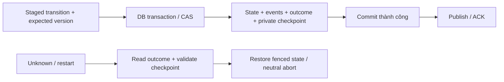

# FRS-L06 — Persistence, Recovery & Replay

| TASK_ID | Phụ trách | Phạm vi |
|---|---|---|
| L-05 | Long | Durable commit, command outcome, checkpoint, khôi phục, result/history/Elo và replay |

## 1. Mục tiêu

Nước đã ACK không mất hoặc nhân đôi khi retry/restart. Khôi phục đúng board/setup/role/clock/Bot memory; không thể khôi phục an toàn thì hủy trung lập có lý do. Replay dùng dữ liệu thực đã commit.

Dùng PostgreSQL hiện có qua async adapter. In-memory/file adapter chỉ là fixture hoặc dùng khi storage durability được chứng minh; không lấy file tồn tại qua process restart làm bằng chứng sống qua redeploy. Schema/migration chỉ chạy trên disposable DB trong harness.

## 2. Dữ liệu và atomic boundary

| Dữ liệu | Ràng buộc |
|---|---|
| Room/context | Generation/version, config, memberships/roles/principal bindings, active match và previous committed initial setup |
| Match checkpoint | Match/rules/setup versions, actual initial board/seed/signature, current board/counts/turn/status, stateVersion/sequence |
| Lifecycle | Clock remaining/anchors, blockers/phase, pause totals, absolute deadlines, Ref/replacement/Ready/controller bindings |
| Domain events/moves | Immutable event IDs, unique target/sequence; accepted moves liên kết đúng stateVersion, initial state và final outcome |
| Command ledger | Principal/target/operation/commandId, canonical payload digest, server receivedAt/expiry và outcome/ACK; không lưu raw source/password trong command journal |
| Private Bot checkpoint | Active/pending revision reference, memory/version, pre-turn seed, invocation epoch/token và active compute budget; tách public snapshot |
| Terminal settlement | Result identity, history và Elo eligibility/outcome; một result/trận, retry idempotent |

Transaction kiểm tra expected version/generation, ghi state/move/events/outcome và private Bot checkpoint liên quan cùng commit. Setup mới + context previous cập nhật nguyên tử; room/queue assignments không công bố trước commit. CAS/unique constraints ngăn stale writers và duplicate terminal.

Không I/O runtime hoặc fan-out trong transaction. Publish thất bại sau commit không rollback DB: client resync, publisher retry theo event ID; duplicate delivery không duplicate mutation. History/Elo nếu xử lý sau terminal dùng durable settlement job cùng DB, unique matchId và retry hữu hạn.

## 3. Idempotency và retention

| Trường hợp | Xử lý |
|---|---|
| Retry đã commit | Trả original outcome trước stale/age check; không chạy rules/Python lần hai |
| Commit chắc chắn rollback | Giữ state cũ; retry cùng command theo policy |
| Timeout/mất connection lúc commit | Đánh UNKNOWN; fence mutation liên quan, tra ledger/checkpoint trước quyết định tiếp |
| DB chưa xác minh outcome | Không ACK success, không reset state hoặc sinh command thay thế; bounded retry/infrastructure blocker |
| Ledger compaction | Giữ unresolved outcomes; outcome hết hạn chuyển tombstone có key/digest/target và expired marker. Không xóa identity khi command vẫn có thể bị nhận như operation mới |
| Expiry/bounds | Server xác lập expiry trong ledger; không suy thời điểm từ UUID v4. Ledger chạm budget thì chặn admission mới, không quên dedup keys để nhận thêm tải |
| Private retention | Temporary match source 30 ngày từ `endedAt`, private logs 7 ngày từ lúc tạo; hết hạn chặn đọc dù GC chưa chạy. Terminal memory chặn đọc ngay, xóa vật lý khi settlement an toàn. Không GC active refs hoặc Library source |

Command đã đánh expired trả COMMAND_EXPIRED; chỉ thao tác mới do người dùng xác nhận mới dùng ID mới. Tombstone/ledger/log đều có giới hạn; cleanup theo batch chỉ xóa identity khi target/credential fencing bảo đảm không thể thực thi lại. Không xóa record còn cần xử lý UNKNOWN.

## 4. Khôi phục và sự cố

| Giai đoạn | Yêu cầu |
|---|---|
| Startup | Chưa mở mutation/admission trước DB/adapter readiness; load checkpoint theo batch, không full-load mọi history |
| Validate | Đối chiếu versions, board/counts/IDs, initial descriptor, sequence/events/outcomes và Bot checkpoint; corrupt không tự sửa |
| Fencing | Lease/epoch mới vô hiệu hóa worker/invocation cũ; một writer cho target; callback cũ không commit sau restart |
| Principal/role | Restore bindings, re-auth và áp revocation/expiry hiện hành; không restore quyền từ URL hoặc token đã hết hạn |
| Clock | Restore remaining/phase/blockers; không dùng monotonic time process cũ. Outage không trừ thành thua người chơi hoặc tạo grace mới giả |
| Safety deadlines | Deadline đã tồn tại giữ policy L-04; không reset Ref absence/pause/player grace bằng restart hoặc retry |
| Bot | Cùng committed board/revision/memory; bỏ partial computation, retry uncommitted turn từ pre-turn checkpoint khi gates rõ; không activate pending do Resume |
| Phục hồi thất bại | Bounded recovery hết hạn → durable neutral abort khi DB cho phép; DB chưa ghi được thì hiển thị unavailable, không bịa terminal đã lưu |
| Local session | Adapter local lưu cùng descriptor/context; nhiều tab serialize writer; restore Bot paused, thiếu kit giữ dữ liệu và yêu cầu tải kit |

Process crash có thể ngắt nhiều trận trên một instance. Phải kiểm thử restart/redeploy rehearsal và dependency outage riêng; không tuyên bố zero interruption.

## 5. Replay, history và compatibility

| Hạng mục | Yêu cầu |
|---|---|
| Replay mới | Actual initial board + rules/setup pair → accepted moves theo sequence → final board/result; seed dùng đối chiếu, không thay actual snapshot |
| Timeline/audit | Start/Stop/Resume/replacement/revision/result, actor/category/durations; public whitelist, phân trang; không code/memory/log |
| Trận cũ đã nhận diện | Pin reader/rules đúng version; thiếu initial nhưng known fixed9 thì dùng đúng constants cũ và validate chain |
| Chỉ có final board | Chỉ xem vị trí cuối có nhãn, không dựng move chain/seed giả |
| Unknown/corrupt | Giữ record; read-only/error, không Start/resume hoặc replay bằng default mới |
| Result/Elo | Ranked account manual mới eligible; Bot/hybrid/local không Elo; retry settlement không cộng lại điểm/history |
| Rollback | Reader vẫn đọc được records đã ghi; không downgrade bỏ field/version hoặc rewrite history để chạy code cũ |

History trả source ACCOUNT/LOCAL và controller classification đúng; Guest là principal, không gộp mọi trận Guest vào một game mode. Retention/private export không làm mất public replay hợp lệ.

## 6. Nhiệm vụ và nghiệm thu

| TASK_ID | Hạng mục | Điều kiện đạt |
|---|---|---|
| L-05.01 | Async persistence/schema | Migration rehearsal trên DB disposable có identifier; indexes/constraints/CAS đúng, không dùng DB mặc định chưa xác minh |
| L-05.02 | Atomic transition | Failpoint giữa từng write không tạo mixed board/events/outcome/memory; public store chỉ đổi sau commit |
| L-05.03 | Crash/retry ledger | Kill trước commit/sau commit trước ACK/sau ACK: không mất hoặc duplicate nước đã ACK |
| L-05.04 | Unknown outcome/expiry | Timeout DB, ledger compaction, command tuổi quá hạn không double commit; unresolved không bị cleanup |
| L-05.05 | Room/context/queue recovery | Same generation/assignment/slot/setup; previous initial đúng; không room mồ côi sau partial create |
| L-05.06 | Clock/role/blocker recovery | Re-auth/revoke, clock anchors, deadlines và pause totals đúng; outage không thành author fault/forfeit mới |
| L-05.07 | Bot revision/memory fencing | Restart/late worker không mixed revision-memory; cancelled invocation không ghi partial data |
| L-05.08 | Terminal/history/Elo | Retry/concurrent settlement một result/history/rating; Bot/hybrid/local không Elo |
| L-05.09 | Replay/compatibility | New random và known old records replay final khớp; broken chain/unknown version bị chặn |
| L-05.10 | Retention/privacy | Public export/SQL projection không private payload; cleanup đúng nguồn/thời hạn, Library không bị xóa nhầm |
| L-05.11 | Local adapter | Save failure/multi-tab/refresh giữ state hoặc báo lỗi; cold restore paused, missing kit không server fallback |
| L-05.12 | Backup/rollback rehearsal | Restore bản backup test đọc đủ new records; rollback không mất ACK/history; có report và giới hạn |

## 7. Phụ thuộc và DoD

L-01/L-02 khóa rules/contracts; L-03/L-04 cung cấp staged transitions/assignments; N-04/N-05 giữ private Bot/local adapters; D-02/D-04/D-05 review ACL/retention; L-07 đo DB/recovery và runbook.

**DoD:** L-05.01…12 có real disposable DB, kill/restart, API/browser và runtime evidence liên quan; typecheck/lint/build đạt. Nộp transaction/compatibility design, failpoint reports, backup/restore steps và gaps. Migration/shared production database và release cần lệnh riêng.

## 8. Phối hợp Long–Đức

Long là owner code tích hợp chung Prisma/transaction/recovery/replay và integration fixes; Đức giữ policy/canaries/failpoint assertions và review/retest; Nam giữ private Bot adapter. Checklist: [LD-02/04/05](../security/DUC.md#long-duc).

| TASK_ID / handoff | Long triển khai | Đức bàn giao | Điều kiện tích hợp |
|---|---|---|---|
| L-05.01/.02/.03/.04 · LD-04 | Atomic board/event/outcome/private checkpoint, unknown reconciliation và failpoints | Tampering/crash/retry fixtures | Kill trước commit/sau commit trước ACK/sau ACK không mixed state hoặc double/lost ACKed moves |
| L-05.06/.07 · LD-02/04 | Recovery re-auth, blocker/clock restore, invocation fencing | Expired/revoked-token và late-output fixtures; Nam private state contract | Restart không hồi quyền hoặc worker cũ; board/revision/memory cùng checkpoint; outage không thành author fault |
| L-05.08/.09/.10 · LD-05 | Whitelist history/replay/export; expiry checks + bounded GC theo retention | Privacy canaries, retention/active-reference policy | Source/log hết hạn không đọc được; terminal memory không truy cập; GC không xóa active refs/Library hoặc public replay hợp lệ |
| L-05.12 · LD-05 | Backup/restore/rollback rehearsal và quyền storage | Secrets/access checklist, incident fixtures | Backup không public; restore test đọc đúng versions/outcomes; report không credentials/private payload |

**Checkpoint:** khóa transaction/private-state interface → candidate trên DB disposable → Đức race/privacy/retention retest. Mỗi report ghi candidate + DB identifier; không dùng DB chung/production để thử failpoints.
