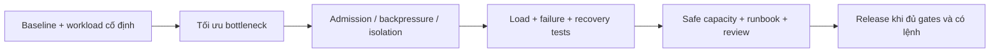

# FRS-L07 — Capacity, Integration & Runbook

| TASK_ID | Phụ trách | Phạm vi |
|---|---|---|
| L-06A / L-07 / L-06B | Long | Baseline, admission/isolation, integration/load/recovery tests, hướng dẫn vận hành và bàn giao |

## 1. Mục tiêu

Xác định hệ thống phục vụ an toàn được bao nhiêu người/trận, tối ưu điểm nghẽn và bảo vệ trận đang chạy. Team có quy trình kiểm tra/khôi phục rõ ràng, không cần vai trò DevOps riêng.

Giữ topology deployment hiện tại, HTTP/SSE và free-only. Không tự thêm microservices/cluster, đổi nhà cung cấp, tách frontend hoặc tăng billing. 1.000/5.000/10.000 CCU là mốc đo, chưa phải capacity đã đạt.

## 2. Workload và số liệu bắt buộc

| Profile | Tải cần mô phỏng | Số liệu |
|---|---|---|
| Lobby | Duyệt/tìm phòng, create/join/cancel, stream churn và history read | CCU, RPS, streams, admission/rejection, DB/cache pressure |
| PvP | Active matches, nước hợp lệ hai bên, clock pulse, spectator, reconnect | Matches, moves/s, ACK latency, bytes/event, hội tụ/correctness |
| Python | Runtime thật: preflight, turn, revision, cancel/reclaim, Human–Python và Bot–Bot | Active invocations/matches, compute/startup/wait latency, total runtime memory/CPU, lỗi author/infra riêng |
| Mixed | Tỷ lệ lobby/player/spectator/Bot, think time và churn khóa trước mỗi đợt đo | Offered/admitted/committed/completed/rejected/timeout; bottleneck và safe limit |

CCU không đồng nghĩa active players hoặc matches. Ghi số principals, số tabs/connections và vai trò; PvP hai người có tối đa floor(active players/2) trận, spectators không cộng thành player. Queue/rejection không tính là phục vụ đủ mốc gameplay.

| Gate | Điều kiện |
|---|---|
| Human move ACK | Server receive → durable committed ACK: p95 ≤300ms, p99 ≤1s; gồm auth/schema, queue wait, rules và DB commit |
| Correctness | Không sai/mất/nhân đôi nước đã ACK; một terminal/history/Elo outcome; đúng quyền và zero private leakage |
| Latency reporting | Internet RTT và Python compute báo riêng; timeout/unknown/pending phải được đếm, không loại âm thầm khỏi mẫu |
| Resource | CPU/throttling, RSS/heap/external, memory toàn instance gồm child runtime, event-loop lag, DB pool/wait, queue bytes/depth/age, stream buffers |
| Efficiency | So baseline/candidate: CPU/nước, RAM/stream, bytes/event và committed moves/s trong cùng workload |
| Headroom | Throughput tối đa vẫn trong SLO và memory budget, có ngân sách dự phòng đã kiểm chứng; không đặt sustained CPU/RAM 95–98% |
| Cleanup | Sau disconnect/cancel/terminal, stream/listener/timer/queue/runtime trả về mức nền trong cửa sổ đã khóa |

Metrics có histogram/counters đủ p95/p99, route labels chuẩn hóa và cardinality hữu hạn; không dùng URL/raw principal/match IDs làm metric labels. Metrics/diagnostics có ACL và không chứa secrets/source/log riêng.

## 3. Budget profile và capacity controller

| Nhóm cấu hình | Phải khóa trước candidate test |
|---|---|
| Admission | Max active PvP/Python, new rooms/queues/streams, per-principal quota; Python Online ban đầu tối đa một trận active |
| Match lanes/DB | Queue depth/bytes/max age, concurrent commits, pool reserve/deadline; ưu tiên gameplay, không queue vô hạn |
| SSE | Streams/principal, buffer bytes/age, drain deadline, backlog window, heartbeat và cleanup bound |
| Retry/leases | Backoff base/cap/jitter/max attempts, queue lease/max wait, reservation timeout, infrastructure recovery deadline |
| Command ledger | Retry window, tombstone/expiry policy, unresolved outcome retention; không prune khi có thể execute lại command cũ |
| Payload/query | Body/event/deep JSON bounds, history/replay page limits, cache size/TTL, bounded log volume |
| Pressure/recovery | CPU/memory/event-loop/DB/queue high-low thresholds, hysteresis, cooldown và recovery probe budget |

Ghi từng giá trị, đơn vị, nguồn config và lý do từ baseline. Threshold chưa đo thì chưa chứng nhận safe capacity; không sao chép số tùy ý giữa modules. Runtime source/memory/compute limits nhập từ manifest, không hạ security gates để tăng throughput.

| Controller state | Hành vi |
|---|---|
| NORMAL | Admission trong budgets; reserve ngân sách cho trận đã nhận |
| PRESSURE | Chặn hoặc giảm admission/lobby/history/preflight trước; bounded gameplay queue và quotas vẫn có hiệu lực |
| RECOVERY | Chỉ mở dần sau hysteresis/cooldown và probe thành công; jitter tránh reconnect storm |

Pool lobby/PvP/Python tách quota/concurrency; match hoặc listener lỗi chỉ khóa phần liên quan. Dependency chung/process crash có thể gián đoạn nhiều trận; chuyển recovery theo L-04/L-05, không hứa zero interruption.

## 4. Load và failure protocol

| Bước | Thực hiện | Đầu ra |
|---|---|---|
| 1. Environment | Xác minh test target/DB disposable, candidate/config/runtime versions và tài nguyên generator | Environment report không credentials; production không dùng làm tải thử khi chưa có lệnh |
| 2. Baseline | Tải thấp, đo từng profile và mixed; generator tách server, chứng minh phát đủ tải | Bottleneck, resource và latency baseline |
| 3. Ramp | Tăng từ nhỏ tới 1.000/5.000/10.000 CCU; khóa step/warmup/duration trước chạy | Mỗi mốc PASS/FAIL/NOT RUN; actual offered/admitted/served counters |
| 4. Soak/spike | Giữ tải ổn định, burst join/reconnect; duration và safety stop được ghi trước | Leak/cleanup, tail latency, controller transitions |
| 5. Failure | Slow SSE, listener throw, lobby/history flood, Bot author/infra fault, DB delay/outage và process kill | Match không liên quan đạt gates trong envelope; shared failure recover đúng |
| 6. Crash boundaries | Kill trước commit, sau commit trước ACK, sau ACK; retry và restart | Không mất/double ACKed move, board/revision/memory/role/clock nhất quán |
| 7. Retest | So cùng workload/config, tìm ngưỡng safe thấp hơn saturation | Safe capacity + admission config + giới hạn công bố |

Dừng có kiểm soát khi vượt SLO/memory/safety bound; mốc cao hơn chưa chạy ghi NOT RUN. Generator nghẽn không phải server đạt capacity. Local resource cap chỉ là rehearsal; kết luận cho Render cần measurement ở test target tương ứng được phép.

HTTP generator phải đi nước hợp lệ và giữ identity/version/idempotency; bổ sung SSE generator và real browser parity. Health-only smoke, mock Python hoặc bỏ durable DB không chứng nhận gameplay capacity.

## 5. Runbook cho team

| Tình huống | Thao tác | Kết quả đúng / xử lý |
|---|---|---|
| Chuẩn bị | Tại repo root, ghi candidate SHA/diff hash; xác minh test target/DB và tool versions | Không sử dụng DATABASE_URL mặc định nếu chưa xác định DB |
| Config | Kiểm tra HOST/PORT/CORS_ORIGINS, DB và runtime paths/pins; cấu hình Render đang dùng PORT=10000 | Log chỉ tên key lỗi, không in secret/connection string; không vô hiệu hóa validation |
| Gates local/test | Sau xác minh môi trường: `corepack pnpm typecheck`, `corepack pnpm lint`, focused tests rồi integration/browser phù hợp | Report có số tests thực; zero tests hoặc skipped không tính PASS |
| Build/runtime | `corepack pnpm build`; riêng Python readiness dùng `corepack pnpm --filter @ottv2/server probe:r3:provider` trên test environment thích hợp | Build successful không thay real consumer PASS; readiness lỗi chặn Bot admission |
| Kiểm tra app | App health, DB readiness, HTTP/SSE readiness và Bot readiness tách riêng; mở hai browser và chạy luồng room/move/reconnect | Không lấy `/health` 200 chứng nhận mọi mode |
| Pressure | Xem queue/stream/DB/runtime metrics, giảm admission mới; bảo vệ gameplay reserve | Không kill trận đang chạy để làm số tải đẹp; không tăng quota hoặc billing tùy tiện |
| DB/runtime outage | Khóa mutation/invocation liên quan, tra command outcome/checkpoint và bounded recovery | Không author fault/ACK giả; nêu rõ unavailable, giữ last committed state |
| Restart/restore | Rehearsal trên test: drain admission, lưu checkpoint, restart, re-auth/fence, xác minh board/clock/role/memory | Không reroll, double invocation hoặc hồi role đã revoked |
| Rollback | Đọc compatibility/backup report, chạy lại previous candidate trên test data có new records | Reader đọc được dữ liệu mới; không xóa/migrate ngược production để ép rollback |
| Release | Khóa candidate, review gates và approval đúng phạm vi; deploy/smoke/rollback plan chỉ sau lệnh riêng | Release đúng bản; theo dõi actual capability, không chỉ build status |

Runbook bàn giao phải có commands test cụ thể, đường dẫn reports, người nhận sự cố và cách phân loại lỗi; lệnh trong bảng là nền tảng, không phải evidence đã chạy. DB migration/shared production operations và provider load tests cần authorization tương ứng.

## 6. Nhiệm vụ và nghiệm thu

| TASK_ID | Hạng mục | Điều kiện đạt |
|---|---|---|
| L-06A.01 | Config/capability inventory | Versions/env/start/build, app/DB/transport/Bot readiness và ownership rõ, không secrets |
| L-06A.02 | Audit candidate | Freeze candidate/config, runbook/fixtures đủ cho D-05 và consumer review, chưa gọi release |
| L-07.01 | Metrics/baseline | Đủ counters/p95/p99/resources, labels bounded; baseline từng profile |
| L-07.02 | Workload/generator | Tỷ lệ actors/streams/think time/duration khóa trước; generator đủ tải, Python thật |
| L-07.03 | Budget/admission | Các giá trị hữu hạn từ measurement; NORMAL/PRESSURE/RECOVERY và headroom kiểm chứng |
| L-07.04 | Payload/throughput | Snapshot/pulse gọn; CPU/move, RAM/stream, bytes/event so cùng baseline; không mất semantics |
| L-07.05 | Ramp/soak/spike | Từng mốc 1k/5k/10k có verdict/counters, không đếm queue/rejected là served; safety stop đúng |
| L-07.06 | Fault isolation | Lobby flood/slow stream/listener/history/Bot lỗi không phá match khác trong safe envelope |
| L-07.07 | Recovery/correctness | DB delay/unknown, crash/retry/reconnect storm không sai/mất/double ACKed moves hoặc private leakage |
| L-07.08 | Consumer regression | Human/Bot/hybrid, Guest/account/Ref/Spectator, local/Online và bản lưu cũ có evidence đúng scope |
| L-07.09 | Runbook rehearsal | Người khác làm theo trên test environment: kiểm tra, restart/restore, rollback; ghi actual/expected |
| L-06B.01 | Handoff | Capacity report, review verdicts, demo, gaps/owner và next action đầy đủ; không unresolved blocker |
| L-06B.02 | Release gate | L-07/N-08/D-06/S-06 đạt; approval remote/DB tương ứng trước thao tác; chưa làm ghi NOT RUN |

## 7. Ưu tiên và DoD

| Checkpoint | Công việc |
|---|---|
| 10/10 | Baseline/harness/config audit, contract/commit interface, payload-clock; bắt đầu admission/backpressure/isolation và staged commit + persistence integration |
| 11/10 | Hoàn thiện integration/recovery/replay; consumer/load/failure retest, review và runbook |

Deadline chung toàn team: 00:00 10/10/2026 → 00:00 12/10/2026, UTC+7; 48 giờ lịch. Không tự bỏ scope hoặc đổi tiêu chí nghiệm thu; dependency/blocker báo sớm. Evidence mỗi task: candidate + environment/DB identifier + config/workload/commands + expected/actual + artifact + PASS/FAIL/NOT RUN/BLOCKED + reviewer/limitations.

**DoD:** Các task trên có report đúng candidate; safe capacity và SLO chỉ công bố mức thực sự đạt. Không P0/P1 mở; reviews có người/evidence thật, không tự ký independent PASS. Runbook đã rehearsal, known gaps có owner; release chưa được giao không coi đã DONE.

## 8. Phối hợp Long–Đức

Long là owner code tích hợp chung, config/budgets, app/metrics/network-load-integration harness/runbook và integration fixes. Đức giữ security modules riêng, policy/attack fixtures/security matrix và review/retest. Checklist: [LD-01…LD-06](../security/DUC.md#long-duc).

| TASK_ID / handoff | Long triển khai | Đức bàn giao | Điều kiện tích hợp |
|---|---|---|---|
| L-06A.01 · LD-01/02 | Đăng ký guards/hooks, CORS/env và shared-client config | Guard order/signature; allowlist/session/error policy | Không wildcard/reflect Host; Origin sai không được cứu bằng Referer; chỉ fallback Referer khi thiếu Origin. Test không bypass guards |
| L-07.01/.03 · LD-03 | Baseline; khóa config names/units, room/queue/SSE/DB budgets và NORMAL/PRESSURE/RECOVERY | Action/principal/IP limiter keys, TTL/cap và abuse workload | Ngưỡng hữu hạn từ measurement; shared IP không là identity chính; buckets đầy không quên active keys để nhận thêm; giữ headroom/gameplay reserve |
| L-07.02/.05/.06/.07/.08 · LD-03/04/06 | Mixed workload + multi-account/room/move/SSE/reconnect spam, race/crash harness | Fixtures/expected outcomes và security assertions | Legitimate + attack vẫn đúng quyền/state trong safe envelope; human ACK p95≤300ms, p99≤1s gồm auth/queue/DB; Python thật đo riêng; 1k/5k/10k báo đúng verdict |
| L-06A.02; L-07.04/.09 · LD-05 | Candidate inventory, bounded labels/logs, public diagnostics projection và incident rehearsal | Redaction/retention/canaries/checklist | Không raw-path cardinality vô hạn hoặc private leakage; readiness đúng candidate/provider; người khác làm theo runbook trên test target |
| L-06B.01/.02 · LD-06 | Freeze candidate/config/diff, tổng hợp reports và sửa phần Long sở hữu | D-06 coverage/findings/retest/scoped sign-off | Thay candidate phải retest phần ảnh hưởng; P0/P1, isolation/privacy/correctness lỗi hoặc ca bắt buộc thiếu evidence chặn nghiệm thu; remote/DB cần lệnh riêng |

**Checkpoint:** đầu 10/10 khóa interfaces/budgets và chạy baseline → bàn giao candidate liên tục → 11/10 tích hợp/retest → freeze/sign-off trước hạn. L-06A/L-07 không đợi Security DONE để bắt đầu; L-06B vẫn chờ L-07/N-08/D-06/S-06 và các gates liên quan.
