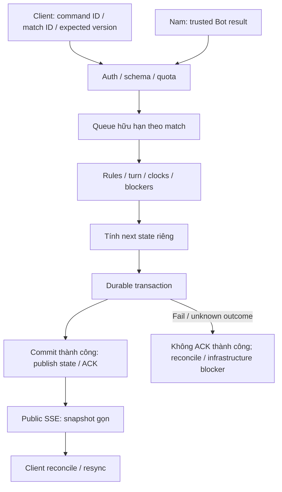
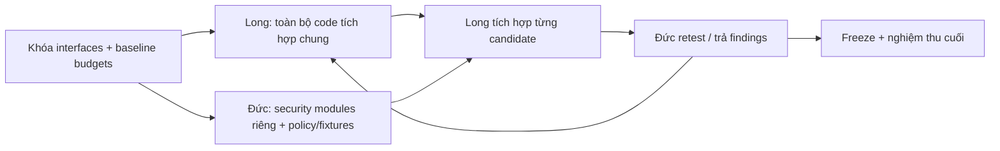

# Long — Network Core, shared rules và dữ liệu trận

Cập nhật: 2026-10-09 · Đầu vào: [quyết định](../01-QUYET-DINH.md), [hiện trạng](../02-HIEN-TRANG.md), [AGENTS.md](../../../AGENTS.md), [Robot Lab plan](../../implementation_plan_ott_v0.2_robot_lab.md).

**Bảy FRS đã đặc tả; implementation và load/recovery tests: NOT RUN.** Task chỉ READY khi interface/dependency/AC đủ rõ và được giao thực hiện; đủ tài liệu chưa có nghĩa DONE.

## 1. Long chịu trách nhiệm gì?

| Phạm vi | Kỹ thuật → tác dụng |
|---|---|
| Network Core, cả server và shared client | HTTP/SSE, schema, reconciliation, idempotency, concurrency → client gửi/nhận đúng trạng thái, retry không tạo nước/trận trùng |
| Capacity và fault isolation | Admission, backpressure, bounded queues, resource budgets → traffic/tác vụ ngoài trận không chiếm hết tài nguyên trận đang chạy |
| Shared match authority | State machine, scheduler, clock/blockers → server quyết định lượt, thời gian, quyền và kết quả cho Human/Bot/Referee |
| Rules/data dependencies được giao | Setup random, terminal rule, durable checkpoint, versioned replay → mọi mode dùng cùng luật; khôi phục/xem lại đúng trận |

Long là owner duy nhất phần code tích hợp chung Long–Đức: wiring middleware/hooks, resource ACL, quota/admission, shared HTTP/SSE, commit/recovery, projection/retention và ops integration. Đức giữ auth/security modules riêng, policy, attack fixtures và review/retest. Nam giữ Python runtime/SDK/private Bot API; Sơn giữ router/layout/Robot Lab.

## 2. Bảy FRS của Long

| FRS | Nội dung chính | TASK_ID |
|---|---|---|
| [FRS-L01](FRS-L01-GAME-RULES-SETUP.md) | Setup/version/random, legal moves, bị khóa nước, consumer parity | L-01 |
| [FRS-L02](FRS-L02-API-DATA-CONTRACTS.md) | DTO/schema/controller, command/event/error, projection, compatibility, commit interface | L-02 |
| [FRS-L03](FRS-L03-ROOM-MATCHMAKING.md) | Room/slot/invite/queue/cancel/Ready, admission/idempotency | L-03; L-04 phần match |
| [FRS-L04](FRS-L04-HTTP-SSE-SYNC.md) | Snapshot/pulse, stream lifecycle, backpressure, shared client/reconcile/reconnect | L-03 |
| [FRS-L05](FRS-L05-MATCH-AUTHORITY-CLOCKS.md) | Serialized lane, clocks/deadlines, blockers, Human/Bot/Referee commit, isolation | L-04 |
| [FRS-L06](FRS-L06-PERSISTENCE-RECOVERY-REPLAY.md) | Durable-before-ACK, checkpoint, result retry, restore/compatibility/replay | L-05 |
| [FRS-L07](FRS-L07-CAPACITY-INTEGRATION-RUNBOOK.md) | Metrics, load/failure harness, budgets, capacity, runbook và release gates | L-06A; L-07; L-06B |

FRS-L02 là nguồn contract; L07 là nguồn performance budget/workload. Các file khác tham chiếu, không tự định nghĩa lại field/ngưỡng. Yêu cầu phối hợp Long–Đức nằm cuối L02…L07; giữ TASK_ID nghiệm thu hiện có.

## 3. How — luồng xác nhận một nước đi

| Cơ chế | Long cần làm | Lỗi / điều kiện bắt buộc |
|---|---|---|
| **Serialized lane** {xử lý tuần tự theo trận} | Queue riêng theo match, bounded; mutation human/Bot/referee/terminal đi cùng lane; fairness giữa các match | Không global mutex; không xếp command vô hạn; queue chờ vẫn tính vào latency |
| **Idempotency + version fencing** | Lưu command outcome với transaction; retry cùng identity/payload trả outcome cũ; version/match khác không commit nhầm | Cùng ID nhưng payload khác phải conflict; client tự sửa side/controller không cấp quyền |
| **Durable-before-ACK** | Đổi synchronous persistence seam thành async commit interface; stage next state; transaction DB hiện có lưu move/checkpoint/outcome và private Bot state liên quan | Không public mutation/ACK trước commit; không chạy Python/gửi mạng trong transaction; unknown outcome phải tra command trước retry |
| **Compact snapshot / clock pulse** | Snapshot live có current board/state cần thiết, không toàn bộ moves/timeline. Full sync khi join/reconnect; history/replay tải riêng. Pulse mang server anchor/version | Pulse/heartbeat không ghi DB mỗi giây; sequence domain và pulse không gây false gap; client không tự quyết timeout |
| **Deadline scheduler** | Scheduler server theo deadline, xử batch hữu hạn/yield; không phụ thuộc subscribers; đối chiếu deadline khi xử command | Không quét mọi room liên tục hoặc để timer UI sở hữu clock; pause đóng băng clock/active cap |
| **SSE backpressure** | Serialize public payload một lần cho nhóm cùng quyền; theo dõi `write()`/`drain`, bounded bytes/wait, cleanup stream chậm | Chỉ đóng stream bị lỗi/chậm; domain event không bị coalesce âm thầm. Sau gap/đóng stream, snapshot resync và timeline bền phục hồi thông tin |
| **Capacity controller** | NORMAL/PRESSURE/RECOVERY, hysteresis; quota theo gameplay/lobby/history/Bot; bảo vệ ngân sách trận đã nhận, chặn admission mới khi hết | Quota/auth vẫn áp dụng với player đang đấu; queue đầy trả lỗi/retry có nghĩa, không nhận rồi xử thua vì thiếu hạ tầng |
| **Fault isolation** | Boundary theo listener/match/subsystem; timeout/concurrency riêng; cache/coalesce lobby, query History có limit/aggregate | Một listener lỗi không ngắt fan-out khác; retry/pending log/cache đều bounded. Dependency bắt buộc lỗi thì khóa an toàn phần liên quan |
| **Reconnect / recovery** | Backoff + jitter; single subscription manager; xác thực lại quyền; restore room và match cùng controller/blockers/private revision-memory | Không hồi role từ URL, không reroll board; discard invocation cũ. Nếu không recover an toàn thì neutral abort theo policy |

Logical isolation không chống được toàn bộ process crash/OOM: quota và resource measurement giảm nguy cơ; checkpoint/recovery xử gián đoạn. Không hứa mọi trận luôn liên tục trên một instance. Không thay sandbox/quota Python để lấy số tải đẹp.

## 4. Task, dependency và thứ tự thực hiện

Giữ tám task IDs cũ để không phá [traceability](../03-TRACEABILITY.md). “Bắt đầu sớm” là baseline/design/harness; không phải bỏ dependency để ship code.

| ID | Thứ tự / output | Dependency | FRS mới | DoD trọng tâm |
|---|---|---|---|---|
| L-01 | Foundation: rules/setup/blocked terminal | DEC-01/02/03/11 | L01 | Property/fixtures/parity đúng; legacy không bị ép thành luật mới |
| L-02 | Foundation: contract và commit/recovery interface | L-01 rule outputs; Nam/Đức review | L02 | Schema/examples/actor matrix/compatibility đủ; consumer hiểu cùng contract |
| L-03 | Sau contract: room/queue + server/client HTTP/SSE | L-02; capacity profile L-07 baseline | L03/L04 | Hai client hội tụ; retry/cancel đúng; stream chậm được giới hạn |
| L-04 | Sau contract: match authority/clock/isolation | L-02; phối hợp L-03 room handoff | L05 | Race/Stop/timeout/late Bot đúng; commit interface không tạo authority khác |
| L-05 | Sau interface: durable commit, restore/result/replay | L-01/02; staged-commit interface của L-04; Nam private Bot state | L06 | Durable-before-ACK + crash/retry/legacy/replay PASS trên DB test |
| L-06A | Bắt đầu sớm: env/runbook; khóa candidate sau tích hợp | Audit sớm; candidate sau L-05/N-01 và scope cần review | L07 | Config/capability/report sẵn cho Đức audit; chưa phải release |
| L-07 | Baseline sớm → integration/load/failure retest cuối | Baseline không đợi task khác DONE; retest cần candidate L-06A và implementation tương ứng | L07 | Capacity/SLO/correctness/recovery có evidence đúng candidate |
| L-06B | Cuối: handoff và release nếu có lệnh riêng | L-07; N-08; D-06; S-06; approval remote/DB tương ứng | L07 | Release checklist đúng scope; không unresolved blocker hoặc PASS giả |

L-04 và L-05 khóa interface từ L-02, phát triển candidate rồi tích hợp; **L-04 DONE cần durability evidence L-05**, không bắt L-05 đợi L-04 DONE. D-05 audit candidate L-06A, không đợi release L-06B; N-08/L-07 không đợi production deploy.

## 5. Mỗi task phải làm và nộp gì?

### L-01 — Luật/setup dùng chung

| Đầu vào | Việc theo thứ tự | Bàn giao / DoD |
|---|---|---|
| DEC-01/02/03/11; source game-rules; record legacy | 1. Tạo fixtures/property harness. 2. Versioned deterministic shuffle: 18 quân/bên, đối xứng, bounded non-repeat. 3. Thêm bị khóa nước và terminal precedence. 4. Liệt kê consumer cần đổi | Rule API/version/test corpus; cùng seed/version cùng bàn; counts/ô/A1/I9 đúng; khóa nước không thành author fault; cả hai bên và legacy có test |

### L-02 — Contract và handoff trước Dev

| Đầu vào | Việc theo thứ tự | Bàn giao / DoD |
|---|---|---|
| Rule delta; Nam: Bot ABI/controller/private state; Đức: actor/policy | 1. Khóa mode/controller/actor matrix. 2. Field/schema/error/visibility/version + examples. 3. Khóa command identity, compact snapshot/pulse, commit/restore interface. 4. Review với Nam/Đức, gửi consumer Sơn | Schema/contract tests và compatibility table; malformed/forged/stale/cross-room bị chặn; privacy whitelist; error có retryability; không source/memory/log trong public DTO |

### L-03 — Room/queue và HTTP/SSE/client sync

| Đầu vào | Việc theo thứ tự | Bàn giao / DoD |
|---|---|---|
| L-02; workload/budget baseline | 1. Test create/join/leave/invite/cancel-vs-match. 2. Admission/idempotency và cleanup bounded. 3. Tách live payload/clock pulse, stream backpressure. 4. Chuyển network logic trong page vào shared client service/store theo handoff. 5. Reconnect/resync/revoke test | Room/queue state table, server/client adapter, slow-client report; hai browser hội tụ; retry không tạo trùng; matched thắng race thì client mở assigned match; thu hồi quyền ngừng stream; không báo PlayHTML ready giả |

### L-04 — Match authority, clock và isolation

| Đầu vào | Việc theo thứ tự | Bàn giao / DoD |
|---|---|---|
| L-02; room handoff L-03; Nam trusted Bot integration | 1. Race harness trước sửa. 2. Per-match lane và staged next state. 3. Scheduler/deadline độc lập subscriber. 4. Human/Bot/referee commit chung; bounded quotas/blockers. 5. Tích hợp L-05 và retest | State transitions + race report; chỉ một outcome cho move/Stop/timeout/rematch; zero-subscriber clock đúng; late output không đổi ván mới; Resume không xóa blocker khác; DONE sau durable commit gate |

### L-05 — Durability, recovery và replay

| Đầu vào | Việc theo thứ tự | Bàn giao / DoD |
|---|---|---|
| Commit interface L-02/04; disposable DB; Nam private checkpoint schema | 1. Xác minh DB/storage thực. 2. Async transaction move/checkpoint/outcome/private state; persist room/role/controller cần recovery. 3. Unknown-outcome reconciliation và terminal retry. 4. Restore setup/clock/blockers, revision/memory; legacy replay. 5. Kill/restart và DB-failure tests | Persistence design + DB test report; crash sau commit trước ACK retry không trùng; crash sau ACK phục hồi nước; không mixed state; restore không chiếm role/reroll; history/Elo idempotent; replay final board khớp; private scan sạch |

Room identity/membership/controller/referee và principal binding phải phục hồi có authorization policy của Đức. Clock anchor qua process restart cần policy hạ tầng đã duyệt; không dùng monotonic timestamp của process cũ như clock mới, không xử thua do outage hoặc tự clear pause/disconnect blockers.

### L-06A — Candidate và runbook cho audit

| Đầu vào | Việc theo thứ tự | Bàn giao / DoD |
|---|---|---|
| Source/env sanitized; candidate tích hợp; Nam consumer runtime report | 1. Ghi version/build/start/env. 2. Tách app health, DB/transport readiness và Bot readiness. 3. Viết thao tác kiểm tra/restart/recovery/rollback trong môi trường test. 4. Khóa candidate cho D-05 | Runbook từng bước: mở/chạy gì → expected → lỗi xử lý/báo ai; candidate SHA/diff hash và config không secrets; rehearsal có report; PORT đã giải quyết ở 10000, Bot gate vẫn cần evidence riêng |

### L-07 — Capacity/integration/failure harness

| Đầu vào | Việc theo thứ tự | Bàn giao / DoD |
|---|---|---|
| Baseline source; test environment và generator đủ sức; candidate L-06A cho retest | 1. Metrics/baseline trước tối ưu. 2. Khóa workload/protocol/budget. 3. HTTP + SSE/gameplay + runtime thật. 4. Ramp/soak/spike/failure tests. 5. So trước/sau, hiệu chỉnh admission và báo giới hạn | Reports theo mục 6; đủ dữ liệu từng mốc 1.000/5.000/10.000 hoặc lý do NOT RUN/FAIL; không lấy rejected/queue làm served; SLO và đúng dữ liệu đạt trong safe envelope công bố; không P0/P1 mở khi bàn giao |

### L-06B — Handoff/release cuối

| Đầu vào | Việc theo thứ tự | Bàn giao / DoD |
|---|---|---|
| L-07/N-08/D-06/S-06 evidence; approval riêng nếu thao tác remote | 1. Khóa checklist/candidate/capacity limits. 2. Nam xem demo/runbook/known gaps. 3. Chỉ khi có lệnh riêng mới deploy/migrate và smoke đúng candidate. 4. Theo dõi capability/rollback đã rehearsal | Có reviewer/verdict thật; không dùng build/health200 chứng nhận tất cả mode; không deploy/mutate production chỉ để lấy test xanh. Chưa có lệnh remote thì phần đó NOT RUN, không coi toàn task release DONE |

## 6. Performance, load và failure gates

| Gate | Cách đo / expected |
|---|---|
| Workload | Lobby: request/stream churn; PvP: active matches, move frequency, players/spec, reconnect; Python: runtime thật, preflight/turn/cancel, quota riêng. Mixed profile khóa trước test; không tự gộp ba nhóm |
| Latency DEC-18 | Server receive→committed ACK, gồm queue wait/auth/schema/compute/DB commit: p95 ≤300ms, p99 ≤1s cho nước người. Internet RTT/Python compute báo riêng; pending response không tính ACK thành công |
| Capacity DEC-16 | Ramp từ tải nhỏ đến 1.000/5.000/10.000; từng mốc ghi workload, thời lượng, offered/admitted/completed/rejected/timeout, saturation và bottleneck. Dừng có kiểm soát khi vượt safety gate; mốc chưa chạy không PASS |
| Resource DEC-17 | CPU/throttling, memory toàn instance gồm child runtime, event-loop lag, DB wait/pool, bytes/event, stream buffer, queue depth/age, cleanup sau disconnect. Không chỉ đo RSS Node; ngưỡng pressure/recovery/config phải từ baseline |
| Correctness | Không sai/nhân đôi/mất nước đã ACK; terminal/history/Elo không trùng; cả hai browser hội tụ; auth/private projection đạt; stale command và Bot output không đổi trận |
| Isolation | Khi match đang chạy, gây lobby flood, slow client, listener throw, History failure, Bot fault. Trận không liên quan vẫn đúng/SLO trong ngân sách đã đo; dependency chung mất thì recovery policy, không hứa zero interruption |
| Recovery | Mất/gap/reordered event, reconnect storm, timeout/unknown DB outcome, crash trước commit/sau commit trước ACK/sau ACK; board+room+role+clock+memory nhất quán hoặc neutral abort có reason |
| Generator/environment | Máy phát tải tách server test; ghi CPU/RAM/socket limit/generator throughput. Local resource cap chỉ là rehearsal; không gọi đó là Render capacity. Đo provider thật ở test target được cho phép, chưa tự load-test production |

Source hiện [load smoke](../../../tests/load/smoke.js) chỉ một VU gọi `/health`. Dùng k6 cho HTTP; bổ sung generator SSE giữ stream/chơi nước hợp lệ và browser integration. Mock chỉ kiểm tra plumbing, không thay runtime/DB/provider evidence thật.

Mỗi report: task/FR/AC → candidate SHA hoặc dirty-diff hash → môi trường/DB test identifier không credentials → workload/config/lệnh → expected/actual → artifact → PASS/FAIL/NOT RUN/BLOCKED → reviewer/limitations. Capacity profile chỉ được công bố ở mức thực sự đạt gates, không hứa 10.000 trước đo.

## 7. Ownership — file nào Long sửa?

| Long là writer | Phối hợp / ranh giới |
|---|---|
| `packages/game-rules/**`, `packages/contracts/**`, `prisma/**` | Nam cung cấp requirements Bot; Đức policy/privacy; schema/API delta review trước consumer changes |
| Server `match/**`, `room/**`, `matchmaking/**`, `realtime/**`, `history/**`, `rating/**`; integration `app.ts`, metrics/env/build/release scripts | Đức giữ auth/security plugins; Nam giữ `bot-online/**`, `bot-library/**`, adapter/runtime. Shared commit integration có interface và writer rõ |
| Web `services/http/**`, `services/rooms/**`, `services/matchmaking/**`, shared network store/reconciler; core History/health client | Nam giữ private Bot API/SDK/local sandbox; Đức auth/Guest session policy. Shared HTTP sửa theo policy Đức; không đổi semantics auth tự phát |
| Network harness/fixtures, load/recovery reports và runbook được giao | Không test bằng DB mặc định hoặc gây tải production chưa được giao |
| Network logic đang nhúng trong page: **chỉ sửa sau handoff writer** | Sơn/Nam giữ page/router/layout/Bot UI. Long xuất service/state contract và examples; owner page tích hợp hoặc bàn giao writer theo phase; không hai người cùng sửa |

Đầu ra handoff: field/version/visibility/error matrix + request/event examples + test fixture + migration/compatibility notes. Guest principal đang đấu không đổi vì login; role không lấy từ URL; public SSE/history/audit không có source/memory/log/private runtime seed.

## 8. Ưu tiên trong 48 giờ

| Ngày | Công việc ưu tiên | Checkpoint cuối ngày |
|---|---|---|
| 10/10 | L-07 baseline/harness + L-06A env audit; L-02/commit interface, rules/payload/clock; admission/sync và durable commit cùng Nam | Baseline, contract/fixture và candidate bàn giao sớm; normal/race/privacy checks; không đoán capacity hoặc ACK trước commit |
| 11/10 | Hoàn thiện admission/backpressure/isolation, recovery/replay/consumer integration; load/failure retest, review/runbook | Evidence và safe limits; fail/blocked rõ; release riêng nếu có approval và đủ gates |

Deadline chung toàn team: 00:00 10/10/2026 → 00:00 12/10/2026, UTC+7; 48 giờ lịch. Thiếu dependency/FRS hoặc evidence thì báo Nam điều phối sớm; không tự cắt scope, tăng billing, đổi topology/transport hoặc bỏ gate bảo mật. Không push/deploy/migrate shared/production DB khi chưa có lệnh riêng.

## 9. DoD bàn giao của Long

1. Bảy FRS/task đủ contract, normal/error/permission states, dependency, ownership và AC; mapping không orphan/trùng nghĩa; chỉ dùng bộ FRS hiện hành trong thư mục này.
2. Rules/controller/clock/role đúng mọi consumer liên quan; network client tách khỏi layout; các ca race/retry/revoke/restore/replay có evidence.
3. Capacity báo thật, giữ headroom, admission theo số đo; không coi user bị từ chối là served; không mất/nhân đôi nước đã ACK.
4. Long bàn giao integrated candidate/config/evidence cho toàn bộ code chung LD-01…LD-06, sửa findings trong phạm vi mình sở hữu; Đức review/retest. Runbook người mới làm theo được. Code Long viết không tự ký independent PASS; auth/security modules Đức viết cần reviewer khác.
5. Giữ nguyên user files/evidence/worktrees; cleanup chỉ sau xác minh consumers/compatibility. Mọi gap còn lại có status/owner/next step; không gọi prototype hoặc test chưa chạy là DONE.

## 10. Thực thi song song Long–Đức

| Nhóm việc | Cách thực hiện | Điều kiện hoàn thành |
|---|---|---|
| L-01 | Code rules độc lập với Đức; consumer parity phối hợp Nam/Sơn | Rules/property/compatibility evidence theo L01 |
| L-02/L-03/L-04/L-05/L-06A/L-07 | Long triển khai trọn phần code tích hợp chung; Đức cung cấp modules/policy/fixtures và kiểm tra candidate liên tục | Long chịu trách nhiệm integration/fixes; Đức retest; dependency và DoD từng task đạt |
| L-06B | Tổng hợp bàn giao sau L-07/N-08/D-06/S-06 | Không blocker; release/DB/remote vẫn cần lệnh riêng |

**7/8 task cấp cha có phần Long tự triển khai; một task L-06B chờ nghiệm thu cuối.** Đây là mức độc lập giữa hai người, không phải bảy task của Long chạy cùng lúc hoặc bỏ dependency nội bộ.

| Handoff | Code/output chung Long sở hữu | FRS Long | Đức cung cấp / kiểm tra |
|---|---|---|---|
| LD-01 · HTTP/CSRF/config | App/CORS wiring, shared HTTP header/JSON/error handling | L02/L04/L07 | Guard module/signature, origin/header/body policy + fixtures; retest API/browser |
| LD-02 · Session/ACL/revocation | Resource ACL, hook consumers, SSE cleanup/cache/re-auth và commit/recovery recheck | L02/L03/L04/L05/L06 | Auth/session hooks, actor matrix; retest revoked token/role/queued command |
| LD-03 · Anti-abuse/resource budgets | Room/queue/SSE/DB budgets, reserve/leases, admission và PRESSURE/RECOVERY | L02/L03/L04/L05/L07 | Limiter module, policy/attack fixtures; retest legitimate + spam workload |
| LD-04 · Commit/epoch/recovery | Serialized lane, atomic commit/outcome, fencing và recovery | L02/L05/L06/L07 | Tampering/race/crash fixtures; retest với runtime candidate của Nam |
| LD-05 · Privacy/retention/ops | Projection/redaction consumers, expiry/GC, bounded metrics/logs và runbook | L02/L04/L06/L07 | Whitelist/retention policy, canaries và incident checklist; audit/retest |
| LD-06 · Candidate/sign-off | Integrated candidate/config, integration harness/evidence và fixes phần chung | L07 | Security matrix, findings/retest và scoped sign-off; không tự review code Đức viết |

Chi tiết đầu vào và điều kiện đóng: [LD-01…LD-06](../security/DUC.md#long-duc). Long giữ contracts/Prisma/app/lifecycle/shared HTTP/SSE, network/load/integration harness và candidate config. Đức giữ auth/security modules, adversarial fixtures/harness và security matrix. Nam giữ Bot runtime/private adapters; Sơn/Nam sửa callers/pages theo ownership.

Long đo baseline và ghi giá trị config/budgets; Đức kiểm tra tuân thủ policy, không có bộ config tích hợp song song. Tổng effort của Long trong 48 giờ gồm cả sáu nhóm này; thiếu module/candidate hoặc vượt lịch phải báo sớm, không chuyển code chung sang Đức hoặc bỏ gate. Giữ TASK_ID hiện có, không thêm một gói implementation trùng lặp cho LD-01…LD-06.

Đầu 10/10 chốt interfaces/budgets → triển khai phần riêng trong 12 FRS L01…L06 và D01…D06 → tích hợp/retest liên tục. L07/D07 chạy baseline/matrix sớm, nghiệm thu cuối ngày 11/10. Handoff đặt cuối tài liệu để tra cứu; checkpoint đầu vào vẫn phải làm sớm. Thiếu interface/candidate báo ngay; không chờ nhau DONE.
