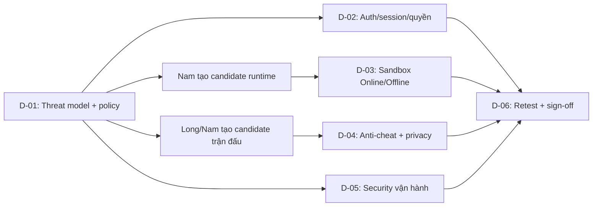

# Đức — Security toàn hệ thống

Đức xây dựng policy, auth/session và security modules riêng; cung cấp attack fixtures, kiểm thử/review và theo dõi fixes. Long là owner duy nhất phần code tích hợp chung Long–Đức; Nam/Sơn sửa module của mình theo ownership.

Ưu tiên bổ sung: chống automation phá hoại từ bên ngoài, tạo nhiều tài khoản/phòng, spam nước đi và làm cạn tài nguyên; bảo vệ trận đang chạy khi tổ chức sự kiện. Không mở thêm module tổ chức giải đấu.

**Deadline chung:** 00:00 thứ Bảy 10/10/2026 → 00:00 thứ Hai 12/10/2026, UTC+7; 48 giờ cho toàn bộ công việc của Nam, Long, Đức, Sơn. Theo [checkpoint chung](../00-TONG-QUAN.md); policy/harness bắt đầu ngay, review khi có candidate, không chờ owner DONE. Thiếu candidate/evidence vẫn BLOCKED/NOT RUN, không bỏ gate.

**Trạng thái:** phân công và FRS đã đặc tả; implementation chưa nghiệm thu. Đọc [tổng quan](../00-TONG-QUAN.md), [Network Core](../network-core/README.md), [AGENTS.md](../../../AGENTS.md) và [plan Robot Lab](../../implementation_plan_ott_v0.2_robot_lab.md).

## 1. Phạm vi và thứ tự

D-01 và audit D-02/D-05 bắt đầu ngay. D-03/D-04 chuẩn bị test matrix trước, chạy khi có candidate; không đợi task của Nam/Long DONE. Review là đầu vào để owner sửa và hoàn thành task.

| TASK_ID | Việc Đức làm | Kỹ thuật → tác động | Dependency | DoD |
|---|---|---|---|---|
| D-01 | Liệt kê tài sản, attacker, đường dữ liệu và ca lạm dụng; giao control/test cho owner | Threat model + trust boundaries → xác định dữ liệu/quyền được phép qua từng thành phần | Source, mode/role matrix, FRS-L01…L07 | Mỗi rủi ro có mức độ, control, owner, test và trạng thái; policy đủ cho Nam/Long bắt đầu |
| D-02 | Audit/sửa đăng nhập, Guest, recovery, phiên hết hạn/thu hồi; kiểm tra quyền đọc/ghi/stream | Authentication, object-level authorization, CSRF/origin checks, bounded rate/payload limits → chặn giả danh, truy cập chéo và lạm dụng API | L-02 contract; phối hợp L-03 room/HTTP/SSE | Negative tests Guest/account/player/host/referee/spectator/outsider; thu hồi phiên/quyền chặn đọc/ghi tiếp; lỗi rõ và không lộ dữ liệu |
| D-03 | Thử code độc hại trong sandbox Online/Offline; kiểm tra quotas, cancel/reclaim và runtime assets | Isolation + trusted watchdog/quotas + hash pins → Bot không đọc secrets, vượt quyền hoặc chiếm tài nguyên vô hạn | D-01 policy; N-01/N-05 candidate; manifest giới hạn | Runtime thật đạt isolation/loop/memory/output/cancel; hai Bot không đọc dữ liệu nhau; gate thất bại chặn chạy; findings đã sửa và retest |
| D-04 | Thử giả nước/quyền/seed, lặp lệnh, sửa revision/memory; kiểm tra race Stop/Resume/reconnect và dữ liệu công khai | Server authority, idempotency, execution fencing, public projection → không ghi nước cũ, đổi kết quả hoặc lộ code riêng | L-01/L-02/L-03/L-04/L-05; N-04 candidate | Payload giả/stale không đổi trận; retry không tạo nước/kết quả trùng; public HTTP/SSE/history/replay/audit không có source/memory/private logs |
| D-05 | Audit secrets, logs/errors/diagnostics/cache, dependency/artifact, retention/export/delete và quyền backup | Secret redaction, cache isolation, integrity checks, least privilege → giảm rò rỉ dữ liệu và rủi ro vận hành | Audit từ source; kiểm chứng với L-06A/candidate build và artifacts Nam/Long | Checklist có evidence; report không chứa secrets; findings có severity/owner/fix/retest; không tự deploy hoặc sửa DB production |
| D-06 | Tổng hợp coverage, retest fixes, kết luận security theo candidate; ghi residual risk {rủi ro còn lại} | Scoped sign-off → biết phần nào đủ điều kiện nghiệm thu, phần nào còn chặn | D-01…D-05 và candidate sau sửa | Không P0/P1 chưa xử lý; ca bắt buộc có evidence; NOT RUN/BLOCKED ghi rõ; Nam quyết định chấp nhận residual risk và phát hành |

| Phần chống phá hoại | Đức sở hữu | Phối hợp / DoD |
|---|---|---|
| D-02: API abuse controls | Rate/concurrency limits theo action/principal/IP và tổng; finite buckets/TTL; test đổi tài khoản/IP, auto-click và replay lệnh | Long tích hợp app/room/match/queue/SSE. Request vượt bound bị chặn sớm; không làm sai/mất/double nước đã ACK |
| D-05: Incident handling | Checklist phát hiện, giảm admission mới, cooldown/recovery và logs/metrics bounded | Long sở hữu PRESSURE/RECOVERY và gameplay reserve. Không restart/kill các trận để đối phó room spam |
| D-06: Attack regression | Mixed workload gồm người hợp lệ + nguồn spam, shared IP, multi-account, lobby/history/SSE/preflight flood | Trong safe envelope đã đo: người hợp lệ đạt SLO, spam không làm map/queue/DB tăng vô hạn; báo đúng giới hạn |

## 2. Ranh giới sửa code

| Phạm vi | Người sửa | Đức thực hiện |
|---|---|---|
| `apps/server/src/modules/auth/**`; security policy/plugin mới; security harness/report | Đức | Audit, tái hiện, sửa, test; công bố file ownership trước khi viết |
| `packages/contracts/**`, `prisma/**`, `apps/server/src/app.ts`; rules/match/room/queue/SSE/history/shared HTTP; network/load/integration harness | Long — owner code tích hợp chung | Cung cấp policy/module interface/fixtures; gửi findings và retest; Long wiring/fix phần chung |
| `packages/bot-sdk/**`; server Bot Library/Online; frontend Bot/Offline compartment | Nam | Đặt security gate, chạy adversarial tests; Nam sửa runtime/luồng Bot |
| Router, shared UI/styles, trang ngoài Bot | Sơn | Gửi finding unsafe rendering/cache/UI permission; retest sau sửa |
| Env/build/release scripts và runbook | Long; Nam quyết định phát hành | Review secrets, artifact integrity, quyền và hướng dẫn ứng phó |

Một writer cho mỗi shared file. Đức không tự ghi “independent PASS” cho code mình triển khai; phần đó cần reviewer khác được phân công.

## 3. Bộ FRS của Đức

FRS-D01…D07 đã được đặc tả. Trạng thái tài liệu không thay evidence implementation; công việc Long–Đức cần tích hợp nằm ở cuối file.

| File trong `security/` | TASK_ID | Nội dung phải đặc tả |
|---|---|---|
| [FRS-D01-THREAT-MODEL-POLICY.md](FRS-D01-THREAT-MODEL-POLICY.md) | D-01 | Assets, data flow, attacker, trust boundaries, abuse cases, severity và control ownership |
| [FRS-D02-AUTH-SESSION-ACCESS.md](FRS-D02-AUTH-SESSION-ACCESS.md) | D-02 | Account/Guest, session/recovery/revocation, actor–resource–action matrix, CSRF/origin và API abuse limits |
| [FRS-D03-ONLINE-SANDBOX.md](FRS-D03-ONLINE-SANDBOX.md) | D-03 | Runtime isolation, resource limits, cancel/reclaim, cross-invocation isolation, integrity và real-provider gate |
| [FRS-D04-OFFLINE-SANDBOX.md](FRS-D04-OFFLINE-SANDBOX.md) | D-03 | Browser compartment/bridge, network/storage/DOM denial, watchdog, kit integrity/cache, cold Offline và giới hạn browser |
| [FRS-D05-ANTI-CHEAT-PRIVACY.md](FRS-D05-ANTI-CHEAT-PRIVACY.md) | D-04 | Authority, seed/setup/revision/memory tampering, race/retry, public/private projection và replay |
| [FRS-D06-OPERATIONS-DATA-SECURITY.md](FRS-D06-OPERATIONS-DATA-SECURITY.md) | D-05 | Secrets/logs/diagnostics/cache, dependency/artifact, retention/export/delete, backup access và xử lý sự cố |
| [FRS-D07-SECURITY-ACCEPTANCE.md](FRS-D07-SECURITY-ACCEPTANCE.md) | D-06 | Test/evidence matrix, severity/triage, fix/retest, review độc lập và sign-off |

FRS dùng TASK_ID con của D-01…D-06; mỗi mục có hành vi, lỗi/quyền, dependency và tiêu chí kiểm tra. Danh mục không tạo thêm tính năng ngoài scope đã thống nhất.

## 4. Trình tự thực hiện và bàn giao

| Bước | Thao tác | Đầu ra |
|---|---|---|
| 1 | Đọc source/FRS; vẽ đường dữ liệu; xác định control hiện có và khoảng trống | Threat model + test matrix; chưa kết luận control đạt khi chỉ đọc source |
| 2 | Tạo test tái hiện trên môi trường local/test; ghi expected/actual trước sửa | Failing regression/security case; candidate và môi trường xác định |
| 3 | Sửa phần Đức sở hữu hoặc giao finding cho owner | Patch/finding có owner; ghi dependency đang thiếu |
| 4 | Retest bản sửa; chạy regression đúng consumer bị ảnh hưởng | PASS/FAIL/NOT RUN/BLOCKED + artifact đã loại dữ liệu nhạy cảm |
| 5 | Review coverage, bàn giao kết luận cho Nam; dọn fixture/tài nguyên test | Security report, open findings, residual risk, điều kiện nghiệm thu; giữ evidence cần thiết |

| Artifact | Nội dung tối thiểu |
|---|---|
| Threat/control matrix | Risk ID, asset/boundary, abuse path, control, owner, test, trạng thái |
| Finding | TASK_ID, repro, expected/actual, impact/severity, owner, fix candidate, retest |
| Runtime evidence | OS/browser/provider, runtime/SDK/hash/limits, thao tác, đo thực tế, cancel/reclaim và isolation |
| Sign-off | Commit hoặc diff hash, config/môi trường, coverage, artifacts, verdict, reviewer, residual risk |

Dùng DB test dùng một lần đã xác minh; không chạy integration có ghi/xóa với `DATABASE_URL` mặc định. Code độc hại chỉ chạy trong harness cô lập đã kiểm tra boundary; không chạy Python người chơi trong Node hoặc native subprocess không hạn chế. Không tấn công website production để đo tải/bảo mật.

## 5. Điều kiện nghiệm thu chung

- Có traceability rủi ro → control → owner → test → evidence; retest trên candidate cuối.
- Không P0/P1 chưa xử lý; severity và cách triage được đặc tả trong FRS. Ca bắt buộc BLOCKED/NOT RUN vẫn chặn nghiệm thu phạm vi đó.
- CORS không thay CSRF/authorization; static checks không thay sandbox; UI ẩn nút không thay quyền server.
- Runtime gate thất bại phải fail closed; phân biệt lỗi tác giả và hạ tầng, không tạo nước giả hoặc xử thua vì hạ tầng.
- Mock/build xanh không chứng minh isolation, durability hoặc chịu tải thật. Evidence cũ chỉ dùng đúng scope.
- Browser không có bảo đảm hard CPU/RAM tương đương server; không tuyên bố an toàn tuyệt đối hoặc chịu tải 1.000/5.000/10.000 người khi chưa đo.
- Sign-off không cấp quyền push, deploy, dịch vụ trả phí hoặc migration DB chung/production.

## 6. Phối hợp Long–Đức

Bảng này là đầu vào kiểm thử/bàn giao của Đức. **Long chịu trách nhiệm toàn bộ code tích hợp chung LD-01…LD-06**, gồm wiring, config, integrated candidate và fixes; chi tiết phân công tại [LONG.md](../network-core/LONG.md#10-thực-thi-song-song-longđức). Đức cung cấp modules riêng/policy/fixtures, review và retest. Checkpoint đầu vào phải thống nhất sớm.

| ID / checkpoint | Đức: module/policy/fixtures và review | Long: owner code tích hợp chung | FRS Long | Điều kiện đóng |
|---|---|---|---|---|
| LD-01 · Trước coding → tích hợp middleware | Policy/signature, middleware CSRF/limits trong security files Đức sở hữu; fixtures allowed/denied origin, header/body/error | `apps/server/src/app.ts`, config/CORS; `apps/web/src/services/http/httpClient.ts`: đăng ký guard đúng thứ tự, gắn `X-OTT-Request: 1` cho mutation; update callers theo writer | L02 API boundary/errors; L04 HTTP client; L07 config | Login/logout/Guest/upload/gameplay hợp lệ chạy được; cross-site/thiếu header bị chặn; không double guard hoặc bypass |
| LD-02 · Khóa revocation/ACL interface sớm → test stream | Auth rotation/recovery/logout/expiry hooks, scope/session IDs bị revoked, role/resource matrix và race fixtures | Room/match/history/Bot access integration, SSE cleanup + fan-out checks, shared client cache/re-auth; reconnect/restart không hồi quyền | L02 ACL/errors; L03 roles; L04 streams; L05 commit recheck | Old token/referee mất HTTP/SSE quyền, new token resync đúng principal; queued command không bypass revoke |
| LD-03 · Lock baseline budgets → tích hợp abuse controls | Action/principal/IP limiter, bounded buckets, multi-account/shared-IP/spam workload | Room/queue reserve + leases/caps, SSE buffers, DB/commit budgets; NORMAL/PRESSURE/RECOVERY, gameplay reserve. Chốt config names/units/thresholds với Đức | L03 room/queue; L04 backpressure; L07 admission/workload | Room/move/SSE/preflight spam không né total caps; legitimate+attack workload đạt SLO/correctness trong measured envelope |
| LD-04 · Khóa commit seam → race/crash retest | Tampered output/epoch/version/controller fixtures; canary assertions; Nam cung cấp runtime candidate | Match serialized lane và durable board/memory/outcome commit; invocation fence, pause blockers, unknown outcome/recovery. Long sửa contracts/schema khi có delta, Nam giữ runtime/private adapters | L02 DTO/error/version; L05 authority; L06 persistence | Không late/double/lost ACKed move, mixed revision-memory hoặc false infra loss; Offline chỉ phối hợp ABI/error nếu có shared delta |
| LD-05 · Tích hợp projection/ops → audit | Public/private allowlist, redaction/retention policy, canaries và incident checklist | Snapshot/SSE/history/replay/diagnostics serializers; metrics labels/log volume; expiry/GC/storage/backup access, env/build/runbook | L02 visibility; L04 fan-out; L06 retention/replay; L07 metrics/runbook | Zero private leak; expired access bị chặn, active refs/Library không bị GC nhầm; runbook đã rehearsal |
| LD-06 · Có candidate → freeze/retest cuối | Matrix, findings/severity, attack fixtures, expected outcomes, scoped sign-off | Integrated candidate + config/diff hash, test DB/failpoints, generator/baseline và fixes trong file Long sở hữu | L07 integration/handoff/release | Retest đúng final candidate, owner/reviewer thật; mandatory gaps còn BLOCKED/NOT RUN, không tự deploy |

Handoff tối thiểu: `ID → signature/payload/config → owner + files → fixture/expected → candidate → verdict`. Đức sửa auth/security modules và attack harness riêng; Long giữ code/config/harness tích hợp chung và sửa integration findings. Nam/Sơn cập nhật callers/UI của mình. Đức có thể review code chung Long viết; code Đức tự viết phải có reviewer khác.

**Thứ tự:** chốt LD-01/02 interface và LD-03 budgets đầu ngày 10/10 → coding song song + candidate bàn giao liên tục → Long tích hợp từng seam → Đức chạy/retest LD-04/05/06 trong ngày 11/10. Thiếu interface/candidate thì báo Nam ngay; không đợi task DONE mới review hoặc chờ hết ngày mới bàn giao.
