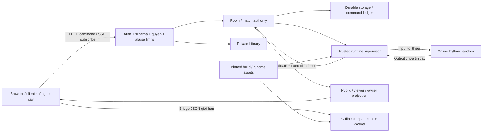

# FRS-D01 — Threat Model & Security Policy

| TASK_ID | Phụ trách | Đầu ra |
|---|---|---|
| D-01 | Đức | Threat/control matrix toàn hệ thống; policy và test cases đầu vào D02…D07 |

## 1. Mục tiêu và ranh giới

Xác định dữ liệu/quyền cần bảo vệ, đường tấn công quan trọng, control phải có và owner sửa. Bao phủ toàn hệ thống; tập trung giả danh, vượt quyền, rò rỉ dữ liệu, sai trạng thái và cạn tài nguyên.

Client và Python đều không đáng tin cậy, kể cả khi đã đăng nhập hoặc qua preflight. Runtime output phải kiểm tra trước commit; UI không cấp quyền hoặc quyết định kết quả Online.

| Boundary / tài sản | Policy |
|---|---|
| Browser → API: session, identity, role | Actor lấy từ credential đã xác minh; kiểm tra quyền theo resource/action. Tên Guest, URL, side/role/owner trong body không cấp quyền |
| Server → DB: board, clock, kết quả, checkpoint | Durable commit nhất quán; retry/race không tạo nước/kết quả trùng; không ACK khi chưa xác nhận commit |
| Application → Online sandbox: secrets, filesystem, tài nguyên | Không application mounts/network/secrets; chỉ input/stdlib/source cần thiết theo runtime policy; quotas và watchdog do trusted host thực thi |
| Renderer → Offline compartment: DOM, cookies, storage, Bot khác | Compartment không có credentials; bridge có schema/size/request identity; không dùng same-origin Worker đơn lẻ làm security boundary |
| Private → public: source, memory, logs, recovery data | Projection theo allowlist; spectator/referee/host không được đọc source/memory/private logs của người khác |
| Build/ops/cache: runtime assets, secrets, dữ liệu riêng | Kiểm tra integrity; không ghi secret vào bundle/report/log; cache không trộn principal; quyền backup/export/delete được kiểm tra |

Threat actors: outsider, Guest/account độc hại, player/host/referee/spectator lạm quyền, client đã sửa, Python độc hại, website bên ngoài và artifact bị thay thế. Credential bị đánh cắp được xét trong giới hạn thu hồi phiên và quyền principal; không coi đăng nhập là bằng chứng hành vi an toàn.

## 2. Threat/control matrix bắt buộc

Mỗi dòng dưới phải có trong matrix chung. Risk ID gắn với TASK_ID để nối control, test và finding; không tạo báo cáo riêng cho từng module nếu không cần.

| Risk ID | Attack path / hậu quả | Control → owner triển khai | Test tối thiểu / kết quả đúng |
|---|---|---|---|
| D-01.R01 | Giả session/Guest ID, dùng phiên đã hết hạn/thu hồi | Server-issued credential, expiry/revocation → Đức; stream cleanup → Long | Token giả/hết hạn/revoked không truy cập được; stream cũ ngừng nhận dữ liệu được bảo vệ |
| D-01.R02 | Đổi room/match/Bot/revision ID để truy cập chéo; tự nhận referee/host | Object/action ACL, role/membership server-side → Đức policy, Long/Nam tích hợp | Actor hợp lệ nhưng sai owner/room/role bị từ chối cả HTTP/SSE/export/delete |
| D-01.R03 | Website ngoài gửi lệnh bằng cookie của người chơi; brute-force login/recovery | CSRF/origin controls, bounded auth throttles → Đức | Cross-site mutation bị chặn; login/recovery có giới hạn; lỗi không tiết lộ mật khẩu/code hoặc nội dung dữ liệu riêng |
| D-01.R04 | Python đọc network, secrets, filesystem hoặc thoát sandbox | Isolated runtime, minimal capabilities, pinned artifacts → Nam | Fixed hostile fixtures bị chặn trong runtime thật; không chạy player Python native không hạn chế |
| D-01.R05 | Offline Python đọc parent DOM/storage, gọi network, giả bridge hoặc đọc Bot khác | Credential-free compartment, narrow bridge, invocation isolation → Nam | Truy cập/bridge trái phép không thành công; hai slot và các lần gọi không chia sẻ dữ liệu ngoài payload được phép |
| D-01.R06 | Loop/OOM/output flood/upload spam chiếm tài nguyên | Manifest quotas/watchdog/reclaim → Nam; bounded API/stream/admission → Đức + Long | Dừng ở bound đã cấu hình; dọn tài nguyên; traffic hợp lệ khác đạt SLO trong safe envelope |
| D-01.R07 | Sửa board/seed/side/clock/winner; refresh để reroll Online | Rules/server authority, versioned setup/checkpoint → Long; Bot integration → Nam | Payload giả bị chặn; refresh giữ trận; local outcome không cộng Elo Online |
| D-01.R08 | Duplicate/stale commands; late Bot output; race Stop/Resume/revision/rematch | Idempotency, serialized commit, epoch/revision fences → Long + Nam | Không ghi nước/kết quả trùng; output cũ không commit; pause không bị bypass |
| D-01.R09 | Source/memory/log lọt qua SSE, snapshot, history/replay, diagnostics | Public/private allowlist, owner ACL, redaction → Long + Nam; Đức review | Canary riêng không xuất hiện ở mọi public/viewer response hoặc artifact công khai |
| D-01.R10 | Tên/file/log/error chứa markup hoặc payload làm frontend thực thi script | Safe rendering, bounded input/output, phù hợp CSP → Sơn shared UI; Nam trang Bot; Đức policy | Nội dung độc hại hiển thị dạng dữ liệu hoặc bị từ chối; không thực thi script; không phản chiếu raw secret/source |
| D-01.R11 | Asset/dependency bị thay; secrets lọt bundle/log/cache; đổi account thấy cache cũ | Hash pins, dependency review, secret hygiene, private cache isolation → Nam/Long/Sơn theo module | Asset sai hash chặn capability; logout/switch principal không trả private cache của principal trước |
| D-01.R12 | Export/delete/GC trái quyền; restart hồi quyền cũ hoặc sai checkpoint | Ownership/retention guards, revocation-aware recovery → Long + Nam; Đức policy | Không xóa/lấy dữ liệu người khác; replay không phụ thuộc source đã hết hạn; restart không hồi role đã revoked |
| D-01.R13 | Automation/auto-click/multi-account tạo phòng, join/leave, lặp nước đi hoặc mở stream hàng loạt để phá sự kiện | Layered rate/concurrency/resource caps, room leases/cleanup, gameplay reserve, bounded PRESSURE/RECOVERY → Đức policy/harness; Long tích hợp; Nam bảo vệ preflight | Mixed legit+spam, đổi tài khoản/IP, shared IP: chặn sớm vượt budget; không mất/double nước ACK; tài nguyên hữu hạn trong safe envelope |
| D-01.R14 | SQL/command/path injection qua field, URL hoặc tên file | Strict schemas, parameterized queries, không shell interpolation với input; server-controlled file paths → owner từng module; Đức audit/test | Payload không được thực thi thành query/command/path tùy ý; không đọc/ghi ngoài phạm vi; errors không lộ stack/secrets |

Mỗi risk có severity theo exploitability, impact và phạm vi ảnh hưởng; mức độ không được hạ chỉ để kịp tiến độ. D02…D06 bổ sung test chi tiết và ngưỡng cụ thể, không bỏ các risk trên.

## 3. Ưu tiên và cách xử lý

| Mức | Phân loại | Quyết định |
|---|---|---|
| P0 | Compromise hệ thống, secrets trọng yếu hoặc phá dữ liệu diện rộng đang xảy ra/có đường khai thác rõ | Chặn nghiệm thu; cô lập capability bị ảnh hưởng, xử lý và retest trước mở lại |
| P1 | Vượt quyền, đọc dữ liệu riêng, phá isolation/tính đúng trận hoặc gây outage đáng kể qua đường khai thác thực tế | Chặn nghiệm thu phạm vi bị ảnh hưởng; owner sửa và retest |
| P2 | Ảnh hưởng có giới hạn/điều kiện; control còn thiếu nhưng chưa thành đường khai thác mức P1 | Có owner, mitigation và residual risk; Nam xét chấp nhận |
| P3 | Hardening/diagnostic gap nhỏ, chưa xác định ảnh hưởng bảo mật trực tiếp | Ghi backlog và owner; không được dùng nhãn P3 để bỏ test bắt buộc |

Vi phạm isolation, quyền dữ liệu riêng hoặc tính đúng trận vẫn chặn nghiệm thu phạm vi đó dù được gắn nhãn thấp hơn. Test bắt buộc NOT RUN/BLOCKED không chuyển thành PASS bằng risk acceptance.

Abuse limits theo action + principal; IP là lớp bổ sung, có xét người dùng chung mạng. Buckets/concurrency/backlog có size/TTL hữu hạn; dùng trusted proxy configuration, không tin IP header tùy ý. Ngưỡng API lấy từ harness và profile L-07; runtime dùng manifest hiện có. Không thêm Redis/dịch vụ trả phí hoặc đổi topology chỉ để hoàn thành policy.

Theo quỹ thời gian đã giao: khóa matrix/policy sớm, tận dụng harness có sẵn, ưu tiên external abuse/auth/quyền và các runtime gates bắt buộc, dành thời gian cuối cho retest/verdict. Automation dùng AI hay phần mềm thông thường đều bị kiểm soát tại request/resource boundary; không xây hệ thống nhận diện AI hoặc fingerprint cá nhân. Không hứa chống volumetric DDoS, máy người dùng đã bị chiếm hoặc mọi lỗi provider; vẫn kiểm tra application abuse và bounded recovery.

## 4. Nhiệm vụ, dependency và DoD

| TASK_ID | Công việc | Điều kiện đạt |
|---|---|---|
| D-01.01 | Inventory assets/data flow/actors/boundaries | Đủ sáu boundaries trên; chỉ rõ private/public và điểm kiểm tra quyền/quota |
| D-01.02 | Threat/control matrix | R01…R14 có attack path, severity/lý do, control, owner, test, dependency và trạng thái |
| D-01.03 | Policy handoff | Nam/Long/Sơn có control và expected behavior cụ thể; shared file có một writer; chưa có candidate ghi dependency thay vì PASS |
| D-01.04 | Evidence/finding convention | Một matrix chung nối risk → control → owner → test → artifact; finding có repro/impact/fix/retest; runtime reports tách Online/Offline |
| D-01.05 | Review coverage | Không sót actor/boundary quan trọng; gaps có owner; gate không bị nới vì deadline |

Dependency: [L02 contracts](../network-core/FRS-L02-API-DATA-CONTRACTS.md), [L04 transport](../network-core/FRS-L04-HTTP-SSE-SYNC.md), [L05 authority](../network-core/FRS-L05-MATCH-AUTHORITY-CLOCKS.md), [L06 persistence](../network-core/FRS-L06-PERSISTENCE-RECOVERY-REPLAY.md), [L07 capacity/runbook](../network-core/FRS-L07-CAPACITY-INTEGRATION-RUNBOOK.md). Đức sở hữu policy/matrix; sửa module theo [DUC.md](DUC.md).

**DoD D-01:** inventory và matrix có đủ control/owner/test để triển khai; coverage đã review, chưa có dependency vòng. Test evidence ghi candidate, môi trường, expected/actual, artifact và verdict; findings ghi owner/fix/retest. Hoàn thành threat model không chứng nhận implementation/runtime đã an toàn; các ca chưa chạy giữ NOT RUN/BLOCKED và chuyển sang D02…D07.

## 5. Phối hợp cuối tài liệu

[LD-01/LD-02/LD-03](DUC.md#long-duc): Đức bàn giao boundary/actor/action policy và fixtures, review/retest candidate. Long là owner code tích hợp chung/contracts, middleware/ACL wiring và budgets/config; khóa interface trước coding. Policy không yêu cầu chờ implementation DONE.
