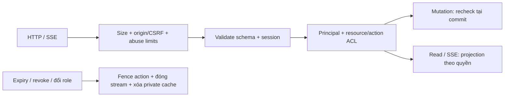

# FRS-D02 — Auth, Session & Access

| TASK_ID | Phụ trách | Phạm vi |
|---|---|---|
| D-02 | Đức; Long/Nam/Sơn tích hợp theo ownership | Account/Guest, session/recovery, CSRF, resource ACL, revocation và API abuse limits |

## 1. Mục tiêu và luồng kiểm tra

Người dùng chỉ đọc/điều khiển resource được phép. Phiên bị thu hồi không tiếp tục nhận dữ liệu; website ngoài không gửi lệnh bằng cookie người chơi. Giữ auth hiện có, không thêm SSO/MFA, dịch vụ trả phí hoặc màn quản trị mới.

Thực hiện controls rẻ trước password hashing/DB/runtime. Request đã được nhận không mặc nhiên có quyền commit sau khi session/role bị thu hồi; recheck/fencing phải phối hợp authority. Không hoàn tác commit hợp lệ trước revoke hoặc tuyên bố thu hồi được dữ liệu đã gửi.

## 2. Account, Guest và session

| Hành vi | Yêu cầu / tác động |
|---|---|
| Register/login | Validate/bound input; chuẩn hóa username; password/recovery code lưu hash có salt; session token ngẫu nhiên do server cấp, storage lưu token hash. Không lấy clientId/tên Guest làm credential |
| Cookie | Account/Guest dùng HttpOnly, Path=/, SameSite=Lax; Secure trên HTTPS production; không Domain rộng. Token không xuất hiện trong URL, JSON public, localStorage hoặc logs |
| Expiry | Giữ account 24 giờ hoặc 30 ngày theo remember; Guest 30 ngày theo policy hiện có. Server kiểm tra expiry, không dựa riêng cookie; cleanup maps/listeners có bound |
| Guest | Tên giữ trong browser profile/storage; không hứa nhận diện physical device. Không Ranked/Referee. Account login không đổi principal đang giữ slot Guest hoặc chuyển ownership Bot tự động |
| Login nhiều phiên | Giữ hành vi nhiều phiên hiện có trong giới hạn cấu hình; login tạo session mới. Không thay role/match principal từ URL hoặc cookie khác xuất hiện |
| Logout | Thu hồi session hiện tại tại server, sau đó clear cookie và đóng stream của session đó. Idempotent; không báo thành công giả nếu DB unavailable. Không tự xóa Library/local drafts hoặc chuyển sang principal khác để tiếp tục action |
| Đổi mật khẩu | Bắt buộc current password đúng. Atomically đổi password, thu hồi tất cả session cũ và cấp session mới cho trình duyệt hiện tại. Giữ remember, không kéo dài absolute expiry cũ; phát cookie mới sau commit |
| Rotation thất bại/unknown | Không trả token mới trước commit; không phục hồi token cũ đã revoked. Nếu commit thành công nhưng mất response, người dùng đăng nhập lại bằng mật khẩu mới; thông báo yêu cầu kiểm tra/đăng nhập lại, không giả kết luận rollback |
| Recovery | Username + code hợp lệ; code dùng một lần. Atomic consume bằng điều kiện chưa dùng + hash/version hiện hành, đổi password và revoke toàn bộ sessions. Hai request đồng thời chỉ một request thành công; yêu cầu login lại, không tự tạo session |
| Password/recovery race | Xác minh hash ngoài transaction khi phù hợp; commit kiểm tra lại credential/session version hoặc điều kiện tương đương. Không cho request dùng mật khẩu cũ ghi đè kết quả đổi/recover vừa commit |
| Client lifecycle | Rotation đóng stream token cũ, re-auth/resync bằng token mới; principal/side vẫn giữ nguyên. Logout/expiry/revoke chặn actions, clear private cache theo principal và báo các tab; không dựa vào cross-tab signal làm control server |

Login/recovery sai dùng thông báo chung trong từng luồng; không tiết lộ username tồn tại hay code đã dùng qua error details. Public profile vẫn theo visibility đã duyệt. Không đổi luồng cấp lại Recovery Code trong phạm vi này.

## 3. CSRF và origin middleware

| Hạng mục | Quy định |
|---|---|
| Phạm vi | Mọi POST/PUT/PATCH/DELETE của browser API, gồm register/login/logout/recovery/password, Guest session/import, room/queue/match, Library/upload/preflight. GET/HEAD chỉ đọc; OPTIONS chỉ preflight |
| Custom header | Mutation bắt buộc `X-OTT-Request: 1`; kiểm tra giá trị chính xác. Đây là dấu hiệu request API, không phải secret/credential và không thay ACL |
| Body | Có body chỉ nhận `application/json` với parameters hợp lệ; schema/byte/depth bounds tương ứng. Không nhận text/plain, form-urlencoded, multipart rồi tự parse như JSON. Upload Python dùng JSON bounded; request không body vẫn phải có header/origin hợp lệ |
| Source origin | Có Origin: phải là một HTTP(S) origin hợp lệ khớp chính xác allowlist theo scheme/host/port. Reject `null`, malformed, nhiều giá trị và origin lạ; không suffix/substring match |
| Fallback | Chỉ khi Origin vắng: parse Referer và so origin chính xác. Cả hai vắng thì từ chối mutation; Origin sai/null không được cứu bằng Referer đúng |
| Allowlist/proxy | Cấu hình frontend origins rõ; production HTTPS, không wildcard/reflect origin/subdomain rộng. Không tự suy allowlist từ Host/X-Forwarded-Host của request; trust proxy chỉ đúng ingress đã xác minh |
| Fetch Metadata | Hỗ trợ phát hiện request bất thường; không coi same-site là trusted. Same-origin phải qua các controls còn lại; cross-origin chỉ chấp nhận frontend origin được cấu hình rõ và custom-header preflight hợp lệ. Header vắng không bỏ origin/header checks |
| CORS | Cho phép credentials/methods/custom header đúng origins; preflight không chạy mutation. CORS plugin từ chối response access không thay middleware từ chối thực thi |
| SSE/read | Native EventSource không cần custom header; vẫn kiểm tra credential/resource ACL và origin khi có. GET không được thay state để né CSRF; trả private data theo projection và cache policy |
| Test/internal calls | Harness gửi origin/header như client thật, bao gồm negative fixtures. Không tạo global bypass cho localhost/test hoặc request thiếu Origin; trusted Bot output đi authority nội bộ, không public endpoint bỏ auth |

Long cập nhật shared HTTP client để tự gắn header vào mutation; Đức cung cấp middleware/policy, Long đăng ký tại app boundary. Nam/Sơn kiểm tra mọi caller, kể cả logout không body. Không triển khai frontend header và server enforcement thành hai release không tương thích.

## 4. Resource/action ACL và revocation

| Actor / resource | Cho phép | Phải chặn |
|---|---|---|
| Outsider | Public resources đúng visibility | Private room/source/history; mutation cần membership; đoán ID không cấp quyền |
| Account/Guest player | Own slot/action khi mode, turn, lifecycle cho phép | Đi thay bên/Bot; sửa seed/clock/winner; Guest Ranked/Referee |
| Host capability | Quản lý/mời đúng room policy | Tự có Referee/player quyền; đọc private Bot source |
| Referee / candidate | Referee được bổ nhiệm mới có Start/Stop/Resume/Hold; candidate chỉ dữ liệu lời mời cần thiết | Candidate/referee cũ điều khiển trận; chọn winner/sửa clock; đọc source/memory/log riêng |
| Spectator | Public projection khi phòng cho phép | Move/Ready/control; private data; tự nâng role |
| Bot owner | Own Library/revision/preflight/export/delete theo guard; system sample được phép dùng | Chọn revision riêng của người khác; xóa active references; dùng object ID để bypass ownership |
| Account data/social/history | Own/private hoặc public fields được phép | Xem/sửa dữ liệu riêng người khác; Guest import vào account không authenticated; local result thành Elo |

Mỗi endpoint kiểm tra principal → resource existence/visibility → ownership/membership → action/lifecycle; chọn thứ tự tránh tiết lộ resource riêng. Invite/password là điều kiện vào phòng, không cấp role. Chi tiết action/side dùng L02/L05, không định nghĩa lại trong UI.

Expiry/revoke/role transfer phải chặn HTTP tiếp theo và enqueue/fan-out được bảo vệ sau enforcement point; listener/buffer/timer được cleanup. Kiểm tra trước gửi event, không chỉ khi mở stream. Reconnect luôn re-auth; restart không khôi phục quyền bị revoked. Không query DB riêng cho mỗi clock pulse; Long/Đức dùng revocation hooks và expiry tracking có bound, kiểm chứng race cùng authority.

Không xác minh được session/quyền do dependency lỗi: fail closed với 503, dừng gửi dữ liệu cần quyền; không giả session expired hoặc fallback sang actor khác. Lệnh đang chạy tuân theo commit/fencing của Long; revoke không tự quyết định thắng/thua hay phá match của actor khác.

## 5. Abuse limits và lỗi người dùng

| Nhóm | Control bắt buộc |
|---|---|
| Register/Guest/login/recovery/password | Action + normalized target/principal khi có; IP bổ sung, concurrency bound trước expensive hash. Không chỉ key username+IP khiến đổi một chiều là né mọi limit |
| Upload/preflight/room/queue/mutation/SSE | Quota/concurrency theo principal/action/resource; IP + global budgets bổ sung, dùng L07 admission reserve để bảo vệ trận đã nhận |
| Limiter storage | Key bounded/hash khi cần, size cap/TTL/cleanup; đầy thì reject có kiểm soát, không tạo map vô hạn hoặc quên khóa đang active. Không permanent lock account chỉ vì attacker gửi sai |
| Proxy/shared IP | Trusted ingress xác định IP; spoof forwarded header không né limit. Test nhiều principal chung IP: một principal spam không làm vượt budget hoặc khóa toàn bộ người hợp lệ ở tải được nhận |
| Config/evidence | Lock threshold/cooldown/concurrency/TTL trước test; baseline và retest với Long. Không coi cap Guest 10.000 hiện có là bằng chứng capacity 10.000 CCU |

### Chống automation phá hoại sự kiện

| Tấn công | How / owner tích hợp | Điều kiện kiểm tra |
|---|---|---|
| Tạo account/Guest hàng loạt | Rate + concurrency + global cap trước hashing/session allocation; không chỉ giới hạn login sai → Đức, Long app integration | Đổi username/IP không vượt total budget; không cấp session/bucket vô hạn |
| Auto-click tạo phòng/join/leave/queue liên tục | Creation burst/cooldown, cap phòng chờ/leases theo principal và tổng, atomic reserve, cleanup phòng trống → Đức policy, Long room/queue | Không tạo vượt cap do race; room spam không chiếm gameplay reserve; cleanup không xóa trận đang chạy |
| Spam cùng nước hoặc lệnh với ID mới | Tính request budget trước expensive work kể cả request trùng; target lane bounded; idempotency/version/turn/controller validation → Long authority | Duplicate không commit lại; ID mới không né quota; nước hợp lệ nhanh không tự bị gán gian lận chỉ vì tốc độ |
| Nhiều account/IP phối hợp | Kết hợp principal/action/resource quotas với global concurrency/bytes/DB budgets; IP chỉ bổ sung → Đức + Long | Không suy một người từ IP/device; đổi principal không vượt total cap; có shared-IP legitimate workload |
| SSE/reconnect/history/preflight flood | Stream/backlog/query bounds; cache/pagination; preflight queue/quota riêng, retry backoff → Long + Nam | Chặn workload phụ trước khi lấy hết ngân sách trận đang chạy; listener/log/metrics không tăng vô hạn |
| Pressure kéo dài | NORMAL/PRESSURE/RECOVERY có hysteresis/cooldown; giảm admission/lobby/preflight mới, giữ resync/gameplay budget hữu hạn → Long; Đức attack regression | Không kill/restart trận để làm room spam biến mất; khi dependency chung lỗi dùng recovery có kiểm soát |

Threshold/caps cụ thể chốt từ baseline L07 trước khi chạy. Rate limit 429 theo actor/action; service capacity 503 theo L02; không mở queue vô hạn khi từ chối. Throttling không thay authorization/commit validation và không chứng minh nhận diện hết multi-account. Không thêm CAPTCHA bên thứ ba, device fingerprint, WAF service hoặc tournament roster module trong phần việc này.

| Tình huống | HTTP / hành vi |
|---|---|
| Credentials login/recovery/current password sai | 401 `UNAUTHORIZED`, severity INVALID; báo lỗi nhập liệu, không tự logout phiên khác |
| Session thiếu/hết hạn/revoked | 401 `UNAUTHORIZED`, FATAL_SESSION; dừng action/stream, yêu cầu đăng nhập lại |
| ACL/CSRF từ chối | 403 theo envelope L02, INVALID; private resource có thể 404 để tránh lộ tồn tại; không logout |
| Body/schema/size sai | 400/413 phù hợp; lỗi giới hạn, không raw input/source/stack |
| Rate/concurrency limit | 429, retryability + `retryAfterMs` theo L02; frontend chờ, không retry storm |
| Auth/DB dependency unavailable | 503 RECOVERABLE; không mint session/ACK giả, giữ draft theo đúng owner |

## 6. Nhiệm vụ và nghiệm thu

| TASK_ID | Hạng mục | Điều kiện đạt |
|---|---|---|
| D-02.01 | Principal/cookie/expiry | Token giả, malformed cookie, expired session bị chặn có kiểm soát; production flags đúng; clientId không impersonate Guest |
| D-02.02 | Logout/rotation/recovery | Hai phiên + stream thật; đổi password cấp token mới, tất cả token cũ mất quyền; recovery concurrent chỉ một success; rollback/unknown response không cấp token giả |
| D-02.03 | CSRF middleware/client | Allowed origin success; cross-site/null/missing/malformed origin, simple content type, thiếu/sai header bị chặn; login/logout/Guest/upload đều covered; GET/OPTIONS không mutation |
| D-02.04 | ACL matrix | Positive/negative từng actor và resource; đổi ID/role/side/invite không vượt quyền; room password không cấp Referee |
| D-02.05 | Live revocation | Revoke/expiry/replace-ref đóng stream, race fan-out/commit không bypass; reconnect/restart không hồi quyền; cleanup có evidence |
| D-02.06 | Abuse controls | Multi-principal chung IP, đổi username/IP, spoof forwarded header, buckets đầy/TTL và hash concurrency được kiểm tra trong safe envelope |
| D-02.07 | Client privacy/error regression | 403/INVALID không logout; FATAL_SESSION dừng action; cross-tab/rotation/principal switch không dùng private cache cũ hoặc đổi match principal |
| D-02.08 | External automation controls | Multi-account/auto-click/room/move/stream floods bị chặn sớm; counters/leases/buffers/logs hữu hạn; ngưỡng và writer đã khóa với Long |
| D-02.09 | Mixed attack regression | Tải hợp lệ + spam cùng lúc trong measured envelope: gameplay đạt SLO L07; không sai/mất/double ACK; thử shared IP, đổi ID và restart limiter; giới hạn ghi rõ |

Dependency: [D01](FRS-D01-THREAT-MODEL-POLICY.md), [L02](../network-core/FRS-L02-API-DATA-CONTRACTS.md), [L04 transport](../network-core/FRS-L04-HTTP-SSE-SYNC.md), [L05 authority](../network-core/FRS-L05-MATCH-AUTHORITY-CLOCKS.md), [L07 budgets](../network-core/FRS-L07-CAPACITY-INTEGRATION-RUNBOOK.md). Ownership theo [DUC.md](DUC.md); schema/app/shared client do Long, Bot callers do Nam, UI ngoài Bot do Sơn.

**DoD:** D-02.01…09 có evidence trong matrix chung: candidate, môi trường/DB test đã xác minh, expected/actual, artifact và verdict. Unit/contract/API + real SSE/browser kiểm tra đúng scope, focused typecheck/lint/build đạt; fixes được retest. Đức không tự ký independent PASS cho code mình viết. Không dùng mock revocation để chứng nhận stream thật hoặc chạy integration trên DB mặc định chưa xác minh.

## 7. Phối hợp cuối tài liệu

[LD-01/LD-02/LD-03](DUC.md#long-duc): Đức viết auth/session/CSRF/limiter modules riêng và attack fixtures. Long là owner code tích hợp chung: app/CORS wiring, shared HTTP header, resource ACL/SSE/cache, admission caps/config và integration fixes. Khóa interfaces sớm; Long đưa integrated candidate, Đức review/retest browser/API/SSE/mixed attack workload. Code Đức viết cần reviewer khác.
