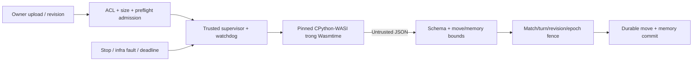

# FRS-D03 — Online Sandbox Security

| TASK_ID | Phụ trách | Phạm vi |
|---|---|---|
| D-03.ON | Đức kiểm thử/review; Nam sửa runtime; Long tích hợp authority/admission | Wasmtime/CPython-WASI, isolation, quotas, output, cancel/reclaim và real-provider gate |

## 1. Mục tiêu và kiến trúc

Python người chơi không đọc dữ liệu server/Bot khác, vượt quyền trận hoặc giữ tài nguyên vô hạn. Dùng runtime đã pin và harness hiện có; bộ fixture có mục tiêu bao phủ đủ threat groups, bổ sung regression cho findings. Không mở fuzzing diện rộng hoặc đổi kiến trúc trong scope này.

AST/import/builtins allowlist là lớp bổ sung. Source bị parser chặn không chứng minh sandbox boundary an toàn; có fixture kiểm tra trực tiếp boundary bằng runtime/harness cô lập. Không chạy player Python trong Node hoặc native subprocess không hạn chế.

## 2. Boundary và giới hạn

| Hạng mục | Yêu cầu |
|---|---|
| Artifacts | Verify executable, Python WASM/stdlib và assets liên quan theo pinned manifest trước thực thi; mismatch/missing chặn runtime. Không dùng runtime ngẫu nhiên từ PATH hoặc tự tải bản mới để bỏ pin |
| Host capabilities | Allowlist environment, không DB/session/secrets/application mounts, không network sockets. Runtime chỉ nhận stdlib/wrapper/own source/input cần thiết qua đường dẫn host kiểm soát; player không có filesystem capability |
| Input | Snapshot/side/legal moves/seed và memory đúng ABI; không source/log/memory của đối thủ, cookie hoặc credential. Source/revision được kiểm tra ownership; không đưa input vào shell command |
| Invocation reset | Runtime/global state mới mỗi lần gọi; chỉ JSON memory đã commit được chuyển tiếp. Temp files độc lập và được cleanup; invocation khác không đọc được dữ liệu còn sót |
| Quotas | Host thực thi fuel/epoch/memory/stack/output và outside watchdog; Python không tự khai báo usage hoặc sửa timer. Trusted wrapper marker không bị author giả để reset budget |
| Fairness | Equal limits mỗi bên; bootstrap/queue wait báo riêng với active compute. Startup/host-call watchdog hữu hạn; không cộng thời gian pause/infra wait vào author compute |
| Output | Chỉ result ABI hợp lệ, JSON hữu hạn/depth/bytes bound; reject NaN/Infinity, trailing payload hoặc data sai schema. Validate legal move trên state hiện tại; memory đi cùng move trong commit |
| Privacy | Owner diagnostics có giới hạn và được sanitize; public chỉ reason/status an toàn. Không echo raw source, stack/path/secret qua room/SSE/history/replay hoặc provider report |

| Giới hạn | Giá trị lấy từ `packages/bot-sdk/src/manifest.ts` |
|---|---|
| Source/upload | 64 KiB |
| JSON memory | 8 KiB, depth tối đa 32 |
| Output | 16 KiB, bao gồm memory |
| Private logs | 16 KiB |
| Compute | Preflight 250 ms; mỗi lượt 500 ms; tổng active compute 30.000 ms |
| Game cap | 120 plies / 60 rounds; adjudication theo rules, không tự kết luận khi bootstrap lỗi |
| WASM resources | 1.024 memory pages {64 MiB linear memory}, stack 1 MiB; fuel/epoch/startup settings theo manifest |
| Admission | Python Online ban đầu tối đa một trận active; bounded preflight queue/concurrency theo L07 |

Linear memory không phải tổng RSS runtime/instance. Ghi cả Node + child runtime + bootstrap peak + temp disk; freeze các host timeout/kill/cleanup bounds trước test từ baseline. Không tăng limits/tắt watchdog để sample qua gate.

## 3. Cancel, lifecycle và lỗi

| Tình huống | Hành vi bắt buộc |
|---|---|
| Stop/Resume/revision/rematch | Cancel in-flight theo lifecycle, invalidate invocation token/epoch. Late output không commit; Resume không dùng kết quả cũ hoặc mở hai invocations |
| Kill/reclaim | Watchdog/abort dừng process và chờ xác nhận exit; dọn timer/listener/temp data, release reservation đúng một lần. Chưa xác minh reclaim thì không tái sử dụng capacity không an toàn |
| Preflight spam | Quota theo principal/action và total; queue hữu hạn, deadline/cancel. Không để candidate tests chiếm toàn bộ lượt Bot đang đấu; phối hợp scheduler của Nam/Long |
| Author fault | Syntax/ABI/illegal move/compute budget violation được xác định sau trusted startup hợp lệ. Trả lỗi riêng; adjudication theo policy trận, không tự thay nước mặc định |
| Infrastructure fault | Missing/hash mismatch/bootstrap failure/runtime crash không xác định là author/DB fault/cancel → khóa capability hoặc recovery đúng scope; không phạt tác giả vì hạ tầng |
| Consumer gate fail | Chặn nhận/chạy Python mới và không giả PASSED/Ready. Health app khác không chứng minh Bot readiness; fault không liên quan được cô lập trong safe envelope |
| Unknown commit | Không chạy lại invocation rồi ACK bừa; authority tra outcome/checkpoint. Output/memory chưa commit không trở thành state lượt sau |

## 4. Bộ kiểm tra bắt buộc

| TASK_ID | Fixture / thao tác | Điều kiện đạt |
|---|---|---|
| D-03.ON-01 | Known-valid ABI source chạy preflight và turn qua application consumer thật | Runtime/SDK/pins đúng; tạo legal move và memory được authority chấp nhận, không chỉ direct probe |
| D-03.ON-02 | Network, secrets/env, filesystem traversal/write và readonly sentinel | Cấm capabilities ngoài phạm vi; canary test không lộ. Sentinel là dữ liệu test, không dùng secrets thật |
| D-03.ON-03 | Loop, sleep/host-call stall, allocation/OOM, recursion, output flood | Dừng trong configured bounds; lỗi author/infra đúng; peak resources và reclaim được đo |
| D-03.ON-04 | Missing/malformed/multi-result output, NaN, memory oversize/depth, illegal move, forged timing/result fields | Reject trước commit; không đổi board/memory/result; logs/errors bounded |
| D-03.ON-05 | Hai Bot/two turns, globals/temp leftovers và memory reset/round-trip | Không cross-Bot/cross-invocation leakage; chỉ own committed memory qua lượt sau |
| D-03.ON-06 | Pause/cancel/timeout/revision race và repeated abort | Không late/double commit; process/timer/temp/reservations không leak; invocation tiếp theo dùng capacity đã reclaim |
| D-03.ON-07 | Asset missing/hash mismatch/bootstrap failure | Fail closed, không fallback native Python hoặc phạt author; không công khai private diagnostics |
| D-03.ON-08 | Preflight flood + real runtime + API/trận hợp lệ trong measured envelope | Queue/concurrency hữu hạn, gameplay reserve/SLO L07 đạt; rejection được đếm, không gọi rejected là served |
| D-03.ON-09 | Linux/provider real-consumer gate trên candidate được phép kiểm tra | Môi trường, pins, limits, admission, cancel/reclaim và consumer checks có evidence; local/mock không thay provider proof |

Mỗi fixture có positive control và expected denial/output phù hợp; exit code khác 0 đơn lẻ không chứng minh isolation. Probe chỉ kiểm tra fixture không chứng nhận mọi upload path; suite phải có consumer seam. Khai thác chưa xác định được boundary phải ghi finding/BLOCKED, không chạy ngoài sandbox để thử.

## 5. Dependency và DoD

Đầu vào: [D01](FRS-D01-THREAT-MODEL-POLICY.md), [D02](FRS-D02-AUTH-SESSION-ACCESS.md), N-01/N-04 candidate và manifest; [L05 authority](../network-core/FRS-L05-MATCH-AUTHORITY-CLOCKS.md), [L06 commit/recovery](../network-core/FRS-L06-PERSISTENCE-RECOVERY-REPLAY.md), [L07 budgets/runbook](../network-core/FRS-L07-CAPACITY-INTEGRATION-RUNBOOK.md). Bắt đầu chuẩn bị fixture trước khi candidate DONE; Đức review, Nam sửa/retest.

**DoD:** D-03.ON-01…09 nối vào matrix chung và Online runtime report: candidate/diff hash, OS/architecture/provider, runtime/SDK/pins/config, expected/actual, measurements, artifacts/verdict và reviewer. Không P0/P1 hoặc isolation/privacy/correctness blocker mở; missing mandatory evidence vẫn BLOCKED/NOT RUN. Provider tests/deploy chỉ thực hiện khi có authorization đúng phạm vi; chưa được phép chạy không suy thành PASS.

## 6. Phối hợp cuối tài liệu

[LD-03/LD-04/LD-06](DUC.md#long-duc): Long là owner code tích hợp chung admission/config, invocation/commit fence và persistence seam. Đức cung cấp cancellation/late-output/privacy/headroom fixtures và review/retest; Nam giữ runtime/watchdog/reclaim. Runtime PASS là đầu vào; integrated consumer/recovery phải kiểm tra trên candidate của Long.
