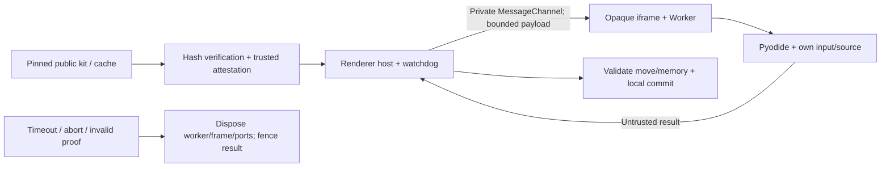

# FRS-D04 — Offline Sandbox Security

| TASK_ID | Phụ trách | Phạm vi |
|---|---|---|
| D-03.OFF | Đức kiểm thử; Nam sửa runtime/local storage | Pyodide compartment, bridge, watchdog, kit/cache, privacy và cold Offline |

## 1. Mục tiêu và boundary

Bot Offline không đọc renderer credentials/DOM/storage, truy cập network hoặc lấy dữ liệu Bot khác. Giữ opaque-origin iframe + Worker hiện có; xác minh bằng runtime/browser thật. Kết quả local không dùng để cấp quyền hoặc cộng Elo Online.

## 2. Controls bắt buộc

| Hạng mục | How / hành vi |
|---|---|
| Compartment | Iframe sandbox không allow-same-origin; bootstrap tĩnh, không nội suy player text vào HTML/JS. Worker nằm trong compartment; same-origin Worker riêng lẻ không đủ |
| Network/storage | CSP và runtime capability denial chặn fetch/XHR/WebSocket/import tải ngoài, DOM/cookie/IndexedDB/CacheStorage của ứng dụng. Bootstrap chỉ dùng bytes runtime đã xác minh, không mang credential vào frame |
| Bridge | Private MessageChannel; kiểm tra đúng frame/source, kind/schema/phase/invocation identity và byte/depth bounds. Opaque origin `null` hoặc request ID biết được không tự cấp quyền. Không nhận lệnh từ window message tùy ý |
| Output | Renderer validate legal move/JSON memory theo SDK và state hiện tại. Worker không quyết định clock/winner hoặc tự chứng nhận isolation bằng field do author điều khiển |
| Watchdog | Host timer độc lập Python; bootstrap và compute có deadline riêng; hạn mức SDK như D03. Kiểm tra WASM memory maximum thực tế, không chỉ cấu hình khai báo |
| Dispose/fencing | Abort/timeout/unmount/đổi phiên làm invocation cũ mất hiệu lực; terminate/dispose worker/frame/ports/timers, ignore late result. Không commit hai lần hoặc dùng resource chưa cleanup |
| Per-turn isolation | Fresh compartment/namespace; chỉ own committed JSON memory qua lượt sau. Hai slot không chia sẻ globals/source/memory/log |
| Revision/memory | Revision mới reset memory mặc định; preserve chỉ khi người dùng chọn rõ và declared schema tương thích. Restore giữ actual setup/version, paused và chưa Ready đến khi preflight/gates đạt |
| Kit integrity | Verify pinned runtime assets trước dùng; cache presence không thay hash/attestation. Kit/version đổi phải invalidate readiness và xác minh lại; thiếu/sai hash thì fail closed |
| Cache/privacy | Service Worker chỉ cache public shell/runtime/assets theo version; không cache private HTTP/SSE/source/log. Local Bot/save theo principal namespace, không tự chuyển owner khi login |

Browser không có hard CPU/RAM/process guarantees tương đương server. Đo cả linear memory, bootstrap/compute, cleanup và UI responsiveness; không gọi memory 8 KiB của ABI là giới hạn RAM. Máy/browser đã bị người sở hữu sửa không tạo được chứng cứ kết quả Online hợp lệ.

## 3. Trạng thái người dùng

| Tình huống | Kết quả đúng |
|---|---|
| Kit thiếu/sai hash/không có browser capability | Khóa Run/Ready; nêu cần tải lại kit hoặc browser hỗ trợ; giữ source/save, không fallback server/native |
| Attestation/bridge failure | Khóa runtime, dispose invocation; thông báo không thể xác minh bộ chạy, không xử thua author do lỗi hạ tầng |
| Syntax/ABI/illegal move/compute breach đã xác định | Owner thấy lỗi có giới hạn; adjudication theo SDK/mode. Không tạo nước mặc định |
| Pause/Step/Speed | Pause tại safe turn boundary, Step đúng một lượt Bot; speed không tăng compute budget hoặc đổi state/authority. Abort do lỗi/unmount không commit late output |
| Quota storage hoặc restore hỏng | Không ghi đè bản còn tốt; báo lỗi/khôi phục hoặc export theo quyền. Không tự xóa Library hoặc lưu private source vào public report |
| Mất mạng sau chuẩn bị | Cold launch chạy app/route/runtime cần thiết từ cache; missing assets báo đúng, giữ save paused |

## 4. Nhiệm vụ và nghiệm thu

| TASK_ID | Kiểm tra | Điều kiện đạt |
|---|---|---|
| D-03.OFF-01 | Kit pins + runtime attestation | Known-valid source chạy qua consumer; sửa/mất một asset chặn chạy; presence-only không thành Ready |
| D-03.OFF-02 | DOM/cookie/storage/network/JS bridge probes | Canaries không bị đọc/gửi; capability denial xảy ra trong compartment thật, không chỉ AST rejection |
| D-03.OFF-03 | Forged/duplicate/stale/oversized bridge messages | Không đổi local state, không reset watchdog, không nhận kết quả invocation cũ |
| D-03.OFF-04 | Loop/allocation/recursion/output flood/bootstrap stall | Deadline/memory/output bounds có đo; cleanup xong, UI còn điều khiển được trong test profile |
| D-03.OFF-05 | Two-slot/cross-turn/revision memory | Không leakage; memory round-trip đúng; preserve/reset chỉ đúng lựa chọn/schema |
| D-03.OFF-06 | Pause/Step/unmount/cancel và late result | Một commit hợp lệ; không worker/frame/port/timer leak sau repeated cycles |
| D-03.OFF-07 | Warm-up → đóng tab → network disabled → cold route | Shell/runtime đủ; chạy Bot thật sau verify; restore paused, không request server fallback |
| D-03.OFF-08 | Author vs infrastructure/error/limit paths | Đúng reason; không fake move, false author loss hoặc silent reset |
| D-03.OFF-09 | Principal switch/cache/export/restore | Không dùng private cache của owner trước; export đúng local scope; local result không thành Online authority/Elo |

Đức tận dụng browser probes/harness hiện có, bổ sung ca thiếu và regression. Matrix ghi browser/version/OS/viewport, kit/SDK/pins, candidate, expected/actual và artifact; thiếu browser/device evidence phải ghi rõ, không gắn PASS cho thiết bị giả lập như máy thật.

**DoD:** D-03.OFF-01…09 có evidence runtime/browser thật trong Offline report và matrix chung; không isolation/privacy/correctness blocker hoặc P0/P1 mở. Nam sửa/retest; Đức review đúng candidate. Historical attestation và mock Worker không thay adversarial consumer/cold Offline evidence. Startup attestation thành công không tự cấp production release approval trước khi security/release gates đạt.

## 5. Phối hợp cuối tài liệu

Nam giữ compartment/Worker/local adapters; Đức gửi fixtures/findings và review/retest. Long sở hữu code tích hợp chung ABI/error/version khi delta ảnh hưởng consumer: [LD-04/LD-06](DUC.md#long-duc); Nam cập nhật Offline adapter theo contract. Code runtime và code tích hợp có writer riêng.
