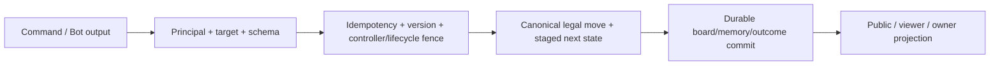

# FRS-D05 — Anti-cheat & Privacy

| TASK_ID | Phụ trách | Phạm vi |
|---|---|---|
| D-04 | Đức kiểm thử/review; Long authority/data; Nam Bot integration | Tampering, replay/race, controller/revision/memory fencing và public/private projection |

## 1. Mục tiêu

Client/Bot không tự sửa bàn, quyền, clock, kết quả hoặc dữ liệu người khác. Retry, reconnect, Stop/Resume và restart không tạo nước trùng hoặc dùng output cũ. Kiểm tra theo rules/contracts hiện hành, không thêm luật chống gian lận trong UI.

## 2. Controls và attack cases

| Hạng mục | Yêu cầu / ca phá hoại |
|---|---|
| Setup/seed | Server tạo setup theo L01 và context non-repeat, lưu actual initial/version. Client không chọn lại seed qua refresh/rematch payload; replay không dùng setup hiện tại để dựng trận cũ |
| Identity/role | Actor/side từ session và membership; host không mặc nhiên referee; invite/password không cấp role. Candidate/referee cũ không điều khiển sau transfer |
| Controller | HUMAN chỉ own move; player không gửi move thay PYTHON; trusted runtime result chỉ qua adapter nội bộ. Không giả controller/owner qua body/URL |
| Legal/terminal | Rules quyết định legality/blocked/goal/extinction. Check terminal trước invocation; client clock/animation/result không tạo authority; không hồi terminal thành PLAYING |
| Duplicate/unknown | Same command/digest trả outcome cũ; đổi payload cùng key bị từ chối. Lost ACK tra outcome, không retry bằng ID mới hoặc chạy invocation mới tùy ý |
| State/epoch | Recheck stateVersion/match generation/turn/revision/invocation token trong serialized commit. Delayed output/event từ match trước không đổi rematch |
| Stop/Resume | Stop khóa action và clocks; freeze đúng budgets. Resume không xóa disconnect/infra blocker, không activate pending do resume hoặc renew safety deadline |
| Revision/memory | Immutable source/revision digest và owner; pin revision/seed mỗi turn; output memory chỉ commit cùng legal move. Partial computation/cancel không ghi memory; invalid candidate không thay active/pending hợp lệ |
| Crash/persistence | Before/after commit/ACK/broadcast có failpoints; recovery đọc checkpoint nhất quán, không double result/Elo, không hồi quyền bị revoked |
| Automation | Fast valid action không tự thành gian lận. Spam bị quota/429; action trái phép bị ACL/version/rules chặn. Không tự thêm permanent bans, detector AI/fingerprint hoặc phạt cả IP chung |

## 3. Visibility matrix

| Dữ liệu | Owner được phép | Player khác / host / referee / spectator / public |
|---|---|---|
| Board, moves, clocks, public revision name/status, kết quả | Theo quyền resource | Chỉ public projection theo room/mode/access policy |
| Source, JSON memory, private logs/diagnostics | Own resource còn hạn; export/delete theo guards | Không có, kể cả public replay/downloadable audit |
| Session/recovery code/password hash/runtime secrets | Chỉ luồng credential cần thiết; không public response/log | Không có |
| Invite/room password/private references | Chỉ actor và luồng được cấp quyền | Không trả dư qua lobby/snapshot/errors |
| Local save/source | Browser storage theo namespace/chức năng đã duyệt | Không tự upload/public hoặc chuyển owner vì login |

DTO whitelist tại server, không chỉ ẩn field ở UI. Dùng canary khác nhau cho source/memory/log để phát hiện mọi đường leak: HTTP, SSE, full sync, history/detail/replay/export/audit, errors, metrics và cache. Public payload vẫn có bounds; không phát toàn bộ history mỗi clock pulse.

## 4. Nhiệm vụ và nghiệm thu

| TASK_ID | Kiểm tra | Điều kiện đạt |
|---|---|---|
| D-04.01 | Actor/side/controller/seed/result tampering | Request giả không đổi trận/quyền; Guest/account/mọi role covered |
| D-04.02 | Setup/refresh/rematch/replay | Actual board/version đúng, non-repeat đúng context; refresh không reroll; old/new replay đúng reader |
| D-04.03 | Replay commands/unknown ACK | Same/different digest và ID mới chịu đúng outcome/quota; không lost/double ACKed move |
| D-04.04 | Move vs Stop/timeout/surrender/terminal | Một outcome đúng precedence; clocks/blockers không bị bypass |
| D-04.05 | Revision/epoch/memory races | Latest valid pending đúng activation; late output/cancel/restart không mixed board/revision/memory |
| D-04.06 | Ref replacement/revoke/reconnect | Consent/accept/transfer đúng; old referee mất HTTP/SSE controls; deadline không bị kéo dài do flapping |
| D-04.07 | Crash boundaries/settlement | Recover committed state, không double history/Elo; không xử thua do hạ tầng |
| D-04.08 | Canary privacy matrix | Zero private leakage qua mọi surface/role được kiểm tra; owner vẫn xem đúng own data |

Đầu vào: L01…L06 và N-04/N-05/N-06 candidate; D02 credential/ACL, D03/D04 runtime controls. Tests tối thiểu có hai browser/principals, API/SSE thật và disposable DB cho crash/durable gates. Source audit/mock không thay evidence này.

**DoD:** D-04.01…08 nối risk/test/evidence trong matrix chung; candidate/environment/failpoints/expected/actual/verdict rõ; findings sửa và retest. Không privacy/isolation/correctness blocker hoặc P0/P1 mở; chưa kiểm tra phải NOT RUN/BLOCKED, không kết luận theo build.

## 5. Phối hợp cuối tài liệu

[LD-02/LD-04/LD-05](DUC.md#long-duc): Long là owner code tích hợp chung contracts/room/match/SSE/Prisma/history và integration fixes. Đức cung cấp tampered fixtures, race schedules/canaries và review/retest. Nam giữ runtime/revision/private adapters; khóa staged transition + atomic memory contract với Long trước integration.
