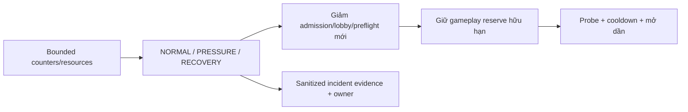

# FRS-D06 — Operations & Data Security

| TASK_ID | Phụ trách | Phạm vi |
|---|---|---|
| D-05 | Đức audit/policy/harness; Long vận hành/admission/data; Nam runtime/private data | Secrets, diagnostics, artifacts, retention, backup access và ứng phó application abuse |

## 1. Mục tiêu và phạm vi 48 giờ

Giảm rò rỉ dữ liệu và ngăn spam workload phụ làm cạn ngân sách trận đang chạy. Dùng metrics/logs/config/runbook hiện có; không thêm dashboard quản trị, SIEM, WAF dịch vụ, CAPTCHA, topology hoặc module tổ chức giải đấu mới.

## 2. Controls dữ liệu/vận hành

| Hạng mục | Yêu cầu |
|---|---|
| Secrets | DB URLs/passwords/tokens/recovery codes không trong Git, public bundle, API errors, logs/report. Kiểm tra source/config/build output; phát hiện credential thật thì báo owner, không in lại vào evidence |
| Logs/errors | Allowlist fields/reason; loại Cookie/Authorization/body/source/memory/secret/path/stack nhạy cảm. Log volume/record size/TTL hữu hạn; sample/aggregate repeated denials, không ghi một report cho mỗi spam request |
| Metrics | Route-template labels bounded, không raw URL/ID/username làm cardinality vô hạn. Đủ admitted/rejected/429/503, streams/backlog/queue, event-loop/RSS/DB/runtime và p95/p99 từ L07 |
| Diagnostics | Public chỉ safe capability/status/aggregate được duyệt; không env/raw logs/private IDs/source/stack. Operational detail qua test/ops environment được phép, không tạo public admin shortcut |
| Cache | Public assets versioned/pinned; private responses không shared-cache/Service Worker. Logout/revoke/switch principal invalidate private cache; verified readiness không lấy report của candidate khác |
| Dependencies/assets | Inventory runtime/compiler/SDK, hashes, notices/licenses; review direct/transitive vulnerability có exploitability. Không mass-upgrade hoặc force fix phá compatibility; retest phần thay đổi |
| Backup/export | Credentials và file backup không public; export owner check, output bounded. Restore rehearsal trên DB test đã xác minh; không tải/copy production backup vào artifacts công khai |
| Retention | Temp match source giữ khi active, hết hạn 30 ngày từ terminal endedAt; private logs 7 ngày từ entry creation. Deny access khi hết hạn dù GC trễ; Account Library giữ đến owner deletion |
| Memory/GC | Terminal live/checkpoint-private memory mất quyền truy cập ngay, cleanup sau safe settlement; không recover từ dữ liệu đã hết quyền. GC không xóa active source/Library, actual replay độc lập với private source |

Security-event logs dùng policy TTL/size hữu hạn được chốt trong config/runbook; không mặc nhiên áp retention private Bot logs cho mọi loại log. Runtime pins/manifest không được hạ để pass build hoặc tăng capacity.

## 3. Ứng phó phá hoại khi đang đấu

| Tình huống | Thao tác / owner | Kết quả đúng |
|---|---|---|
| Room/account/queue spam | Đức kiểm tra limiter/counters; Long giảm admission/resource caps, cleanup expired empty leases | Quota tổng không bị né bằng đổi account; không xóa active match hoặc blacklist toàn bộ Wi-Fi |
| Lobby/history/SSE flood | Long áp bounded fan-out/query/backlog, pagination/cache; Đức kiểm thử client chậm/đổi target liên tục | Chặn request/stream vượt bound riêng; gameplay reserve còn trong envelope đã đo |
| Preflight/Bot abuse | Nam quotas/watchdog/reclaim; Long separate admission; Đức fixtures/retest | Runtime bận không giữ queue vô hạn hoặc làm API/trận khác sai state |
| Pressure | Long tự chuyển PRESSURE theo thresholds L07, giảm workload mới; ghi aggregate reason/metrics | Không restart/kill trận để làm số đo đẹp; gameplay/resync vẫn có ngân sách hữu hạn |
| Recovery | Probe rate hữu hạn + hysteresis/cooldown; mở admission dần, client retry jitter | Không mở tất cả vì một health response xanh hoặc tạo reconnect storm |
| DB/runtime/shared failure | Khóa mutation/capability liên quan, đối chiếu durable outcome/checkpoint và bounded recovery | Không ACK giả, double command hoặc author penalty vì hạ tầng |
| Credential/integrity incident | Cô lập capability, báo Nam/owner; chuẩn bị rotation/fix và retest | Không phát secret trong report; remote rotation/deploy cần authorization riêng |

Runbook ghi mở ở đâu → xem chỉ số nào → thao tác bằng config/command hiện có nào → expected result → rollback/escalate cho ai. Không yêu cầu newbie tự chạy lệnh production khi chưa rõ target/quyền. Không hứa application controls chống được volumetric DDoS hoặc outage provider chung.

## 4. Nhiệm vụ và nghiệm thu

| TASK_ID | Công việc | Điều kiện đạt |
|---|---|---|
| D-05.01 | Secret/log/error/bundle audit | Canary credentials không xuất hiện trên public output/report; lỗi sanitizer có regression |
| D-05.02 | Bounded metrics/diagnostics | Random paths/IDs + denial flood không tăng label/log storage vô hạn; public response whitelist đúng |
| D-05.03 | Cache/principal isolation | Hai principals, logout/revoke, warm cache/cold routes không trả private data sai owner |
| D-05.04 | Dependency/artifact review | Pins/notices/versions và findings có owner/severity; exact candidate runtime gate đúng, không dùng evidence cũ để mở gate |
| D-05.05 | Retention/export/delete/backup | Time-travel expiry và cleanup delay vẫn deny; active refs/Library/replay giữ đúng; backup access và test restore có evidence |
| D-05.06 | Incident rehearsal | Legit+spam workload: PRESSURE/cooldown/recovery đúng, resources bounded; không sai/mất/double ACKed move; commands/expected/actual rõ |

**DoD:** D-05.01…06 có sanitized evidence trong matrix chung; runbook đã được người khác làm theo trên test target; findings có fix/retest, không P0/P1 hoặc privacy/correctness blocker mở. Test chưa được phép/chưa có environment ghi BLOCKED/NOT RUN. Không thay production, bật billing hoặc migrate DB chung trong task audit.

## 5. Phối hợp cuối tài liệu

[LD-03/LD-05/LD-06](DUC.md#long-duc): Long là owner code tích hợp chung metrics/diagnostics/env/build/admission/retention, config/budgets và runbook. Đức đưa policy/attack workload, audit leak/correctness và retest. Nam sửa runtime assets/private Bot cleanup; Sơn sửa unsafe UI/cache consumers theo ownership.
