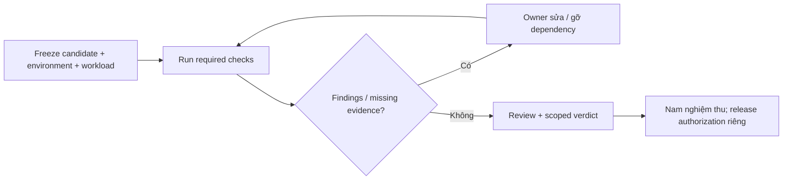

# FRS-D07 — Security Acceptance

| TASK_ID | Phụ trách | Phạm vi |
|---|---|---|
| D-06 | Đức điều phối; module owners sửa/retest; Nam nghiệm thu | Coverage, evidence, adversarial regression, findings và scoped sign-off |

## 1. Nguyên tắc

Nghiệm thu đúng candidate/capability đã chạy; một report hoặc build xanh không chứng minh toàn hệ thống an toàn. Deadline toàn team: 00:00 10/10 → 00:00 12/10/2026, UTC+7. Hết giờ không tự biến task thiếu evidence thành DONE.

## 2. Coverage và bộ kiểm tra

| Nhóm | Minimum evidence | Không được thay bằng |
|---|---|---|
| D01 policy | Assets/actors/boundaries; R01…R14 nối control/owner/test | Checklist chung không có attack path |
| D02 auth/abuse | HTTP/SSE/browser: rotation/recovery/ACL/CSRF/revoke, multi-account/shared-IP/spam và finite resources | Chỉ unit mock hoặc UI ẩn nút |
| D03 Online | Pinned runtime + real consumer + hostile fixtures + kill/reclaim + Linux/provider gate | AST rejection/direct probe/local cap thay provider proof |
| D04 Offline | Real opaque iframe/Worker, adversarial bridge/capabilities, cold offline, restore/privacy | Warm tab, fake Worker hoặc kit presence |
| D05 anti-cheat | Race/replay/crash boundaries + canary public projection | Happy-path single client hoặc build |
| D06 operations | Secrets/cache/artifact/retention/backup access và incident rehearsal | Bản hướng dẫn chưa chạy theo hoặc logs chứa secrets |

Dùng fixture có mục tiêu và positive control; mọi lớp denial quan trọng có expected reason/state/resource outcome. Fix mới có regression riêng; không mở fuzzing diện rộng trước khi đủ mandatory coverage.

## 3. Mixed attack protocol

| Bước | Thực hiện | Điều kiện |
|---|---|---|
| 1 | Xác minh local/test target, DB disposable, candidate/config/runtime và generator | Không dùng production để thử phá; không credentials trong report |
| 2 | Lock legitimate/attack rates, principals/IPs, match/stream mix, durations và safety stop | Report baseline/safe envelope của Long; các giá trị hữu hạn, không tự đoán capacity |
| 3 | Baseline legitimate gameplay rồi cùng workload + room/account/command/history/SSE/preflight spam | Spam có action hợp lệ và trái phép, ID cũ/mới, multi-account và shared-IP cases |
| 4 | Đo offered/admitted/rejected/committed, p95/p99, CPU/RSS/lag/DB/queues/streams/log cardinality | Human ACK p95 ≤300 ms, p99 ≤1 s trong measured profile; internet RTT/Python compute báo riêng |
| 5 | Inject slow client/listener fault/runtime fault/DB delay, rồi dừng nguồn spam | Fault isolation, bounded pressure/recovery/cleanup; shared failure ghi gián đoạn thực tế |
| 6 | So board/version/outcomes và canary scan, retest sau fix | Zero lost/double ACKed moves, unauthorized state change hoặc private leakage |

Rejections không tính là served CCU. Mốc 1k/5k/10k chỉ PASS khi generator và environment thực sự đạt; safety stop/thiếu tài nguyên ghi FAIL/NOT RUN/BLOCKED. Không hạ security/quota/durability để đạt số tải.

## 4. Evidence và verdict

Một matrix chung, finding riêng khi có lỗi; runtime report tách Online/Offline. Mỗi test ghi `TASK_ID → risk → candidate/diff hash → environment/DB identifier → config/command → expected/actual → artifact → verdict/reviewer`. Báo cáo không chứa source/private logs hoặc secret của người chơi thật.

| Verdict / gate | Ý nghĩa |
|---|---|
| PASS / FAIL | Check đã chạy, kết quả đúng/sai trên candidate xác định |
| NOT RUN / BLOCKED | Chưa chạy / thiếu dependency cụ thể, ghi owner và next action |
| Scoped PASS | Toàn bộ mandatory checks của phạm vi đó đạt và review đủ; không suy sang capability khác |
| Release blocker | P0/P1 mở; hoặc isolation/privacy/correctness violation dù severity thấp hơn; hoặc mandatory evidence chưa có |
| Residual risk | Chỉ rủi ro còn lại không vượt các gates trên; có impact, mitigation, owner và Nam chấp nhận |

Code/auth Đức viết cần reviewer khác thực tế. Review Bot của Nam có thể do Đức thực hiện; review không được gọi independent nếu tác giả/reviewer cùng một người hoặc reviewer chưa chạy/đọc evidence. Ghi rõ review đọc report hay tự chạy lại test.

## 5. Nhiệm vụ và DoD

| TASK_ID | Công việc | Điều kiện đạt |
|---|---|---|
| D-06.01 | Freeze/matrix | D01…D06 không orphan risk/control/test; environment/candidate/config xác định |
| D-06.02 | Mandatory gates | Đủ runtime/browser/API/SSE/DB checks theo capability; thiếu check không PASS |
| D-06.03 | Mixed attack regression | Legitimate+hostile workloads đạt correctness/privacy/SLO trong safe envelope; có counters và limits |
| D-06.04 | Findings/retest | Owner/severity/repro/fix candidate/retest đầy đủ; không unresolved release blocker |
| D-06.05 | Review/sign-off | Reviewer thực tế, scope/coverage/limitations/residual risks rõ; không self-independent PASS |
| D-06.06 | Handoff | Nam nhận matrix, reports, finding list, tested runbook và next actions; release chưa được giao giữ NOT RUN |

**DoD:** D-06.01…06 có evidence đúng final candidate; thay code/config/asset ảnh hưởng control phải retest phần liên quan trước sign-off. Focused tests/typecheck/lint/build đạt không thay real runtime/load gates. Phạm vi còn blocker không DONE; không tự cắt scope hoặc tự deploy/migrate để đóng gate.

## 6. Phối hợp cuối tài liệu

[LD-06 và toàn bộ bảng Long–Đức](DUC.md#long-duc): Long sở hữu code/config/harness tích hợp chung, integrated candidate và integration fixes; bàn giao baseline/load/DB/failpoint/runbook evidence. Đức giữ attack fixtures, risk/test matrix, review/retest và security sign-off theo scope. Code Đức viết cần reviewer khác; Nam quyết định nghiệm thu/residual risk, quyền production cấp riêng.
